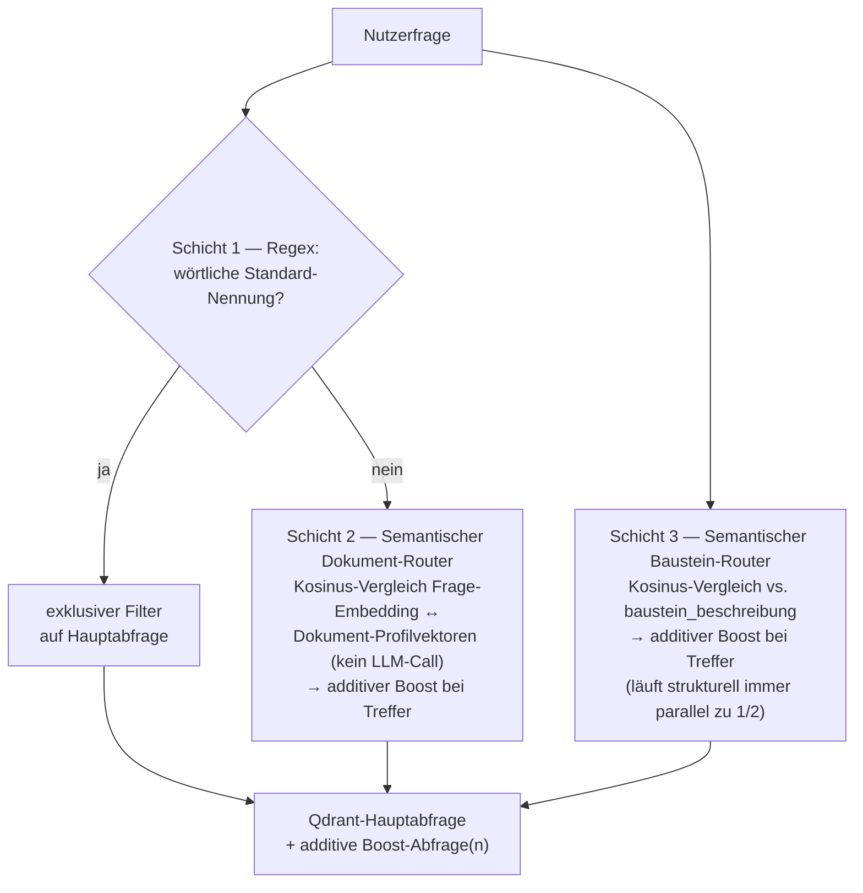
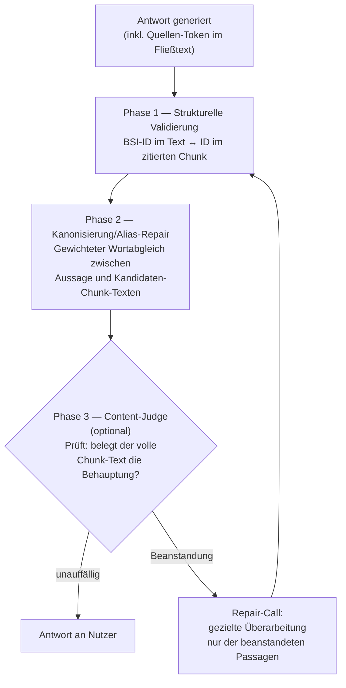
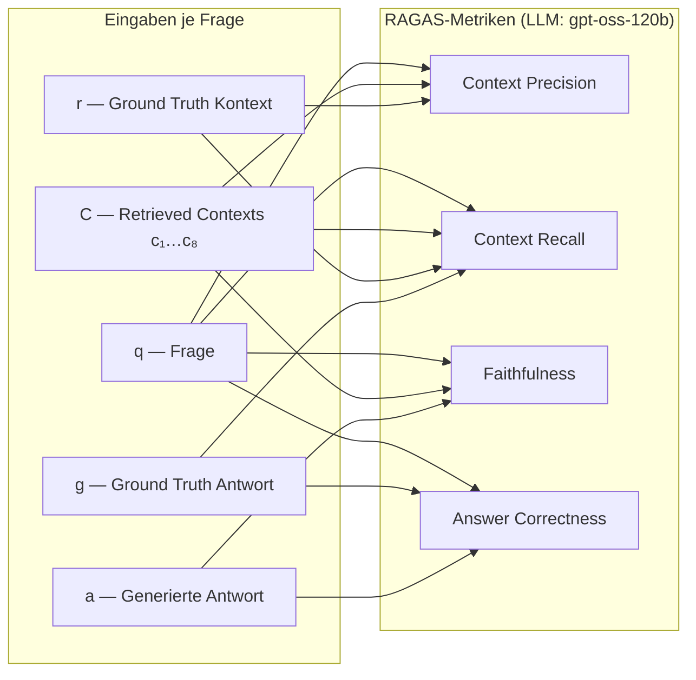
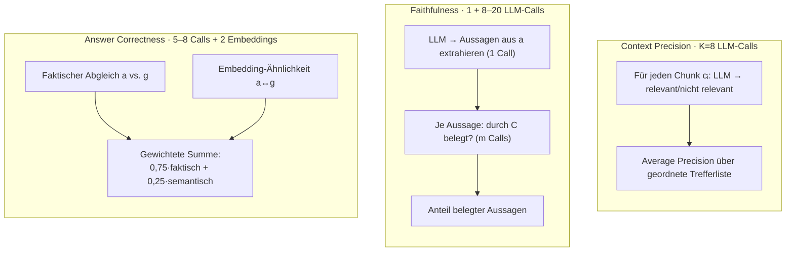

# 5 Entwurf Grundschutz-KI

Dieses Kapitel entwickelt den Lösungsentwurf für Grundschutz-KI schrittweise aus den in Kapitel 3/4 hergeleiteten Anforderungen. Es beschreibt zunächst die leitenden Entwurfsziele und -prinzipien (5.1), auf deren Grundlage die logische Systemarchitektur (5.2) sowie im Detail der Entwurf der RAG-Pipeline (5.3) und der Benutzungsschnittstelle (5.4) entwickelt werden. Abschnitt 5.5 beschreibt die Schnittstellen des Systems und die architektonischen Vorkehrungen für Erweiterbarkeit. Abschnitt 5.6 fasst den Entwurf zusammen und leitet zu Kapitel 6 (Umsetzung) über, in dem die hier begründeten Entscheidungen konkret implementiert werden.

Alle Entwurfsentscheidungen werden mit ihrer fachlichen Begründung dargestellt; wo eine Entscheidung im Projektverlauf revidiert oder nur teilweise umgesetzt wurde, wird dies explizit ausgewiesen, um den Iterationscharakter der Entwicklung — evaluationsgetrieben statt einmalig festgelegt — sichtbar zu machen.

---

## 5.1 Entwurfsziele und -prinzipien

Der Lösungsentwurf orientiert sich an sechs Zielen, die aus der Charakteristik der Anwendungsdomäne (normative, sicherheitsrelevante Fachinformation) und der Zielgruppe (Institutionen unterschiedlicher Größe und Rollen im IT-Grundschutz-Prozess) abgeleitet sind.

**Z1 — Zitierfähigkeit und Beleghaftigkeit.** Da IT-Grundschutz-Anforderungen normativen Charakter haben (MUSS/SOLLTE/DARF NICHT), darf das System keine unbelegten fachlichen Aussagen erzeugen. Jede inhaltliche Aussage muss auf eine konkrete Fundstelle im Kompendium oder den BSI-Standards rückführbar sein. Dieses Ziel — als „Goldene Regel" in den Verhaltensvorgaben für das Sprachmodell verankert — ist der zentrale Entwurfstreiber für die Wahl von Retrieval-Augmented Generation gegenüber einem allein auf Parameterwissen basierenden Einsatz eines Sprachmodells: Ein Sprachmodell kennt den IT-Grundschutz zwar bereits aus seinen Trainingsdaten, dieses Wissen ist jedoch weder zitierfähig noch zuverlässig aktuell.

**Z2 — Nachvollziehbarkeit (Transparenz der Quellenzuordnung).** Zitierfähigkeit allein genügt nicht, wenn der Bezug zwischen Aussage und Fundstelle für Nutzende nicht unmittelbar prüfbar ist. Der Entwurf sieht daher durchgehend klickbare, inline platzierte Quellenverweise vor, die zu einer Vorschau der Originalseite führen (Abschnitt 5.4), statt einer gesammelten, nicht satzscharfen Literaturliste.

**Z3 — Aktualisierbarkeit ohne Modelltraining.** Das IT-Grundschutz-Kompendium wird durch das BSI periodisch revidiert. Eine Aktualisierung der Wissensbasis darf keine erneute Modell-Anpassung erfordern. Retrieval-Augmented Generation erfüllt dies strukturell, da die Wissensbasis unabhängig vom Sprachmodell aktualisiert wird.

**Z4 — Rollenadäquanz.** Nutzende des Systems nehmen im IT-Grundschutz-Prozess unterschiedliche Rollen ein (Informationssicherheitsbeauftragte, Fachverantwortliche, IT-Betrieb, Institutionsleitung), die unterschiedliche fachliche Perspektiven auf dieselbe normative Grundlage benötigen. Der Entwurf sieht daher eine rollenbasierte Antwortanpassung als eigenständiges Merkmal vor, nicht als nachgelagerte Filterung (Abschnitt 5.4).

**Z5 — Kontrollierbarkeit und Datensparsamkeit.** Da hochgeladene Dokumente institutionsspezifische, potenziell sensible Informationen enthalten können, sieht der Entwurf eine strikte Trennung zwischen der kuratierten, dauerhaft indizierten Wissensbasis (BSI-Dokumente) und nutzerspezifischem, nur sitzungsgebunden vorgehaltenem Kontext vor (Abschnitt 5.3.5). Die Selbst-Hostbarkeit aller Kernkomponenten unterstützt dieses Ziel zusätzlich auf Infrastrukturebene.

**Z6 — Evaluationsgetriebene Iteration statt Vorab-Vollständigkeit.** Der Entwurf verzichtet bewusst darauf, alle denkbaren Retrieval- und Qualitätssicherungsmechanismen von Beginn an vollständig und aktiv auszurollen. Stattdessen werden neue Mechanismen zunächst als unabhängig voneinander schaltbare, standardmäßig deaktivierte Erweiterungen vorgesehen, gegen ein kuratiertes Testfragenset kalibriert und erst danach aktiviert (vgl. Abschnitt 5.3.3 und 5.5.3). Dies ist eine bewusste Entwurfsentscheidung, keine Unvollständigkeit: Ein falsch kalibrierter Retrieval-Filter verschlechtert das Ergebnis aktiv (er schließt korrekte Treffer aus, vgl. Abschnitt 5.3.3), sodass unkalibrierte Mechanismen inaktiv bleiben müssen, bis ihre Wirkung empirisch belegt ist. Welche der in diesem Kapitel entworfenen Mechanismen zum Stand dieser Arbeit tatsächlich aktiviert sind, dokumentiert Kapitel 6.5.

Diese sechs Ziele stehen teilweise in Zielkonflikt: Z1/Z2 (Beleghaftigkeit, Transparenz) erfordern nachgelagerte Prüfschritte, die Antwortlatenz kosten; Z4 (Rollenadäquanz) und Z5 (Datensparsamkeit) erweitern den Prompt-Kontext und damit die Angriffsfläche für Prompt Injection (vgl. Abschnitt 5.6). Der Entwurf löst diese Konflikte nicht einheitlich, sondern macht sie an den jeweiligen Entscheidungspunkten explizit.

---

## 5.2 Logische Systemarchitektur

### 5.2.1 Komponentenübersicht

Grundschutz-KI ist als Multi-Container-Anwendung entworfen, deren Komponenten containerisiert und über eine gemeinsame Orchestrierung betrieben werden. Die logische Architektur trennt vier Verantwortlichkeiten in vier Laufzeiteinheiten:

| Komponente | Verantwortlichkeit | Zustand |
|---|---|---|
| Anwendung | Web-Anwendung, Dialoglogik, Zitations-Pipeline, HTTP-Zusatzschnittstellen | zustandsbehaftet (Session), zustandslos zwischen Neustarts |
| Vektordatenbank | semantische Suche über die Wissensbasis | persistent |
| Relationale Datenbank | Nutzerkonten, Chat-Historie, Feedback, Umfrage-Antworten | persistent |
| Ingest-Prozess | einmaliger Batch-Vorgang: liest Quelldokumente, befüllt die Vektordatenbank | transient |

Diese Aufteilung trennt bewusst die **Wissensbasis** (Vektordatenbank, durch den Ingest-Prozess befüllt, von der laufenden Anwendung nur lesend genutzt) von der **Anwendungs- und Nutzungs-Datenschicht** (relationale Datenbank, von der Anwendung schreibend genutzt). Diese Trennung ist Voraussetzung für Ziel Z3: Eine neue Kompendium-Edition erfordert einen erneuten Ingest-Lauf, aber weder eine Änderung der Anwendungslogik noch einen Eingriff in Nutzerkonten oder Chat-Historien. Die konkrete Realisierung dieser vier Einheiten als Container, die verwendeten Basis-Images und die Orchestrierung beschreibt Kapitel 6.1.3.

### 5.2.2 Schichtenmodell

Der Anwendungscontainer gliedert sich entwurfsseitig in vier logische Schichten mit klar getrennter fachlicher Zuständigkeit (Abbildung 5.1).

**Abbildung 5.1 — Schichtenmodell (Entwurf)** (siehe Anhang, Datei `docs/diagrams/schichtenmodell.svg`)


Die gestrichelte, rechtwinklige Kante von der Präsentations- zur Domänendienste-Schicht steht für den direkten Zugriff der administrativen Exportfunktionen auf die Datenzugriffsdienste — ohne Umweg über die Dialogsteuerung in der Anwendungslogik.

Die Präsentationsschicht bündelt die Chat-Oberfläche für den Dialog mit den Nutzenden sowie ergänzende HTTP-Schnittstellen für Funktionen, die über das reine Chat-Paradigma hinausgehen — Authentifizierung, administrative Datenexporte, Auslieferung von Quell- und Vorschaudokumenten. Beide laufen über dieselbe HTTP-Serverinstanz, damit für die zweite Gruppe keine separate Infrastruktur betrieben werden muss.

Die Anwendungslogik bündelt die Dialogsteuerung, die mehrstufige Zitationsprüfung (Abschnitt 5.3.6) und die Personalisierungslogik (Abschnitt 5.4.1) — sie orchestriert die darunterliegenden Domänendienste, enthält aber selbst keine Zugriffslogik auf externe Systeme. Die Domänendienste kapseln jeweils eine fachliche Zuständigkeit vollständig: Retrieval einschließlich Scope-Routing, die Abstraktion über den Sprachmodell-Provider, die sitzungsgebundene Verarbeitung von Nutzer-Uploads sowie den Zugriff auf die persistente Datenschicht (Feedback, Chat-Historie, Umfragedaten). Diese Kapselung erlaubt es, jeden Dienst unabhängig auszutauschen oder zu testen, ohne die Anwendungslogik zu berühren — Voraussetzung für die in Abschnitt 5.2.3 beschriebene Austauschbarkeit des Sprachmodells.

Welche konkreten Module diese vier Schichten realisieren, benennt Kapitel 6.2 (Tabelle 6.1).

### 5.2.3 Modellanbindung als austauschbare Abhängigkeit

Sowohl das Chat-Modell als auch das Embedding-Modell werden nicht direkt, sondern über eine Provider-Abstraktionsschicht angesprochen, die eine einheitliche Schnittstelle über verschiedene Anbieter hinweg bereitstellt. Modellwahl und Zugangsdaten sind ausschließlich Konfiguration, nicht Code. Diese Entwurfsentscheidung ist keine abstrakte Vorsichtsmaßnahme, sondern wird durch die in Kapitel 7 dokumentierte vergleichende Evaluation mehrerer Sprachmodelle unterschiedlicher Größenordnung unmittelbar genutzt: Alle verglichenen Modelle laufen unter identischer Anwendungslogik, ausschließlich über Konfiguration ausgetauscht. Die konkret eingesetzten Modelle, der genutzte Provider und die Versionsstände der beteiligten Bibliotheken werden in Kapitel 6.1/6.2 im Rahmen der Realisierung benannt.

### 5.2.4 Authentifizierung

Der Entwurf sieht zwei parallele Authentifizierungsmechanismen vor: klassische Passwort-Anmeldung sowie eine Anmeldung über einen externen Identitätsanbieter. Für die Passwort-Anmeldung sieht der Entwurf zusätzlich einen Selbstregistrierungsweg mit E-Mail-Verifizierung vor (Schnittstellen `/auth/register`, `/auth/verify`), über den Nutzende ohne manuelle Account-Anlage durch Administratoren ein Konto anlegen können — für den Pilotbetrieb mit einer begrenzten Zahl evaluierender Fachanwender der vorgesehene primäre Weg zur Kontoerstellung. Sicherheitsrelevante Aspekte dieser Komponente werden in Kapitel 6.1.4 als offene Punkte der Realisierung aufgegriffen.

---

## 5.3 Entwurf der RAG-Pipeline

Die RAG-Pipeline ist der fachlich anspruchsvollste Teil des Entwurfs, da sie Ziel Z1 (Beleghaftigkeit) technisch einlösen muss. Sie gliedert sich in vier Entwurfsbereiche: Ingest und Chunking (5.3.1), Metadatenmodell (5.3.2), Retrieval einschließlich Routing (5.3.3), Query-seitige Erweiterungen (5.3.4) und die nachgelagerte Zitations-Pipeline (5.3.5).

### 5.3.1 Ingest und Chunking — Strukturerhalt statt Größensegmentierung

Eine zentrale Entwurfsentscheidung betrifft die Segmentierung der Quelldokumente in Chunks. Anstelle eines verbreiteten, größenbasierten Chunking-Verfahrens (feste Zeichen-/Token-Länge mit Overlap) verfolgt der Entwurf für das IT-Grundschutz-Kompendium einen **strukturerhaltenden** Ansatz: Da das Kompendium bereits als strukturiertes JSON vorliegt, das die Gliederung Schicht → Baustein → Anforderung explizit abbildet, wird jede strukturelle Einheit unverändert zu genau einem Chunk:

- pro Baustein ein `baustein_beschreibung`-Chunk (Einleitung) und, sofern vorhanden, ein `baustein_gefaehrdungslage`-Chunk,
- pro Anforderung ein `anforderung`-Chunk (Titel + Volltext, alle drei Stufen Basis/Standard/Erhöht),
- pro elementarer Gefährdung ein eigener Chunk (bausteinunabhängiger Katalog).

**Begründung.** Diese Entscheidung ist unmittelbar aus Ziel Z1 abgeleitet: Da jede Anforderung im Kompendium bereits eine in sich abgeschlossene normative Einheit mit eindeutiger Kennung ist (z. B. `ORP.4.A2`), stellt eine 1:1-Abbildung Anforderung → Chunk sicher, dass jede zitierte Fundstelle exakt einer prüfbaren, benannten Textstelle entspricht. Eine größenbasierte Segmentierung würde entweder mehrere Anforderungen in einem Chunk vermischen (Zitat wird mehrdeutig) oder eine Anforderung an willkürlicher Stelle zerschneiden (Zitat wird unvollständig) — beides widerspricht Z1/Z2.

Für die BSI-Standards 200-1 bis 200-4, die nur als Fließtext-PDF vorliegen, ist dieser Ansatz nicht direkt übertragbar. Hier wird die Bibliothek *Docling* zur Layout-Analyse eingesetzt: Ein neuer Chunk beginnt mit jedem erkannten Überschriften-Label (`section_header`, `title`, `chapter_title`); der Fließtext wird bis zur nächsten Überschrift akkumuliert. Kurzabschnitte unter 80 Zeichen (Layout-Artefakte) werden verworfen. Diese Segmentierung ist gröber als die Kompendium-Chunks, da die Standards selbst über keine vergleichbar feingranulare normative Gliederung verfügen — sie ist jedoch die bestmögliche Annäherung an denselben Strukturerhalt-Grundsatz innerhalb der Grenzen des Quellformats.

### 5.3.2 Metadatenmodell

Jeder Chunk erhält beim Ingest ein dokumenttyp-abhängiges Metadatenschema, das über das reine Retrieval hinaus für Filterung, Routing und Zitationsauflösung genutzt wird:

| Feld | Anforderung | Bausteineinleitung/-gefährdungslage | Standardabschnitt | Zweck |
|---|:---:|:---:|:---:|---|
| `doc_type` | ✓ | ✓ | ✓ | Strukturtyp des Chunks |
| `schicht_id` | ✓ | ✓ | — | Themenschicht (z. B. `ORP`); als Filter genutzt |
| `baustein_id` | ✓ | ✓ | — | Baustein-Kennung; als Filter und für Routing genutzt |
| `anforderung_id` | ✓ | — | — | Eindeutige Kennung; Grundlage der Zitationsauflösung |
| `anforderung_level` / `anforderung_typ` | ✓ | — | — | Basis/Standard/Erhöht bzw. B/S/H; indiziert, für zukünftige Filter vorgesehen |
| `modal_verben` | ✓ | — | — | im Anforderungstext verwendete Modalverben; Grundlage des Modalverb-Konsistenzchecks (5.3.5) |
| `standard_id` | — | — | ✓ | Zugehöriger BSI-Standard (200-1…4); als Filter genutzt |
| `page_start` / `page_end` | ✓ | ✓ | ✓ | Seitenbereich; Grundlage der PDF-Vorschau |

Für die häufig gefilterten Felder (`doc_type`, `schicht_id`, `baustein_id`, `anforderung_typ`, `anforderung_level`) sieht der Entwurf Indizes in der Vektordatenbank vor. Damit ist eine performante gefilterte Suche auf allen genannten Feldern bereits vorgesehen — genutzt wird zum aktuellen Stand jedoch nur ein Teilbestand davon aktiv (`baustein_id`, `schicht_id`, `standard_id`), während `anforderung_typ` und `modal_verben` als vorbereitete, aber noch ungenutzte Erweiterungspunkte angelegt sind (vgl. Abschnitt 5.5.3).

### 5.3.3 Retrieval-Architektur: Dense Retrieval mit vorgelagertem Scope-Routing

**Basismechanismus.** Das Retrieval basiert auf dichten Embedding-Vektoren, gespeichert in einer einzelnen Collection der Vektordatenbank über beide Quellkorpora hinweg. Der Zugriff erfolgt als Werkzeug (`rag_retrieve`), das dem antwortenden Sprachmodell im Rahmen von Function Calling zur Verfügung gestellt wird — das Modell entscheidet selbst, wann und mit welcher Anfrage es Kontext nachlädt, bis zu einer konfigurierbaren Obergrenze an Aufrufrunden pro Antwort. Diese Entwurfsentscheidung (Retrieval als modellgesteuertes Werkzeug statt als starr vorgeschalteter Schritt) erlaubt mehrstufige Recherche bei mehrteiligen Fragen, ohne die Kontrolle über die Zahl der Aufrufe vollständig aufzugeben.

**Filter als literale Gleichheitsbedingungen.** Auf die Metadatenfelder `baustein_id`, `schicht_id`, `standard_id` und `source_scope` kann das retrievende Werkzeug optional exakte Gleichheitsfilter anwenden, die das Suchergebnis vor der Ähnlichkeitsbewertung einschränken. Eine zentrale Entwurfsregel legt fest, **dass das Modell `baustein_id`/`schicht_id` ausschließlich setzen darf, wenn die betreffende ID wörtlich im aktuellen Fragetext genannt wird** — nicht bei bloßer thematischer Erkennung. Diese Regel bleibt bewusst strikt, obwohl eine Lockerung zugunsten thematischer Erkennung naheliegend erscheinen könnte. Der Grund zeigt sich exemplarisch an inhaltlich stark überlappenden, aber unterschiedlichen Bausteinen wie `CON.8 Software-Entwicklung` und `APP.7 Entwicklung von Individualsoftware`: Bei einer thematischen Frage zur Softwareentwicklung sind typischerweise beide gleichermaßen relevant. Ein aus reiner Themenerkennung gewählter, **exklusiver** `baustein_id`-Filter würde einen der beiden unbegründet ausschließen. Diese Überlegung motiviert die in Abschnitt 5.3.4 beschriebene Routing-Architektur, die dasselbe Grundproblem mit einem **additiven statt exklusiven** Mechanismus löst.

Abbildung 5.2 (siehe Anhang) veranschaulicht den vollständigen Ablauf einer Anfrage als Sequenz- und Komponentendiagramm: von der Nutzereingabe über den Function-Calling-Zyklus zwischen Anwendung und Sprachmodell, den Aufruf des `rag_retrieve`-Werkzeugs gegen die Vektordatenbank, bis zur Antwort mit Quellenangaben. Ergänzend zeigt die Abbildung als gestrichelten, ausdrücklich als Ausbaustufe gekennzeichneten Pfad eine für spätere Erweiterung vorgesehene Anbindung eines institutionsspezifischen **ISMS-Inventars** als zusätzliche, scope-getrennte Wissensquelle neben Kompendium und BSI-Standards — analog zur in Abschnitt 5.3.5 beschriebenen Trennung von kuratierter und nutzerspezifischer Wissensbasis, hier jedoch als dauerhaft indizierte, nicht nur sitzungsgebundene Quelle gedacht. Diese Erweiterung ist zum Stand dieser Arbeit nicht realisiert; sie wird in Kapitel 8 (Ausblick) wieder aufgegriffen.

### 5.3.4 Query-seitige Erweiterungen

Auf der beschriebenen Basisarchitektur setzen zwei query-seitige Erweiterungsmechanismen auf, die unabhängig von Ingest und Collection-Schema aktivierbar sind.

**HyDE (Hypothetical Document Embeddings).** Ist dieser Mechanismus aktiviert, wird vor der eigentlichen Vektorsuche ein Modellaufruf vorgeschaltet, der einen kurzen, hypothetischen Antwortabsatz in IT-Grundschutz-Fachsprache generiert; dieser Absatz — nicht die Nutzerfrage selbst — wird eingebettet und als Suchvektor verwendet (Gao et al., 2022). Der Entwurf adressiert damit einen strukturellen Vocabulary-Mismatch: Laienformulierte Fragen liegen im Embedding-Raum entfernt von normativ formulierten Kompendiumstexten, selbst wenn beide inhaltlich zusammengehören. Eine Analyse typischer Antwortfehler ließ sich in zwei strukturell unabhängige Klassen einteilen: Klasse A (das Modell ergänzt unbelegtes Parameterwissen trotz korrektem Retrieval) und Klasse B (das Modell antwortet vollständig kontexttreu, jedoch auf Basis falsch abgerufener Chunks). Klasse B ist durch Prompt-Anpassung strukturell nicht behebbar, da die falschen Chunks bereits im Kontext liegen — dieser Befund begründet, warum HyDE als vorrangiger Retrieval-seitiger Optimierungsschritt in den Entwurf aufgenommen wird. Die empirische Bestätigung dieser Fehlerklassifikation berichtet Kapitel 7.

**Vorgelagertes Scope-Routing.** Ergänzend sieht der Entwurf eine dreistufige Routing-Schicht vor, die der eigentlichen Vektorsuche eine Scope-Eingrenzung voranstellt:



Die Schichten unterscheiden sich fundamental im Grad ihrer Verbindlichkeit und in ihrem Zusammenspiel. Nur Schicht 1 (wörtliche Nennung eines Standards, z. B. „BSI-Standard 200-2", per Regex erkannt) filtert **exklusiv** — nur Chunks aus dem genannten Dokument werden zurückgegeben; ihre Eindeutigkeit macht eine Abwägung entbehrlich. Schicht 2 wird nur geprüft, wenn Schicht 1 nicht bereits angeschlagen hat: Sie vergleicht das Frage-Embedding rein rechnerisch — per Kosinus-Ähnlichkeit, ohne eigenen Modellaufruf — gegen vorab berechnete Dokument-Profilvektoren (einer je BSI-Standard plus einer für das Kompendium) und trägt bei Erfolg (Ähnlichkeitswert über einer kalibrierten Schwelle **und** Mindestabstand zum zweitbesten Kandidaten) einen **additiven Boost** zur Haupt-Trefferliste bei — keinen exklusiven Filter. Schicht 3 sucht unabhängig davon über die Bausteinbeschreibungs-Chunks nach thematisch passenden Bausteinen und ergänzt das Ergebnis ebenfalls additiv.

Entscheidend ist, dass Schicht 3 **strukturell immer parallel** zu Schicht 1/2 läuft, nicht als nachgelagerter Fallback erst dann, wenn diese erfolglos bleiben: Eine Frage kann legitim sowohl einen BSI-Standard als auch einen Kompendium-Baustein gleichzeitig betreffen (z. B. „ISMS-Prinzipien" → Standard-200-1-Text **und** ISMS.1-Anforderungen), sodass ein sequenzielles Aktivieren der Schichten hier fälschlich eine der beiden relevanten Quellen ausschließen würde. Dass ausschließlich Schicht 1 exklusiv filtert, während Schicht 2 und 3 additiv bleiben, ist eine bewusste Entwurfsentscheidung: Ein falscher exklusiver Filter schließt korrekte Treffer vollständig aus, während ein unterlassener additiver Boost lediglich auf die (schwächere) ungefilterte Basisleistung zurückfällt — dieses Risiko ist bei den auf Schwellenwerten basierenden, inhärent unsicheren Schichten 2/3 nicht vertretbar, bei der eindeutigen wörtlichen Nennung in Schicht 1 hingegen schon. Als Profilgrundlage für Schicht 3 dienen bewusst die ohnehin im Kompendium vorhandenen Bausteinbeschreibungs-Chunks statt einer manuell gepflegten Liste über alle 111 Bausteine — eine Entwurfsentscheidung zugunsten von Wartungsarmut: Die Profile bleiben bei jeder Neuindizierung automatisch aktuell.

Ein wichtiges Entwurfsprinzip betrifft die Trennung der für Hypothesengenerierung und Scope-Klassifikation verwendeten Vektorrepräsentationen: Da die Hypothesengenerierung ein stochastischer, auf Stil-Angleichung statt Themen-Klassifikation ausgelegter Schritt ist, würde eine gemeinsame Vektorbasis für beide Zwecke eine fehlgeleitete Hypothese unmittelbar in die Scope-Entscheidung fortpflanzen — obwohl die Routing-Schicht gerade zur Absicherung gegen Retrieval-Fehler vorgesehen ist. Der Entwurf sieht daher zwei getrennte Vektoren vor: einen für die eigentliche Chunk-Suche (ggf. hypothesenbasiert) und einen unabhängigen, unmittelbar aus der unveränderten Nutzerfrage berechneten Repräsentationsvektor für die Scope-Klassifikation der Routing-Schicht. Die Hypothesengenerierung und die Routing-Schicht bleiben dadurch orthogonale, unabhängig voneinander konfigurierbare und evaluierbare Mechanismen — ein Beispiel dafür, wie Ziel Z6 (evaluationsgetriebene Iteration) bereits im Entwurf verdeckte Kopplungen zwischen eigentlich unabhängig gedachten Mechanismen antizipiert.

### 5.3.5 Trennung von kuratierter und nutzerspezifischer Wissensbasis

Zur Erfüllung von Ziel Z5 (Datensparsamkeit, Kontrollierbarkeit) ist der Umgang mit nutzerseitig hochgeladenen Dokumenten (z. B. institutionsspezifische Sicherheitskonzepte) architektonisch von der kuratierten Wissensbasis getrennt: Der Inhalt eines Uploads verbleibt ausschließlich im Sitzungszustand der Anwendung und wird **niemals dauerhaft in der Vektordatenbank gespeichert**. Mit Sitzungsende sind die Daten nicht mehr abrufbar.

Anders als beim Retrieval über die kuratierte Wissensbasis (Abschnitt 5.3.3) sieht der Entwurf für Uploads bewusst **keine** vorherige, ähnlichkeitsbasierte Auswahl einzelner Passagen vor: Der vollständige extrahierte Text eines Uploads wird bei jeder Anfrage unverändert in den Modell-Kontext übernommen, ohne Chunking, Embedding oder Ähnlichkeitssuche. Grund ist die Charakteristik der typischen Fragestellungen zu Uploads: Sie zielen — anders als gezielte Sachfragen an das Kompendium — überwiegend auf eine **ganzheitliche Bewertung** des hochgeladenen Kontexts ab, z. B. „Welche Form der Absicherung sollte ich für mein Unternehmen wählen?" oder „Berücksichtigt dieses Datensicherungskonzept alle Anforderungen des IT-Grundschutzes?". Die Entscheidungsgrundlage für solche Fragen liegt typischerweise in einzelnen, über das gesamte Dokument verstreuten Fakten — etwa Branche, Kundenzahl oder Versorgungsauftrag als Indiz für eine Einordnung als Kritische Infrastruktur, oder Hinweise auf einen bereits bestellten Informationssicherheitsbeauftragten als Indiz für ein bestehendes Sicherheitsniveau. Solche Fakten teilen mit dem Wortlaut der eigentlichen Frage in aller Regel kein gemeinsames Vokabular und würden von einer ähnlichkeitsbasierten Vorauswahl mit hoher Wahrscheinlichkeit nicht als relevant erkannt. Eine Vorauswahl liefe hier folglich Gefahr, genau die entscheidungsrelevanten Passagen zu verwerfen statt Rauschen zu filtern — strukturell dasselbe Problem, das für Meta-Ebenen-Fragen gegen die kuratierte Wissensbasis bereits dokumentiert ist (Abschnitt 5.3.3), hier jedoch verschärft, da nicht einmal thematische Nähe zwischen Frage und relevanter Textstelle besteht. Vollständige Kontextübergabe ist für diese Fragestellungen daher keine Verlegenheitslösung, sondern die dem Anwendungsfall angemessene Entwurfsentscheidung — begrenzt durch das Kontextfenster des jeweiligen Sprachmodells als einzige praktische Obergrenze.

Diese Entwurfsentscheidung hat eine unmittelbare Konsequenz für die Zitations-Pipeline: Aussagen, die ausschließlich aus einem hochgeladenen Dokument stammen, erhalten explizit **kein** Quellen-Token im BSI-Zitationsformat, sondern werden gesondert als aus dem hochgeladenen Dokument stammend gekennzeichnet. Für den Kontext-Injektionsmechanismus selbst — den technischen Weg, über den der Uploadinhalt dem Sprachmodell zugänglich gemacht wird — sieht der Entwurf zum Stand dieser Arbeit noch keine strenge Privilegientrennung zwischen hochgeladenem Nutzerinhalt und Systemanweisungen vor: Schutzmaßnahmen wie eine explizite Rahmung des Uploadinhalts oder dessen Herabstufung auf eine niedrigere Vertrauensebene sind als Erweiterung vorgesehen, aber nicht umgesetzt. Dieser Punkt wird in Abschnitt 5.6 als offene Anforderung benannt.

### 5.3.6 Mehrstufige Zitations-Pipeline

Die Zitations-Pipeline ist die technische Umsetzung von Z1/Z2 und läuft als nachgelagerte Verarbeitung, nachdem das Sprachmodell seine Antwort generiert hat. Sie ist als Kette zunehmend teurerer, aber auch zunehmend aussagekräftigerer Prüfschritte entworfen:



**Phase 1 — strukturelle Validierung** vergleicht im Antworttext genannte BSI-Kennungen (z. B. `ORP.4.A2`) mit der Kennung des jeweils zitierten Chunks. Dieser Schritt ist günstig, greift aber nur bei Chunks mit Anforderungs-ID — bei Standard-200-x-Abschnitten ohne vergleichbare Kennung ist er wirkungslos.

**Phase 2 — Kanonisierung** korrigiert einen konkreten, wiederkehrenden Fehler: Das Modell hängt mehrere, inhaltlich unterschiedliche Aussagen an dieselbe, zu allgemeine „Sammelquelle" — typischerweise die Bausteinbeschreibung oder Gefährdungslage —, obwohl im Kontext auch der jeweils spezifisch passende Chunk (z. B. die einzelne Anforderung) verfügbar wäre. Phase 2 korrigiert, *welcher* unter mehreren im Kontext verfügbaren Kandidaten tatsächlich als Alias verlinkt wird, mittels eines gewichteten Wortabgleichs zwischen der zitierten Aussage und den Volltexten aller im Retrieval zurückgegebenen Chunks. Die Gewichtung erfolgt nach inverser Häufigkeit über den jeweils lokalen Kandidatenpool, nicht über den Gesamtkorpus: Eine Gewichtung über den vollständigen Korpus liefe Gefahr, bausteinweit wiederkehrende BSI-Standardsprache als bedeutungstragend zu behandeln, während eine Gewichtung über einen zu großen, fachfremden Kandidatenpool umgekehrt verzerrt, welche Wörter als aussagekräftig gelten — der lokale Zuschnitt auf die tatsächlich infrage kommenden Kandidaten adressiert beide Fälle. Auch dieser Schritt prüft nur die *Zuordnung*, nicht den *Inhalt* — zwei Textstellen aus demselben, aber falsch zugeordneten Chunk sind für Phase 2 ununterscheidbar.

**Phase 3 — Content-Judge** schließt genau diese Lücke: Ein LLM-Aufruf prüft für jedes extrahierte Paar (Behauptung, zitierter Volltext), ob der Text die Behauptung tatsächlich inhaltlich deckt, unabhängig von struktureller ID-Übereinstimmung. Bei Beanstandung folgt ein gezielter Repair-Call, der ausschließlich die beanstandeten Passagen auf Basis des bereits abgerufenen Kontexts überarbeitet — ohne neuen Retrieval-Aufruf. Dieser Schritt ist als einziger der drei Phasen mit spürbarer Nutzer-Latenz verbunden (1–2 zusätzliche LLM-Aufrufe); der Entwurf sieht daher explizit eine sichtbare UI-Rückmeldung während dieser Prüfung vor (Abschnitt 5.4.3) statt einer stillen Nachbearbeitung, um zu vermeiden, dass sich der bereits vollständig angezeigte Antworttext scheinbar unerklärt verändert. Phase 3 ist zum Stand dieser Arbeit als reiner Logging-Modus vorgesehen (Erkennung ohne Rewrite), bevor der Korrekturpfad anhand realer Fehlerquoten kalibriert freigeschaltet wird — konsistent mit dem in Z6 festgelegten Vorgehen.

Implementiert ist Phase 3 auf dem Branch `feature/citation-content-judge`; zum Stand dieser Arbeit ist dieser Branch noch nicht in `main` gemergt. Erste Tests auf diesem Branch zeigen den Mechanismus bereits sichtbar in der Anwendungsoberfläche wirksam — die Aktivierung in der produktiven Umgebung (`main`) steht jedoch noch aus.

---

## 5.4 Entwurf der Benutzungsschnittstelle — Dialog- und Assistenzfunktionen

### 5.4.1 Grundparadigma und Rollenmodell

Die Benutzungsschnittstelle ist als konversationelle Oberfläche entworfen, ergänzt um ein rollenbasiertes Personalisierungskonzept, das Ziel Z4 umsetzt. Beim Sitzungsstart wählen Nutzende aus fünf vordefinierten **Chat-Profilen**, die typische Rollen im IT-Grundschutz-Prozess abbilden: Informationssicherheitsbeauftragte, Fachverantwortliche, Leitung IT-Betrieb, Durchführungsverantwortliche IT-Betrieb sowie Institutsleitung/Geschäftsführung. Jedes Profil definiert neben Anzeigename und Beschreibung einen Kontext-Text, der dem Prompt der Sitzung hinzugefügt wird, sowie Listen relevanter Bausteine und Themen. Die Profile sind entwurfsseitig als externe, vom Code getrennte Konfiguration vorgesehen (Abschnitt 5.5.3), damit fachliche Anpassungen ohne Software-Änderung möglich sind.

Ergänzend zur statischen Rollenwahl sieht der Entwurf eine **optionale, sitzungsübergreifende Personalisierung** vor: Aus dem bisherigen Chatverlauf werden Schlüsselwörter extrahiert und — nach ausdrücklicher Aktivierung durch die Nutzenden über einen Schalter im Einstellungspanel — dem Prompt-Kontext hinzugefügt. Die bewusste Default-Deaktivierung dieses Merkmals ist eine direkte Ableitung aus Ziel Z5: Nutzende müssen der Verwendung ihres Chatverlaufs zur Profilbildung aktiv zustimmen, statt dass dies stillschweigend geschieht. Einzelne Schlüsselwörter lassen sich über das Einstellungspanel oder äquivalente Textbefehle (`/keywords add|remove|enable-all|disable-all|regenerate`) verwalten — ein bewusst redundantes Bedienkonzept (grafisch **und** textuell), das im folgenden Abschnitt begründet wird.

### 5.4.2 Zwei-Ebenen-Bedienkonzept: Einstellungspanel und Textbefehle

Der Entwurf stellt zentrale Steuerungsfunktionen — Rollenwahl, Personalisierung, Prompt-Einsicht, Chat-Export, Verlaufseinsicht — konsequent über **zwei parallele Zugriffswege** bereit: ein grafisches Einstellungspanel für die alltägliche Bedienung sowie eine Menge textueller Befehle (u. a. `/history`, `/export`, `/keywords`, `/prompt show|reset|set`) für punktgenaue, reproduzierbare Eingriffe. Beide Wege wirken auf denselben Sitzungszustand und lösen bei Änderung denselben Aktualisierungsmechanismus des Prompts aus. Diese Dopplung ist im Kontext einer wissenschaftlichen Evaluierung funktional begründet: Der Befehl `/prompt show` macht den tatsächlich an das Sprachmodell übergebenen Prompt für Testpersonen und Auswertende jederzeit einsehbar und damit die Blackbox „warum antwortet das System so" ein Stück weit auflösbar, ohne dass dafür Serverzugriff nötig wäre.

### 5.4.3 Zitations-UX

Der zentrale interaktive Baustein der Oberfläche ist die Darstellung von Quellenbezügen. Jeder Quellenverweis im Fließtext (Format `Quelle: <Abschnittstitel> (S.<Start>-<Ende>)`) wird nachträglich in einen klickbaren Inline-Verweis umgewandelt, der eine Seitenleiste mit PDF-Vorschau der referenzierten Originalseite öffnet (Schnittstelle `/sources/pdf/{file_name}`, vgl. Tabelle 5.1). Eine ergänzende Aktion öffnet eine vollständige Übersicht aller in einer Antwort verwendeten Quellen. Für den Fall der Sitzungs-Wiederaufnahme wird der Zitationszustand einer Antwort — Panel-Inhalt und Quellenzeilen — als Metadatum am jeweiligen Antwort-Schritt persistiert und beim Wiedereinstieg restauriert; für Chats, die vor Einführung dieses Mechanismus entstanden sind, ist dieser Komfort bewusst nicht nachgerüstet worden, was in Anbetracht des begrenzten Pilotbetriebs als vertretbarer Kompromiss zwischen Aufwand und Nutzen bewertet wurde.

Für die in Abschnitt 5.3.6 beschriebene Phase 3 der Zitations-Pipeline (Content-Judge) sieht der Entwurf eine eigene, transparente UX-Behandlung vor, die dem bereits etablierten Muster für Werkzeugaufrufe folgt (ein einklappbarer Zwischenschritt, wie er für `rag_retrieve`-Aufrufe ohnehin sichtbar ist): Ein kurzer Status „Zitate werden geprüft…" macht die zusätzliche Prüfzeit nachvollziehbar; bei tatsächlicher Korrektur ergänzt eine kleine Transparenz-Fußnote unter der Antwort, dass eine automatische Qualitätsstufe gegriffen hat. Diese Entscheidung — Sichtbarmachen statt stillem Nachbearbeiten — ist unmittelbar aus Ziel Z2 abgeleitet: Eine Antwort, die sich unangekündigt nach vollständiger Anzeige verändert, unterläuft Nachvollziehbarkeit, selbst wenn die Änderung inhaltlich korrekt ist.

### 5.4.4 Anschlussfragen als didaktisches Element

Jede Antwort schließt mit genau drei generierten Anschlussfragen, die als anklickbare Aktionen dargestellt werden und bei Bedarf neu generiert werden können. Die Anschlussfragen sind kein reines Komfortmerkmal, sondern strukturell in die Rollenpersonalisierung eingebunden: Bei aktivierter Personalisierung fließen die aktiven Schlüsselwörter des Nutzerprofils in einen Teil der generierten Anschlussfragen ein. Zusätzlich instruiert der Entwurf das Sprachmodell, bei baustein-bezogenen Fragen das Abgrenzungs- und Modellierungskapitel des jeweiligen Bausteins auf angrenzende, thematisch verwandte Bausteine zu prüfen und diese in den Anschlussfragen aufzugreifen — ein Mechanismus, der die im Kompendium bereits vorhandene, aber sonst nicht erschlossene Querverweisstruktur (vgl. Abschnitt 5.5.3, Ausblick Graph-Retrieval) wenigstens auf Vorschlagsebene nutzbar macht.

### 5.4.5 Feedback-Kanäle: Mikro- und Makro-Ebene

Für die spätere Evaluierung durch Fachanwendende sieht der Entwurf zwei strukturell unterschiedliche Feedback-Kanäle vor, die unterschiedliche Granularität adressieren:

- **Antwortbezogenes Feedback** (Daumen-hoch/-runter-Bewertung mit optionalem Freitextkommentar, persistiert in der relationalen Datenbank) erfasst die Qualitätswahrnehmung einzelner Antworten im laufenden Dialog — die Mikro-Ebene.
- **Übergreifendes Evaluationsformular** (eigenständige Oberfläche mit Entwurfs- und Absende-Zustand) erhebt strukturierte Einschätzungen zur Gesamtnutzung — Rolle der testenden Person, wahrgenommene Antwortrelevanz, Vertrauen in die Korrektheit, hilfreichstes Merkmal, Verbesserungsvorschläge — die Makro-Ebene.

Beide Datenquellen sind über separate, admin-geschützte Export-Endpunkte (`/export/feedback`, `/export/survey`) als CSV abrufbar. Diese bewusste Trennung erlaubt es, in der Auswertung (Kapitel 7) zwischen punktueller Antwortqualität und wahrgenommener Gesamtnutzung zu unterscheiden, statt beides in einer einzigen, weniger aussagekräftigen Kennzahl zu vermischen.

---

## 5.5 Schnittstellen und Erweiterbarkeit

### 5.5.1 Werkzeug-Schnittstelle zwischen Sprachmodell und Retrieval

Die wichtigste interne Schnittstelle des Systems ist das Function-Calling-Protokoll zwischen Sprachmodell und Retrieval-Komponente: Das Modell erreicht die Wissensbasis ausschließlich über das typisierte Werkzeug `rag_retrieve(query, baustein_id?, schicht_id?, standard_id?, top_k?)`, niemals durch direkten Datenbankzugriff. Diese Kapselung dient nicht nur der Trennung von Zuständigkeiten, sondern begrenzt strukturell auch die Angriffsfläche: Selbst ein durch Prompt Injection kompromittiertes Modellverhalten kann nur innerhalb des durch das Werkzeugschema vorgegebenen Parameterraums agieren (definierte Filterfelder, kein freier Ausdruck), nicht beliebige Datenbankoperationen auslösen.

Das Protokoll legt außerdem die Reihenfolge der Interaktion fest, nicht nur die Form der Parameter: Die erste Modellantwort auf eine Nutzerfrage ist verpflichtend an einen Werkzeugaufruf gebunden — das Modell kann nicht ohne vorherigen `rag_retrieve`-Aufruf direkt antworten. Diese Erzwingung ist unmittelbar aus Ziel Z1 (Beleghaftigkeit) abgeleitet: Ohne sie könnte das Modell insbesondere bei vermeintlich bekannten Fragen versucht sein, allein aus Parameterwissen zu antworten, was dem Grundsatz widerspräche, fachliche Aussagen ausschließlich aus dem retrievierten Kontext zu beziehen. Erst nach diesem erzwungenen Einstieg entscheidet das Modell frei, ob eine weitere Runde nötig ist — begrenzt durch die in Abschnitt 5.3.3 genannte Rundenobergrenze, in der Praxis durch die Prompt-Regel auf ein bis zwei Aufrufe gedeckelt.

Ob diese zweite Runde stattfindet, hängt dabei nicht von der subjektiven Einschätzung des Modells ab, ob der abgerufene Kontext ausreicht — eine Einschätzung, die sich in Beobachtungen als unzuverlässig erwies. Stattdessen berechnet der Werkzeugdienst nach jedem Aufruf den besten Ähnlichkeits-Score der zurückgegebenen Treffer und hängt dem Tool-Ergebnis nur dann einen zusätzlichen Hinweistext an, wenn dieser Wert einen Schwellenwert unterschreitet (Default 0,6) — der Hinweis erlaubt dem Modell daraufhin ausdrücklich einen zweiten, inhaltlich anders formulierten Aufruf. Die Prompt-Regel bindet die Ausnahme strikt an das Vorhandensein dieses Hinweises: Ein zweiter Aufruf allein aus der Vermutung heraus, der Kontext könnte lückenhaft sein, ist ohne ihn nicht zulässig. Diese Verlagerung der Entscheidung von einem subjektiven Modellurteil auf ein objektives, code-berechnetes Signal ist ein Beispiel für den in Ziel Z6 verankerten Grundsatz, unzuverlässiges Modellverhalten durch deterministische Prüfschritte abzusichern, statt es unkontrolliert zuzulassen.

Diese Zweiteilung aus erzwungenem Einstieg und anschließend modellgesteuerter, score-gestützter Fortsetzung gilt ausschließlich für den eigentlichen Frage-Antwort-Dialog; die in Abschnitt 5.4.2 beschriebenen Slash-Befehle bilden eine eigene Interaktionsklasse außerhalb dieses Protokolls und lösen keinen Werkzeugaufruf aus.

### 5.5.2 Externe Schnittstellen

Tabelle 5.1 fasst die über FastAPI bereitgestellten externen HTTP-Schnittstellen zusammen, gruppiert nach Zweck.

| Kategorie | Route(n) | Zweck |
|---|---|---|
| Authentifizierung | `/auth/register`, `/auth/verify`, OAuth-Callback, Passwort-Login | Kontoerstellung mit E-Mail-Verifizierung (mündet in Passwort-Login), Anmeldung über externen Identitätsanbieter (OAuth), klassisches Passwort-Login |
| Quellen-/Zitatauslieferung | `/sources/pdf/{file}`, `/sources/upload/{session_id}/{file}`, `/sources/citations/{step_id}` | PDF-Vorschau für BSI-Quellen bzw. Uploads, Zitations-Panel-Inhalt |
| Datenexport (admin-geschützt) | `/export/feedback`, `/export/survey`, `/export/all-chats` | CSV-Exporte für die Evaluierung (Kapitel 7) |
| Übergreifendes Feedback | `/feedback` (GET/POST), `/feedback/submit`, `/feedback/save-draft` | Makro-Feedback-Formular (Abschnitt 5.4.5) |

Alle admin-geschützten Routen prüfen sowohl Authentifizierung als auch eine Rollen-Bedingung; die Quellen-Auslieferungsrouten sehen eine Pfadauflösung gegen eine kontrollierte Menge zulässiger Dateien bzw. gegen den auflösbaren Pfad innerhalb des jeweiligen Sitzungsverzeichnisses vor, um Path-Traversal auszuschließen. Die Umsetzung dieser Schutzmaßnahmen und ihre sicherheitsanalytische Bewertung beschreibt Kapitel 6.1.4.

### 5.5.3 Architektonische Erweiterbarkeit

Der Entwurf sieht mehrere gezielte Erweiterungspunkte vor, die eine Weiterentwicklung ohne strukturelle Neuarchitektur ermöglichen:

**Feature-Flag-Architektur.** Alle in Abschnitt 5.3.4 und 5.3.6 beschriebenen Erweiterungsmechanismen (HyDE, dreistufiges Routing, Content-Judge, Modalverb-Check) sind über unabhängig voneinander aktivierbare Konfigurationsoptionen mit Default „deaktiviert" vorgesehen. Diese Architekturentscheidung — direkte Konsequenz aus Ziel Z6 — erlaubt es, neue Mechanismen vollständig zu entwerfen und zu implementieren, ihre Aktivierung aber von einer separaten empirischen Kalibrierung gegen das kuratierte Testfragenset abhängig zu machen, ohne dass dafür ein Deployment oder Rollback nötig wäre.

**Vorbereitete, aber ungenutzte Metadatenfelder.** Wie in Abschnitt 5.3.2 dargestellt, sind mehrere Metadatenfelder (`anforderung_typ`, `anforderung_level`, `modal_verben`) bereits indiziert, aber von der aktuellen Retrieval-Logik nicht als Filterkriterium genutzt. Sie stellen einen expliziten Erweiterungspunkt für zukünftige, granularere Filterlogik dar (z. B. gezielte Beschränkung auf Basis-Anforderungen bei entsprechend eingegrenzten Fragen), ohne dass ein erneuter Ingest-Lauf erforderlich wäre.

**Austauschbare Rollenprofile.** Die in Abschnitt 5.4.1 beschriebenen Chat-Profile sind vollständig extern und dokumentiert konfiguriert; neue Rollen oder angepasste Themenzuordnungen erfordern keine Codeänderung.

**Austauschbare Quellkorpora.** Der Ingest-Prozess ist über einen Quellparameter modular; ein zusätzliches Quelldokument erfordert einen neuen, auf dessen Struktur zugeschnittenen Verarbeitungspfad, fügt sich aber ohne Änderung an Retrieval oder Anwendungslogik in dieselbe Wissensbasis und dasselbe Metadatenschema ein, sofern es sich in die bestehenden Dokumenttyp-Kategorien einordnen lässt.

**Austauschbares Sprachmodell.** Wie in Abschnitt 5.2.3 beschrieben, ist der Modellwechsel eine reine Konfigurationsänderung — eine Eigenschaft, die für die in Kapitel 7 berichtete vergleichende Evaluation mehrerer Modelle Grundvoraussetzung war und die auch nach Abschluss dieser Arbeit einen produktiven Wechsel (z. B. zu dem in der Evaluation empfohlenen Modell) ohne Architekturänderung ermöglicht.

**Nicht umgesetzte, aber entworfene Erweiterungsrichtungen.** Über die genannten, im Entwurf bereits angelegten Erweiterungspunkte hinaus sind weitere, konzipierte, aber nicht implementierte Architekturerweiterungen vorgesehen: Hybrid Retrieval aus dichten und lokal berechneten lexikalischen Vektoren mit Reciprocal-Rank-Fusion (Cormack et al., 2009) zur gezielten Stärkung exakter Terminologietreffer, Cross-Encoder-Re-Ranking sowie eine graphbasierte Nutzung der im Kompendiumstext bereits vorhandenen, aber nicht maschinell erschlossenen Querverweisstruktur zwischen Bausteinen, bis hin zu einem vollständigen GraphRAG-Ansatz (Edge et al., 2024) für themenübergreifende Anfragen. Diese Richtungen werden in Kapitel 8 (Ausblick) wieder aufgegriffen.

---

## 5.6 Zusammenfassung des Lösungsentwurfs

Der vorgestellte Entwurf leitet aus den Eigenschaften der Zieldomäne — normative, zitierpflichtige Fachinformation für heterogene Nutzendenrollen bei gleichzeitig erforderlicher Aktualisierbarkeit — eine RAG-Architektur ab, deren zentrales Entwurfsmerkmal die konsequente Mehrstufigkeit ist: strukturerhaltendes statt größenbasiertes Chunking, ein mehrstufiges, überwiegend additives statt exklusives Scope-Routing, sowie eine dreiphasige Zitations-Pipeline, die strukturelle Prüfung, Zuordnungskorrektur und inhaltliche Prüfung explizit trennt. Diese Mehrstufigkeit ist kein Selbstzweck, sondern direkte Konsequenz aus wiederholt beobachteten Fehlerbildern eines einfacheren Vorgängerentwurfs (reines ungefiltertes Dense-Retrieval, rein strukturelle Zitatprüfung) — der Entwurf ist damit selbst Ergebnis der in Ziel Z6 verankerten evaluationsgetriebenen Arbeitsweise, nicht eines einmaligen Architekturentwurfs am Projektbeginn. Wie diese Iteration im Projektverlauf konkret ablief, dokumentiert Kapitel 6.5.

Gleichzeitig macht der Entwurf offene Punkte transparent, statt sie zu verschweigen: Mehrere beschriebene Mechanismen (Routing-Schichten 2/3, HyDE, Content-Judge) sind vorgesehen, aber mangels abgeschlossener Kalibrierung zunächst nicht standardmäßig aktiv; Schutzmaßnahmen gegen Prompt Injection über hochgeladene Dokumente sind als Erweiterung vorgesehen, aber zum Stand dieser Arbeit nicht umgesetzt. Kapitel 6 beschreibt, wie die hier begründeten Entwurfsentscheidungen konkret umgesetzt wurden — einschließlich der dabei identifizierten offenen Sicherheitsaspekte (Abschnitt 6.1.4); Kapitel 7 (Evaluation) liefert die empirische Grundlage für die in Ziel Z6 vorausgesetzte, iterative Bewertung; Kapitel 8 (Ausblick) nimmt die in Abschnitt 5.5.3 benannten, noch nicht realisierten Erweiterungsrichtungen wieder auf.

---

### Literatur (Kapitel 5)

- Gao, L., Ma, X., Lin, J. & Callan, J. (2022). *Precise Zero-Shot Dense Retrieval without Relevance Labels.* arXiv:2212.10496.
- Lewis, P. et al. (2020). *Retrieval-Augmented Generation for Knowledge-Intensive NLP Tasks.* Advances in Neural Information Processing Systems, 33, 9459–9474.
- Chen, J. et al. (2024). *BGE M3-Embedding: Multi-Lingual, Multi-Functionality, Multi-Granularity Text Embeddings Through Self-Knowledge Distillation.* arXiv:2402.03216.
- Cormack, G. V., Clarke, C. L. A. & Buettcher, S. (2009). *Reciprocal Rank Fusion outperforms Condorcet and individual rank learning methods.* SIGIR '09.
- Edge, D. et al. (2024). *From Local to Global: A Graph RAG Approach to Query-Focused Summarization.* Microsoft Research.

---

# 6 Realisierung der Grundschutz-KI

Während Kapitel 5 den Lösungsentwurf aus den Zielen Z1–Z6 herleitete, beschreibt dieses Kapitel dessen konkrete technische Umsetzung: die Entwicklungs- und Betriebsumgebung (6.1), die tatsächlich realisierte Systemarchitektur mit ihren konkreten Komponenten, Modellen und Frameworks (6.2), die Implementierung der Wissensbasis und RAG-Pipeline entlang der Verarbeitungskette von Dokumentimport bis Quellenzuordnung (6.3) sowie die Realisierung der Assistenzfunktionen der Benutzungsschnittstelle (6.4). Abschnitt 6.5 stellt Entwurf und Realisierung explizit gegenüber, wo beide voneinander abweichen, und begründet jede Abweichung.

Wo im Folgenden Datei- und Funktionsnamen genannt werden, referenzieren diese den tatsächlichen Quellcode im Verzeichnis `apps/chainlit/` und dienen als Fundstelle für die Source-Listings im Anhang.

---

## 6.1 Technische Rahmenbedingungen

### 6.1.1 Entwicklungsumgebung

Die Anwendung ist in Python (≥ 3.12, `pyproject.toml`, `requires-python = ">=3.12"`) implementiert und wird über ein editierbares Pip-Package (`pip install -e .`) installiert, ohne separaten Build-Schritt für die Chainlit-Oberfläche — Chainlit rendert seine Web-UI aus demselben Python-Prozess heraus. Versionskontrolle erfolgt über Git nach dem in `docs/technologische-grundlagen.md` beschriebenen Feature-Branch-Workflow (`feat/…`, `fix/…`, `docs/…`, `chore/…`, Merge über Pull Request). Lokale Entwicklung und Produktivbetrieb nutzen dieselbe Containerdefinition (Abschnitt 6.1.3), wodurch Umgebungsunterschiede auf eine überschaubare Menge an `.env`-Variablen reduziert sind (u. a. `QDRANT_URL`, `SYSTEM_PROMPT_PATH`, `DATA_RAW_DIR`, die lokal auf relative Pfade bzw. `localhost`, im Container auf Volume-Mounts bzw. Docker-interne DNS-Namen zeigen, vgl. `docs/production-server-setup.md`, Abschnitt 5.3).

### 6.1.2 Hardware / Cloud

Rechenintensive Modellinferenz (Chat- und Embedding-Modelle) wird nicht selbst gehostet, sondern über den **IONOS AI Model Hub** als externen Inferenzdienst bezogen — eine direkte Konsequenz aus der in Abschnitt 5.2.3 beschriebenen Provider-Abstraktion über LiteLLM. Die Anwendung selbst benötigt daher keine GPU-Ressourcen. Für den im Rahmen dieser Arbeit betriebenen Pilotserver genügt entsprechend ein vergleichsweise schlanker virtueller Server (Ubuntu 24.04, 6 vCores, 8 GB RAM, 240 GB SSD, `docs/production-server-setup.md`, Abschnitt „Voraussetzungen"). Die Anbindung an den Modell-Provider erfolgt in der dokumentierten Produktivkonfiguration über einen separat betriebenen LiteLLM-Proxy, der über ein OpenVPN-Tunnel erreichbar ist (`LITELLM_BASE_URL=http://10.127.129.0:4000`); für Testzwecke wurde außerdem direkt gegen den OpenAI-kompatiblen IONOS-Endpunkt (`https://openai.inference.de-txl.ionos.com/v1`) verifiziert, dass Chat- und Embedding-Aufrufe kompatibel sind (vgl. `docs/TASK_10_Hybrid_Retrieval_BGE-M3.md`, Abschnitt „Option A"). Vektordatenbank (Qdrant) und relationale Datenbank (PostgreSQL) laufen dagegen lokal auf demselben Server wie die Anwendung — für den Datenumfang eines Kompendiums (~3.000 Chunks) und eine überschaubare Pilotnutzerzahl ist eine verteilte Datenbankinfrastruktur nicht erforderlich.

### 6.1.3 Laufzeitumgebung

Die Laufzeitumgebung ist vollständig containerisiert (`apps/chainlit/docker-compose.yml`, `apps/chainlit/Dockerfile`). Das Anwendungs-Image basiert auf `python:3.12-slim`; Abhängigkeiten werden vor dem Kopieren des Anwendungscodes installiert, sodass Layer-Caching Rebuilds bei reinen Code-Änderungen beschleunigt. Vier Compose-Services bilden die Laufzeitumgebung, ein fünfter ist als optionales, standardmäßig deaktiviertes Profil hinterlegt:

| Service | Image / Basis | Zweck | Ports |
|---|---|---|---|
| `chainlit` | eigenes Image (`python:3.12-slim` + Editable Install) | Anwendung, UI, FastAPI-Zusatzrouten | 8000 |
| `qdrant` | `qdrant/qdrant:latest` | Vektordatenbank | 6333 |
| `postgres` | `postgres:16-alpine` | Chainlit-native Datenschicht (Nutzer, Threads, Feedback, Umfrage) | 5432 |
| `ingest` | dasselbe Image wie `chainlit` | einmaliger Ingest-Batch-Job, `restart: "no"` | – |
| `langflow` *(Profil `langflow`, deaktiviert)* | `langflowai/langflow:latest` | vorbereitete, ungenutzte Agenten-Orchestrierung | 7860 |

Der `ingest`-Service ist über `depends_on: qdrant: condition: service_started` sowie einen eigenen Wartemechanismus (Polling gegen den Qdrant-`/collections`-Endpunkt, danach optionaler Existenz-Check der Ziel-Collection) so an den Anwendungs-Container gekoppelt, dass `chainlit` erst startet, nachdem der Ingest erfolgreich abgeschlossen ist (`depends_on: ingest: condition: service_completed_successfully`). Ein `INGEST_RECREATE`-Flag steuert, ob eine bestehende Collection unangetastet bleibt (`--skip-if-exists`, Standardfall im Produktivbetrieb) oder vollständig neu aufgebaut wird — relevant nach einer neuen Kompendium-Edition oder einer Änderung am Chunking (vgl. Abschnitt 6.5). HTTPS wird nicht von der Anwendung selbst, sondern von einem vorgeschalteten Caddy-Reverse-Proxy terminiert, der automatisch Let's-Encrypt-Zertifikate bezieht (`docs/production-server-setup.md`, Abschnitt 6).

Der `langflow`-Service ist im Compose-File als deaktiviertes Profil sowie in `.env.example` (`LANGFLOW_ENABLED=false`) angelegt, aber zu keinem Zeitpunkt produktiv in die Dialoglogik eingebunden — ein im Projektverlauf verworfener Architekturansatz (visuelle Agenten-Orchestrierung als Alternative zur direkten Function-Calling-Schleife in `app.py`), dessen Konfigurationsgerüst aus einer früheren Projektphase (vgl. `docs/felix-handover-2026-03-01.md`) im Repository verblieben, aber nie aktiviert worden ist.

### 6.1.4 Datenschutz- und Sicherheitsrestriktionen

Mehrere technische Maßnahmen setzen Ziel Z5 (Kontrollierbarkeit, Datensparsamkeit) auf Infrastrukturebene um: SSH-Zugriff ausschließlich über Schlüssel (Passwort-Login deaktiviert), kein direkter Root-Login, eine restriktive Firewall (`ufw`, nur SSH/HTTP/HTTPS erlaubt), sowie automatische Sicherheitsupdates (`docs/production-server-setup.md`, Abschnitt 1). Zugangsdaten werden ausschließlich über `.env`-Dateien verwaltet, die explizit von der Versionskontrolle ausgeschlossen sind; Passwörter werden mit `bcrypt` inklusive individuellem Salt gehasht (`apps/chainlit/app.py`, `_hash_password`/`_verify_password`). Institutionsspezifische, potenziell sensible Inhalte aus Datei-Uploads verlassen den Arbeitsspeicher der laufenden Sitzung nicht (Abschnitt 5.3.5) — eine Entwurfsentscheidung mit unmittelbarer datenschutzrechtlicher Relevanz, da für diese Kategorie von Daten keine dauerhafte Speicherung, keine Vektorisierung in einer persistenten Datenbank und kein Zugriff über die Admin-Exportrouten entsteht.

Diesen Maßnahmen stehen dokumentierte, zum Stand dieser Arbeit nicht vollständig behobene Restrisiken gegenüber, die im projektinternen Security-Report (`docs/security-report.md`) mit Konfidenzbewertung festgehalten sind: produktiv wirksame Default-Zugangsdaten als Fallback bei fehlender `.env`-Konfiguration (`CHAINLIT_AUTH_PASSWORD:-admin` u. ä. in `docker-compose.yml`), unzureichend gegen Formel-Injection abgesichertes CSV in den Admin-Exporten sowie Klartext-Logging von E-Mail-Verifizierungstokens. Abschnitt 6.5 ordnet diese Befunde als bewusst zurückgestellte Abweichung vom Entwurfsanspruch ein.

### 6.1.5 Code-Qualitätssicherung

Da die Anwendung überwiegend mit KI-Unterstützung entstanden ist, wurde ihr die Qualitätssicherung nicht allein demselben Modell überlassen (Self-Review-Bias), sondern dreistufig, methodisch komplementär angelegt (`docs/TASK_11_Code_Review.md`): regelbasierte statische Analyse, KI-gestütztes Multi-Agenten-Review, unabhängige Zweitmeinung durch ein anderes Modell.

**Stufe 1 — Bandit (statische Analyse).** Über 8.704 Codezeilen (`apps/chainlit/`, `notebooks/`, `scripts/`) meldete Bandit zwei Befunde: einen schwachen SHA1-Hash (`app.py:484`, HIGH) und eine potenzielle SQL-Injection durch String-Interpolation (`chat_history.py:433`, MEDIUM). Beide erwiesen sich bei Prüfung als unkritisch: Der SHA1-Hash dient als Deduplizierungs-Schlüssel für Zitationsmetadaten, nicht als kryptografische Sicherungsmaßnahme — Bandits Regel greift hier unabhängig vom tatsächlichen Verwendungszweck. Die vermeintliche SQL-Injection interpoliert ausschließlich Spaltennamen aus einer festen, im Code definierten Liste; sämtliche Werte sind parametrisiert. Beide Fälle zeigen exemplarisch, dass automatisierte Befunde eine manuelle Plausibilitätsprüfung erfordern, bevor sie als Risiko gelten.

**Stufe 2 — Claude-Multi-Agenten-Review.** Ein Analyse-Agent identifizierte drei Kandidaten-Befunde, die je durch einen unabhängigen zweiten Agenten anhand definierter False-Positive-Kriterien erneut bewertet wurden (Aufnahmeschwelle: Konfidenz ≥ 8/10). Keiner erreichte diese Schwelle (2/10, 6/10, 7/10) — dokumentiert, aber nicht als Befund übernommen.

**Stufe 3 — Unabhängige Zweitmeinung (GitHub Copilot/GPT-5.4).** Ein modell-unabhängiges Review auf `main` bestätigte drei Befunde mit hinreichender Konfidenz: die in Abschnitt 6.1.4 genannten Default-Zugangsdaten, das unzureichend abgesicherte CSV sowie das Klartext-Logging der Verifizierungstokens.

Die Diskrepanz zwischen Stufe 2 (keine übernommenen Befunde) und Stufe 3 (drei bestätigte Befunde) unterstreicht den methodischen Nutzen eines modellunabhängigen Zweitreviews gegenüber einer alleinigen Selbstprüfung.

---

## 6.2 Realisierte Systemarchitektur

Tabelle 6.1 benennt die konkreten Komponenten, Modelle, Datenbanken, Frameworks und externen APIs, die die in Abschnitt 5.2 beschriebene logische Architektur füllen.

**Tabelle 6.1 — Konkrete Realisierung je Architekturschicht**

| Schicht (vgl. Abb. 5.1) | Konkrete Realisierung |
|---|---|
| Präsentation | Chainlit `2.11.0` (bettet eine FastAPI-Anwendung ein, in die eigene Routen eingehängt werden, `_ensure_route_precedes_catch_all`) |
| Anwendungslogik | `apps/chainlit/app.py` (~5.000 Zeilen): Dialogsteuerung (`main()`), Zitations-Pipeline, Personalisierung, Slash-Befehle |
| Domänendienste | `rag_tool.py` (Retrieval/Routing), `llm.py` (LiteLLM-Wrapper), `upload_handler.py` (liefert `extract_text()` für Uploads, gemäß Entwurf ohne Chunking/Retrieval — Abschnitt 5.3.5; die Datei enthält zusätzlich eine ungenutzte Chunking-/Embedding-Komponente aus einem früheren, nicht weiterverfolgten Entwicklungsstand), `native_chat.py` (SQL-Persistenz) |
| Vektordatenbank | Qdrant (Image `qdrant/qdrant:latest`), Client `qdrant-client >= 1.14.1`, Collection `grundschutz_bge_m3` |
| Relationale Datenbank | PostgreSQL 16 (`postgres:16-alpine`), Zugriff via `asyncpg` — Chainlit-natives Schema (User/Thread/Step/Feedback) plus additive eigene Migrationen |
| Chat-Modell | `openai/gpt-oss-120b` über IONOS AI Model Hub (Produktiv-/Referenzkonfiguration); im Modellvergleich (Kapitel 7) zusätzlich `Llama-3.3-70B-Instruct`, `Mistral-Small-3.1-24B-Instruct`, `Llama-3.1-8B-Instruct` |
| Embedding-Modell | `openai/BAAI/bge-m3` über IONOS AI Model Hub, 1024 Dimensionen, Kosinus-Distanz |
| Modell-Abstraktion | LiteLLM (`>= 1.75.8`), OpenAI-kompatibler Aufrufstil (`litellm.acompletion`, `litellm.aembedding`) |
| PDF-/Layout-Parsing | Docling (`>= 1.5.0`) für die BSI-Standards; `pypdfium2` (`>= 4.0.0`) für Nutzer-Uploads |
| Authentifizierung | Chainlit-natives Passwort-Login, GitHub OAuth (`@cl.oauth_callback`), Selbstregistrierung mit SMTP-Verifizierung (`aiosmtplib >= 3.0.0`) |
| Reverse Proxy / TLS | Caddy mit automatischem Let's-Encrypt-Bezug |

Die Abbildung des logischen Schichtenmodells aus Kapitel 5.2.2 wird durch diese konkrete Zuordnung vollständig instanziiert; an der dort dargestellten Struktur ändert die Realisierung nichts — sie war von Beginn an konkret genug entworfen, um 1:1 umgesetzt zu werden (ein erster Beleg für die in Abschnitt 6.5 diskutierte, insgesamt geringe Abweichung zwischen Entwurf und Realisierung auf Architekturebene).

Bemerkenswert an der Realisierung ist, dass sämtliche produktiven Modellnamen ausschließlich in `.env`-Dateien stehen, nie im Quellcode: Der in `apps/chainlit/settings.py` hinterlegte Default (`CHAT_MODEL = _getenv("CHAT_MODEL", "gpt-4o-mini")`) dient nur als Fallback für Entwicklungsumgebungen ohne vollständige Konfiguration und ist in keiner betriebenen Umgebung tatsächlich aktiv.

---

## 6.3 Realisierung der Wissensbasis und RAG-Pipeline

Dieser Abschnitt verfolgt die in Kapitel 5.3 entworfene Pipeline entlang ihrer tatsächlichen Verarbeitungsschritte, jeweils mit Bezug auf die konkrete Implementierung in `ingest.py` (Offline-Pfad) bzw. `rag_tool.py`/`app.py` (Online-Pfad).

### 6.3.1 Dokumentimport

Der Ingest wird über ein CLI-Skript ausgelöst (`python ingest.py --source {grundschutz,standards,all} --collection <name> [--recreate] [--skip-if-exists]`), das im Docker-Compose-Setup automatisiert beim Erststart läuft (Abschnitt 6.1.3). Für das Kompendium ist die Quelle ein bereits vorstrukturiertes JSON (`grundschutz_with_pages.json`); für die BSI-Standards sind es Docling-Ausgabedateien (`data_docling_json_ocr/standard_200_*.json`), mit einem Fallback auf manuell vorverarbeitete JSON-Dateien (`_standards_docs_from_preprocessed`), falls keine Docling-Verarbeitung vorliegt.

### 6.3.2 Parsing

`_grundschutz_docs()` (`ingest.py:228`) durchläuft die JSON-Struktur Schicht für Schicht, erkennt „ENTFALLEN"-markierte Anforderungen (`_is_entfallen_requirement`) und überspringt sie, und reduziert die im Quell-JSON vorliegende Liste einzelner Seitenzahlen je Anforderung auf den dichtesten zusammenhängenden Seitenbereich (`_extract_page_range`), um durch vereinzelte Ausreißer verzerrte Seitenangaben in der späteren Zitatanzeige zu vermeiden. `_standards_docs_from_docling_json()` (`ingest.py:112`) liest die von Docling erkannten Layoutelemente mitsamt Seitenherkunft (`_extract_page_from_prov`) und ordnet Fließtext dem zuletzt erkannten Überschriften-Label zu.

### 6.3.3 Chunking

Wie in Abschnitt 5.3.1 begründet, erfolgt für das Kompendium kein größenbasiertes Chunking — jede strukturelle Einheit (Bausteinbeschreibung, Gefährdungslage, einzelne Anforderung, elementare Gefährdung) wird zu genau einem `Doc`-Objekt (Dataclass mit `id`, `text`, `payload`, `ingest.py:20`). Für die Standards markiert jedes erkannte Überschriften-Label einen neuen Chunk; Segmente mit weniger als 80 Zeichen Inhalt werden verworfen. Jeder Chunk erhält eine deterministische Punkt-ID (`_point_id()`, Hash über die fachliche `doc.id`, nicht über einen Zufallswert) — diese Eigenschaft ist Voraussetzung für einen **idempotenten** Re-Ingest: Ein erneuter Lauf über unveränderte Quelldaten erzeugt exakt dieselben Punkt-IDs und überschreibt (statt dupliziert) bestehende Einträge.

### 6.3.4 Embedding

Die Vektorisierung läuft über dieselbe `embed()`-Funktion (`llm.py:101`), die auch zur Laufzeit für Nutzeranfragen genutzt wird — Ingest- und Retrieval-Pfad verwenden also exakt denselben Aufrufweg zum Embedding-Modell, was Drift zwischen beiden ausschließt. Der Ingest verarbeitet Chunks batchweise (`INGEST_BATCH_SIZE`, Standard 256); tritt beim Upsert ein „Payload error" auf (typischerweise bei zu große Batches für die Qdrant-Payload-Grenze), wird die Batchgröße automatisch halbiert und der Batch erneut versucht (`_ingest()`, `ingest.py:400`) — eine pragmatische Robustheitsmaßnahme statt einer vorab exakt kalibrierten, festen Batchgröße.

### 6.3.5 Speicherung

`_ensure_collection()` (`ingest.py:369`) legt die Qdrant-Collection mit `VectorParams(size=<Embedding-Dimension>, distance=Distance.COSINE)` an und ergänzt Keyword-Indizes auf den am häufigsten gefilterten Feldern (`doc_type`, `schicht_id`, `baustein_id`, `anforderung_typ`, `anforderung_level`) — die Index-Anlage ist idempotent gegen Mehrfachaufruf gestaltet (stille Fehlerbehandlung bei bereits existierendem Index). Punkte werden als `PointStruct(id, vector, payload)` einzeln batchweise per `client.upsert()` geschrieben; ein `--recreate`-Flag erlaubt den vollständigen Neuaufbau der Collection, während der reguläre, im Compose-Setup automatisierte Lauf über `--skip-if-exists` eine bereits befüllte Collection unangetastet lässt (Abschnitt 6.1.3).

### 6.3.6 Retrieval

Zur Laufzeit wird das Retrieval dem Sprachmodell als Function-Calling-Werkzeug bereitgestellt (`TOOLS`-Konstante, `app.py:343`), mit Parametern `query` (Pflicht), `top_k` (Default 7, Obergrenze `MAX_TOP_K = 16`), `baustein_id` sowie `schicht_id` (beide optional). Die eigentliche Suche kapselt `retrieve()` in `rag_tool.py` und implementiert dabei die in Kapitel 5.3.3/5.3.4 beschriebene Filter- und Routing-Logik. Bemerkenswert an der Realisierung ist, dass die im System-Prompt formulierten Nutzungsregeln (z. B. „`baustein_id` nur bei wörtlicher Nennung setzen") **zusätzlich im Code redundant durchgesetzt** werden, nicht dem Modellverhalten allein überlassen bleiben:

```python
if baustein_id and baustein_id.lower() not in (message.content or "").lower():
    # Defense in depth: das Modell übernimmt baustein_id gelegentlich aus dem
    # Gesprächsverlauf einer vorherigen, thematisch verwandten Frage, obwohl
    # die aktuelle Nachricht die ID nicht nennt.
    baustein_id = None
```

Diese Zwei-Schichten-Absicherung (Prompt-Regel *und* Code-Prüfung, `app.py`, Funktion `main()`, um Zeile 4260 ff.) entstand nicht im ursprünglichen Entwurf, sondern wurde im Zuge des in `docs/TASK_12_Citation_und_Retrieval_Fixes.md` dokumentierten Live-Debuggings ergänzt, nachdem beobachtet wurde, dass sich das Sprachmodell nicht zuverlässig an reine Prompt-Anweisungen hält (Abschnitt 6.5, Punkt 5). Analoge Prüfungen bestehen für die Erkennung „nackter" ID-Anfragen (`_BARE_ID_QUERY_RE`) und für Anforderungs-Suffixe in `baustein_id` (`_BAUSTEIN_ID_ONLY_RE`). Wiederholte Tool-Aufrufe mit identischer Signatur (Query, `top_k`, Filter) werden innerhalb einer Antwortrunde aus einem Cache bedient (`cached_tool_payloads`) statt erneut gegen Qdrant ausgeführt.

### 6.3.7 Reranking

Ein eigenständiges Reranking-Modell (Cross-Encoder) ist **nicht realisiert**. An seine Stelle tritt ein leichtgewichtigerer Mechanismus: Bei aktivem Scope-Routing (Abschnitt 5.3.4) werden Haupt- und additive Boost-Treffer über `_fuse_results()`/`_merge_results()` (`rag_tool.py`) anhand ihres Rohscores zu einer gemeinsamen, deduplizierten Rangliste zusammengeführt und auf `top_k` gekürzt — eine Nachsortierung, aber kein inhaltlich unabhängiges zweites Bewertungsmodell. Diese Lücke ist im Entwurf (Abschnitt 5.5.3) bereits als offene, nicht realisierte Erweiterungsrichtung benannt; Abschnitt 6.5 ordnet sie als bewusst zurückgestellte Abweichung ein.

### 6.3.8 Prompt-Aufbau

Der System-Prompt einer Sitzung wird nicht statisch aus `system.md` übernommen, sondern zur Laufzeit dreistufig zusammengesetzt (`_build_full_system_prompt()`, `app.py:3536`): Basis-Prompt (Datei `system.md` bzw. ein von der Person individuell gesetzter Ersatzprompt, `/prompt set`) plus, sofern ein Rollenprofil gewählt ist, ein `## ROLLENKONTEXT`-Abschnitt aus `chat_profiles.json` plus, bei aktivierter Personalisierung, ein Abschnitt mit den aktiven Schlüsselwörtern der Person. Jede Änderung an Rolle, Personalisierungsstatus oder Schlüsselwörtern löst über `_rebuild_system_prompt_in_session()` einen Neuaufbau dieses zusammengesetzten Prompts aus und schreibt ihn an Position 0 der Konversationshistorie zurück. Für Datei-Uploads kommt ein separater Mechanismus zum Einsatz: Der extrahierte Dokumenttext wird als zusätzliche System-Nachricht **vor** jeden einzelnen API-Aufruf gestellt, aber nie in die persistierte Konversationshistorie geschrieben — die eigentliche `messages`-Liste bleibt dadurch unabhängig von der (potenziell sehr langen) Uploadgröße.

### 6.3.9 Generierung

Der eigentliche Modellaufruf läuft über einen bewusst dünn gehaltenen Wrapper (`chat()`, `llm.py:19`), der Modellname, Temperatur (`CHAT_TEMPERATURE`, produktiv `0,0`), Werkzeugliste und Tool-Choice-Modus direkt an `litellm.acompletion()` durchreicht. Der initiale Aufruf jeder Antwortrunde erzwingt einen Werkzeugaufruf (`tool_choice="required"`); bleibt dieser dennoch aus — ein beobachtetes, nicht deterministisches Modellverhalten —, erfolgt ein einmaliger Retry mit einer zusätzlichen System-Anweisung (`app.py`, um Zeile 4181 ff.), bevor ohne Retrieval-Kontext geantwortet würde. Diese Retry-Logik stammt unverändert aus einer früheren Stabilisierungsphase (`docs/felix-handover-2026-03-01.md`, Punkt 2) und wurde in den Entwurf dieser Arbeit übernommen. Die Tool-Aufrufschleife in `main()` iteriert danach bis zu `MAX_TOOL_CALL_ROUNDS = 12`-mal zwischen Werkzeugaufruf und erneutem Modellaufruf, bevor der finale Antworttext feststeht; optionales Token-Streaming (`STREAMING_ENABLED`) liefert die Antwort inkrementell an die Oberfläche, sobald das Modell keinen weiteren Werkzeugaufruf mehr anfordert.

### 6.3.10 Quellenzuordnung

Für jeden Retrieval-Treffer erzeugt `build_context()` (`rag_tool.py:692`) einen nummerierten Kontextblock für das Modell, `format_citations()` (`rag_tool.py:700`) parallel dazu einen sprechenden Klartext-Alias (z. B. `Modul ORP.4 Identitäts- und Berechtigungsmanagement | Anforderung ORP.4.A2 | S. 73`), der als Zielformat für die im Antworttext zu setzenden `Quelle:`-Token dient. Auf den vom Modell erzeugten Antworttext wirkt anschließend die in Kapitel 5.3.6 beschriebene dreiphasige Prüf- und Reparaturkette, konkret realisiert als `_validate_citations()` (`app.py:1039`, Phase 1), `_canonicalize_citations()` (`app.py:1689`, Phase 2) sowie `_judge_citation_support()`/`_repair_flagged_claims()` (`app.py:1151`/`1213`, Phase 3). Alle drei Funktionen arbeiten auf demselben `source_rows`-Datenmodell (Tupel aus Index, Alias, Datei, Seitenbereich, Abschnittstitel, Volltext), wodurch keine Konvertierung zwischen den Phasen nötig ist.

---

## 6.4 Realisierung der Assistenzfunktionen

### 6.4.1 Chat

Der Dialog ist über die vier zentralen Chainlit-Lifecycle-Hooks realisiert: `on_chat_start` initialisiert die Sitzung (Aufbau des System-Prompts, Registrierung der `ChatSettings`, Auswahl einer zufälligen Teilmenge der konfigurierten Startfragen über `STARTER_QUESTIONS_COUNT`), `on_message` (Funktion `main()`) verarbeitet jede Nutzernachricht inklusive der in Abschnitt 6.3.6/6.3.9 beschriebenen Tool-Aufrufschleife, `on_chat_resume` stellt eine zuvor unterbrochene Sitzung wieder her (einschließlich der in Kapitel 5.4.3 beschriebenen Zitations-Snapshot-Wiederherstellung), und `on_chat_end` räumt sitzungsgebundene Ressourcen auf. Vor der eigentlichen RAG-Verarbeitung prüft `_handle_control_message()`, ob eine Nachricht ein Slash-Kommando ist (Abschnitt 6.4.4) — nur wenn das nicht der Fall ist, durchläuft die Nachricht die reguläre Dialogverarbeitung.

### 6.4.2 Kontextverarbeitung

Der laufende Gesprächskontext (`messages`, eine Liste von Rollen-/Inhalts-Dictionaries im OpenAI-Chat-Format) lebt als Sitzungszustand in `cl.user_session`. Bemerkenswert ist, dass die Anwendung **zwei parallele Persistenzmechanismen** für denselben fachlichen Sachverhalt (Chatverlauf) betreibt: Zum einen die von Chainlit selbst verwaltete PostgreSQL-Datenschicht (Threads/Steps, Grundlage für das native Wiederaufnehmen von Chats in der Seitenleiste sowie für `@cl.on_feedback`), zum anderen eine eigene, schlanke SQLite-Datenbank (`CHAT_DB_PATH`, angesprochen über `add_chat_message()`, `create_chat_session()` u. a. aus einem separaten, in dieser Arbeit nicht im Detail behandelten Hilfsmodul), die gezielt die in Abschnitt 6.4.4 beschriebenen Slash-Befehle (`/history`, `/export`) bedient. Diese Koexistenz ist eine bewusste, in Abschnitt 6.5 begründete Entwurfsentscheidung, keine Redundanz aus Versehen.

### 6.4.3 Quellenanzeige

Jeder erkannte `Quelle:`-Verweis im Antworttext wird nach Abschluss der Zitations-Pipeline (Abschnitt 6.3.10) in einen anklickbaren Inline-Link umgewandelt. Ein Klick öffnet die Zitations-Seitenleiste (`_show_citation_sidebar()`), die den referenzierten PDF-Ausschnitt über `cl.Pdf`-Elemente einbettet; die zugrunde liegenden Dateien werden über eigene FastAPI-Routen ausgeliefert — `/sources/pdf/{file_name}` für die kuratierten BSI-Quellen (Zugriff nur auf eine Allowlist bekannter Dateinamen, `_allowed_source_pdf_names()`), `/sources/upload/{session_id}/{file_name}` für nutzereigene Uploads (Pfadauflösung ausschließlich innerhalb des sitzungseigenen Upload-Verzeichnisses) sowie `/sources/citations/{step_id}` für den vollständigen, persistierten Panel-Inhalt einer Antwort.

### 6.4.4 Weitere Funktionen

- **Rollen- und Personalisierungssteuerung** über das grafische Einstellungspanel (`_build_chat_settings()`) sowie äquivalente Slash-Befehle (`/keywords …`, `/prompt …`), realisiert in `user_profile.py` (Schlüsselwortverwaltung, `regenerate_keywords()`) und `app.py` (`_handle_control_message()`).
- **Datei-Upload**, UI-seitig als Chainlit-Datei-Upload-Element eingebunden. Die Textextraktion nutzt `upload_handler.py::extract_text()`; die Kontext-Einbindung erfolgt in `app.py::main()` durch unveränderte Volltext-Injektion bei jeder Anfrage — wie in Abschnitt 5.3.5 begründet, bewusst ohne vorgeschaltete Ähnlichkeitssuche. Nach Verarbeitung erscheint ein Hinweistext, der explizit klarstellt, dass sich Zitate weiterhin auf die BSI-Wissensbasis, nicht auf das Upload-Dokument beziehen.
- **Anschlussfragen** werden aus dem vom Modell gelieferten Antworttext extrahiert (`_extract_followups()`) und als anklickbare `cl.Action`-Elemente dargestellt (`ask_followup`, `regenerate_followups`). Die Prompt-Regel, bei baustein-bezogenen Fragen zusätzlich das Abgrenzungs-/Modellierungskapitel des jeweiligen Bausteins auf angrenzende Themen zu prüfen (`system.md`, Regel 6), ist dabei nicht durch einen garantierten Zusatzabruf abgesichert: „Abgrenzung und Modellierung" ist kein eigener Chunk, sondern struktureller Bestandteil des gewöhnlichen `baustein_beschreibung`-Chunks (`ingest.py::_beschreibung_text()`) und steht dem Modell nur zur Verfügung, wenn dieser Chunk zufällig unter den regulären Top-K-Treffern der Antwortgenerierung war. Es existiert weder ein erzwungener Zusatzabruf noch eine Prüfung, ob die Regel tatsächlich befolgt werden konnte — eine bekannte Zuverlässigkeitslücke, die in Kapitel 8 als möglicher Ansatzpunkt (garantierter Zusatzabruf des `baustein_beschreibung`-Chunks unabhängig vom Haupt-Retrieval-Ergebnis) wieder aufgegriffen wird.
- **Feedback** auf zwei Ebenen (Abschnitt 5.4.5): antwortbezogen über `@cl.on_feedback` → `upsert_feedback()` (`native_chat.py:313`), übergreifend über das eigenständige HTML-Formular unter `/feedback` mit Entwurfs-/Absendezustand (`upsert_survey_response()`, `native_chat.py:594`).
- **Admin-Funktionen**: authentifizierte CSV-Exporte (`/export/feedback`, `/export/survey`, `/export/all-chats`), jeweils zusätzlich auf `role == "admin"` in den Nutzer-Metadaten geprüft.

---

## 6.5 Technische Entwurfsentscheidungen und Abweichungen

Der überwiegende Teil des in Kapitel 5 entwickelten Entwurfs wurde unverändert realisiert — die dortige Detailtiefe (bis auf Funktions- und Feldebene) war bereits Ergebnis derselben iterativen, code-nahen Arbeitsweise, die auch die Realisierung selbst geprägt hat. Tabelle 6.2 dokumentiert dennoch die Fälle, in denen sich Entwurf und tatsächliche Umsetzung unterscheiden, jeweils mit der auslösenden Begründung.

**Tabelle 6.2 — Abweichungen zwischen Entwurf (Kap. 5) und Realisierung (Kap. 6)**

| # | Im Entwurf vorgesehen (X) | Grund für Abweichung (Y) | Tatsächliche Realisierung (Z) |
|---|---|---|---|
| 1 | Nummeriertes Zitierformat `Quelle N: <Titel> (S.x)` | Bei mehreren `rag_retrieve`-Aufrufen pro Antwort begann die Nummerierung bei jedem Aufruf neu bei 1; das Modell übernahm die Zahl aus einem früheren Aufruf, das Alias-System matchte dadurch auf die falsche Fundstelle (`docs/TASK_08_Citation_Nummernkonflikt.md`) | Nummerierung entfernt; stabiler, über alle Tool-Aufrufrunden eindeutiger Alias aus Abschnittstitel + Seite (`Quelle: <Titel> (S.x)`), realisiert in `format_citations()` und im System-Prompt |
| 2 | Ausschließliche Steuerung von `baustein_id`/`schicht_id` über Prompt-Regeln | Beobachtetes, nicht regelkonformes Modellverhalten (ID aus vorherigem Gesprächsverlauf übernommen, obwohl in der aktuellen Frage nicht genannt; Anforderungs-Suffix statt Baustein-ID übergeben) | Redundante Code-seitige Durchsetzung derselben Regeln in `app.py::main()` (`_BARE_ID_QUERY_RE`, `_BAUSTEIN_ID_ONLY_RE`, literale Mention-Prüfung) — Prompt-Regel und Code-Absicherung als zweischichtiger Mechanismus (Abschnitt 6.3.6) |
| 3 | Separate Qdrant-Collections für Kompendium und BSI-Standards zur Vermeidung von Quellen-Verwechslung (Entwurfsalternative, `docs/TASK_07_Retrieval_Quellenzuordnung.md`) | Hoher Migrationsaufwand (vollständiger Re-Ingest) für eine strukturelle Trennung, die dieselbe Wirkung auch ohne Re-Ingest erzielbar machte | Eine gemeinsame Collection mit Metadatenfeldern (`source_scope`, `standard_id`) plus nachgelagerter, additiver Routing-Schicht (Kap. 5.3.4) statt struktureller Trennung auf Speicherebene |
| 4 | Hybrid Retrieval (Dense + lokal berechnetes BM25-Sparse, Reciprocal Rank Fusion) als Stufe-2-Erweiterung (`docs/TASK_10_Hybrid_Retrieval_BGE-M3.md`) | Geschätzter Aufwand von ca. einem Personentag Implementierung zzgl. mehrtägiger Schwellenwert-Rekalibrierung aller bereits kalibrierten Routing-/Score-Parameter; Priorisierung des HyDE-/Routing-Pfads vor der Fach-Community-Evaluierung | Nicht realisiert; bleibt als eigenständige, in Kapitel 8 wieder aufgegriffene Erweiterungsrichtung dokumentiert |
| 5 | Cross-Encoder-Reranking nach initialem Dense-Retrieval | Gleiche Priorisierungsentscheidung wie Punkt 4; zusätzlicher Modellaufruf und Betriebs-/Latenzaufwand ohne eigene Infrastruktur für ein Reranking-Modell | Nicht realisiert; stattdessen score-basierte Fusion von Haupt- und Boost-Treffern bei aktivem Routing (Abschnitt 6.3.7) |
| 6 | Schutzmaßnahmen gegen Prompt Injection über Datei-Uploads — Sandwich-Prompting, Herabstufung des Upload-Kontexts auf die `user`-Rolle (`docs/TASK_06_PromptInjection.md`) | Zeitpriorisierung vor der Fach-Community-Evaluierung; das Feature (lightweight Upload) selbst war zu diesem Zeitpunkt bereits Teil des Evaluationsumfangs, die dokumentierten Schutzmaßnahmen dagegen nicht mehr terminlich abgedeckt | Upload-Kontext wird unverändert als System-Nachricht mit inhaltlicher Nutzungsanweisung injiziert, ohne explizite Ignorier-Klausel oder Rollenherabstufung — offener Punkt, in Kapitel 8 als vorrangige Sicherheitserweiterung benannt |
| 7 | (implizit) einheitliche Chat-Persistenz | Chainlit-native Postgres-Schicht liefert Thread-Resume und UI-Integration bereits vollständig, bietet aber keine flexible Export-/Analyse-API ohne Eingriff in Chainlit-Interna | Bewusste Koexistenz zweier Persistenzmechanismen mit getrennten Zuständigkeiten (Abschnitt 6.4.2) statt Eingriff in die Chainlit-eigene Datenschicht |
| 8 | (implizit) produktionsreife Zugangsdaten-Absicherung | Entwicklungskomfort (funktionsfähiges System ohne vollständige `.env` in lokalen Testumgebungen) wurde höher priorisiert als das Schließen des Fallback-Pfads; Behebung ist als reine Konfigurations-/Code-Änderung nicht aufwändig, aber im Projektverlauf nicht mehr umgesetzt worden | `docker-compose.yml` behält produktiv wirksame Default-Fallbacks (`change-me`/`admin`/`admin`) bei fehlender `.env`-Belegung; als Restrisiko im Security-Report dokumentiert (Abschnitt 6.1.4), nicht behoben |
| 9 | Ein gemeinsamer Suchvektor für Chunk-Retrieval (HyDE) und Scope-Routing | Ein stochastischer, auf Stil-Angleichung statt Themen-Klassifikation ausgelegter Hypothesentext verfälschte bei fehlgeleiteter Generierung auch die nachgelagerte Scope-Entscheidung — ein Fehler der einen Komponente pflanzte sich unmittelbar in die andere fort (`docs/TASK_13_DocRouting_BausteinRouting.md`, Nachtrag) | Zwei getrennte Vektoren: ein hypothesenbasierter für die eigentliche Chunk-Suche, ein unabhängiger, direkt aus der unveränderten Nutzerfrage berechneter `routing_vector` für Dokument-/Baustein-Router — beide Mechanismen dadurch orthogonal konfigurierbar |
| 10 | Ungewichteter bzw. corpusweit gewichteter Wortabgleich in der Zitations-Kanonisierung (Phase 2) | Ungewichtete Wortzählung scheiterte an bausteinweit wiederkehrender BSI-Standardsprache; eine Gewichtung über den Gesamtkorpus verzerrte bei großen, fachfremden Kandidatenpools (mehrere Tool-Aufrufrunden), welche Wörter als aussagekräftig galten (`docs/TASK_12_Citation_und_Retrieval_Fixes.md`) | IDF-Gewichtung nur über den jeweils lokalen Kandidatenpool (die acht Kandidaten mit der höchsten rohen Wortüberlappung je Aussage), nicht über den Gesamtkorpus |

Die Mechanismen, die in Kapitel 5 bereits explizit als „vorgesehen, aber standardmäßig deaktiviert" ausgewiesen wurden (HyDE, die drei Routing-Schichten, der Content-Judge, der Modalverb-Konsistenzcheck), sind an dieser Stelle bewusst **nicht** als Abweichung aufgeführt: Ihre Deaktivierung im Auslieferungszustand ist keine unvollständige Realisierung, sondern exakt das in Ziel Z6 festgelegte, planmäßige Vorgehen — der Code existiert vollständig, seine Aktivierung ist an eine noch ausstehende oder in Kapitel 7 dokumentierte empirische Kalibrierung gebunden.

In der Gesamtschau zeigt Tabelle 6.2 ein wiederkehrendes Muster: Nahezu alle Abweichungen resultieren entweder aus **beobachtetem, vom Prompt allein nicht zuverlässig steuerbarem Modellverhalten oder unvorhergesehenen Kopplungen zwischen Komponenten** (Punkte 1–2, 9–10), das eine zusätzliche, code-seitige Absicherungsebene oder eine Entkopplung erforderlich machte, oder aus einer **expliziten Aufwands-/Terminpriorisierung vor der Fach-Community-Evaluierung** (Punkte 3–6, 8), die zurückgestellte Erweiterungen bewusst dokumentiert statt sie stillschweigend wegzulassen. Diese Musterhaftigkeit stützt die in Kapitel 5.6 formulierte Einschätzung, dass der Entwurf selbst Ergebnis iterativer, evaluationsnaher Arbeit war — die Realisierung setzte ihn dementsprechend zu einem großen Teil unverändert um und musste vor allem dort nacharbeiten, wo reales Modellverhalten oder verdeckte Abhängigkeiten von der im Entwurf angenommenen Funktionsweise abwichen. Kapitel 7 (Evaluation) liefert die empirische Grundlage, auf der die in Tabelle 6.2 zurückgestellten Erweiterungen (Punkte 3–5) sowie die in Kapitel 5 benannten, noch unkalibrierten Mechanismen künftig aktiviert werden können; Kapitel 8 (Ausblick) ordnet insbesondere Punkt 6 als vorrangig zu schließende Sicherheitslücke ein.

---

## 6.6 Historie der Erweiterungen — Eigenleistung ab dem Fork des Vorprojekts

Der praktische Teil dieser Arbeit setzt nicht bei einem leeren Repository an, sondern bei einem Fork des Vorprojekts `aihpi/pilotprojekt-GrundschutzKI` (Fork-Repository `fghgsd-sw/GrundschutzKI`). Um die eigene Leistung im Rahmen dieser Arbeit von der übernommenen Ausgangsbasis klar abzugrenzen, wird dieser Abschnitt unmittelbar aus der Versionshistorie des Fork-Repositorys abgeleitet — nicht aus einer nachträglichen Erinnerung an den Entwicklungsverlauf. Als Abgrenzungspunkt dient der letzte gemeinsame Vorfahr-Commit beider Historien (`bbdce22`, „chore: remove unused scaffold from initial template"), zu dem das Vorprojekt-Repository zum Stand dieser Arbeit keine weiteren Commits mehr beigetragen hat.

### 6.6.1 Übernommene Ausgangsbasis (Vorprojekt)

Zur Einordnung der folgenden Historie ist zunächst festzuhalten, was zum Fork-Zeitpunkt bereits vorhanden war und **nicht** Teil der eigenen Leistung ist, auch wenn es in Kapitel 5/6 beschrieben wird:

- das Chainlit-UI-Grundgerüst mit Docker-Compose-Setup (Chainlit-, Qdrant-, PostgreSQL-Container),
- der Kern der RAG-Pipeline (`ingest.py`, Qdrant-Anbindung, LiteLLM-Abstraktion in `llm.py`),
- die rollenbasierte Personalisierung — die fünf Chat-Profile (`chat_profiles.json`) sowie die Schlüsselwort-basierte Sitzungspersonalisierung (`user_profile.py`), einschließlich der in Kapitel 5.4.1 beschriebenen Rollenkonzeption,
- eine grundlegende Zitations- und Quellenanzeige (PDF-Seitenleiste),
- Chat-Historie mit OpenAI-Format-Export.

Diese Komponenten sind in Kapitel 5/6 an mehreren Stellen beschrieben, weil sie für das Gesamtverständnis der Architektur notwendig sind — ihre Erstleistung liegt jedoch vor dem in dieser Arbeit dokumentierten Bearbeitungszeitraum. Wo im Folgenden **Weiterentwicklungen** an diesen Komponenten dokumentiert sind, ist das entsprechend als solche gekennzeichnet.

### 6.6.2 Chronologie der Erweiterungen

Tabelle 6.3 fasst die inhaltlich wesentlichen, im Fork-Repository auf `main` zusammengeführten Commits chronologisch zusammen, gruppiert nach thematisch zusammenhängenden Entwicklungsphasen. Kleinere Folge-Fixes und rein redaktionelle Commits (Tippfehler, `.gitignore`-Pflege) sind nicht einzeln aufgeführt, fließen aber in die Phasenbeschreibung ein.

**Tabelle 6.3 — Wesentliche Erweiterungen seit dem Fork (main-Branch, `fghgsd-sw/GrundschutzKI`)**

| Phase | Zeitraum | Erweiterung | Kernänderung | Bezug |
|---|---|---|---|---|
| 1 | 04/2026 | Feedback-Persistierung & -Export | `@cl.on_feedback`-Handler ergänzt (Chainlit liefert die UI-Buttons, aber ohne Handler keine Persistierung); `upsert_feedback()`, admin-geschützter CSV-Export `/export/feedback` | Kap. 5.4.5, 6.4.4; `docs/feedback-export.md` |
| 2 | 04–06/2026 | Selbstregistrierung mit E-Mail-Verifizierung | Registrierungsformular, SMTP-Versand, Verifizierungs-Token-Flow (`/auth/register`, `/auth/verify`); iterative Fehlerbehebung (Fetch-Fehlerbehandlung, Formularbedienbarkeit, Datenschutzhinweis vor Registrierung) | Kap. 5.2.4, 6.1.4 |
| 3 | 06/2026 | Sitzungsgebundener Datei-Upload | `upload_handler.py`: PDF-/Text-Extraktion; PDF-Vorschau mit Seitenbreiten-Zoom. Volltext-Injektion ohne Qdrant-Persistenz, ohne vorgeschaltete Ähnlichkeitssuche (Begründung Abschnitt 5.3.5). Eine im Code zusätzlich vorhandene Chunking-/Embedding-Komponente aus einem früheren Entwicklungsstand wurde nicht weiterverfolgt | Kap. 5.3.5, 6.4.4 |
| 4 | 06/2026 | Grundlegende Zitations-Validierung & Ingest-Überarbeitung | Erste Fassung der strukturellen Zitatprüfung, Query-Tool neu geschrieben, Ingest-Anpassungen | Vorstufe zu Kap. 5.3.6/6.3.10 |
| 5 | 06–07/2026 | Metadaten-Filter `baustein_id`/`schicht_id` | Literale-Mention-Filter im `rag_retrieve`-Werkzeug, dazugehörige Zitat-Zuordnungskorrektur; übergreifendes Evaluations-Feedbackformular (`/feedback`) ergänzt | Kap. 5.3.3, 5.4.5; `docs/TASK_07_…`, `TASK_12_…` |
| 6 | 07/2026 | HyDE-Retrieval | Hypothetical-Document-Embeddings als query-seitige Retrieval-Erweiterung, per Feature-Flag deaktivierbar | Kap. 5.3.4; `docs/TASK_10_1_HyDE.md` |
| 7 | 07/2026 | Dokument-/Baustein-Routing (dreistufig) | Regex-, semantisches Dokument- und semantisches Baustein-Routing als vorgelagerte Scope-Eingrenzung, additiv statt exklusiv | Kap. 5.3.4; `docs/TASK_13_…` |
| 8 | 07/2026 | Evaluierungs-Feinschliff | Datenschutzhinweis, Formulierungsschärfung zu Zitat-Fehlern, Default-Deaktivierung der Personalisierung für neue Profile (Ziel Z5), aktualisierte Starterfragen, Grounding-Regel verschärft | Kap. 5.1 (Z5), 5.4.1 |
| 9 *(gepusht, noch nicht gemerged)* | Stand dieser Arbeit | Citation-Content-Judge (Phase 3) & Modalverb-Check | LLM-as-Judge prüft inhaltliche Deckung von Zitat und Behauptung, optionaler Repair-Call; code-basierter Modalverb-Konsistenzcheck; Kalibrierungsskript und Messergebnis | Kap. 5.3.6, 6.3.10; `docs/TASK_14_…`; Branch `feature/citation-content-judge` |

Phasen 1–8 sind vollständig in `main` zusammengeführt und damit Teil des in Kapitel 6.2 beschriebenen, produktiv lauffähigen Systemstands. Phase 9 wurde im Rahmen dieser Arbeit als eigener Branch in das Fork-Repository übertragen (Abschnitt 6.5), aber bewusst noch nicht in `main` gemergt, da die zugehörigen Feature-Flags (`CITATION_JUDGE_ENABLED`, `CITATION_JUDGE_REPAIR_ENABLED`) gemäß dem in Kapitel 5.1 (Ziel Z6) festgelegten Vorgehen erst nach abgeschlossener Kalibrierung aktiviert werden sollen.

### 6.6.3 Quantitative Einordnung

Über die 35 auf `main` zusammengeführten Commits hinweg wurden 31 Dateien mit netto rund 3.000 zusätzlichen Codezeilen verändert (3.483 Einfügungen, 468 Löschungen, ohne die noch unzusammengeführte Phase 9), im Zeitraum von April bis Juli 2026. Inhaltlich lässt sich die Historie in zwei Schwerpunkte gliedern: **Zugänglichkeit und Betriebsfähigkeit** (Feedback-Infrastruktur, Selbstregistrierung, Datenschutzhinweise — Phasen 1, 2, 8) einerseits sowie **Retrieval- und Zitationsgüte** (Datei-Upload, Metadaten-Filter, HyDE, Routing, Content-Judge — Phasen 3–7, 9) andererseits. Diese Zweiteilung spiegelt sich auch im Aufbau von Kapitel 5/6 wider: Die Retrieval- und Zitationsgüte-Erweiterungen bilden den fachlichen Kern von Abschnitt 5.3/6.3, während die Zugänglichkeitserweiterungen vor allem in Abschnitt 5.4/6.4 und 6.1.4 (Datenschutz) einfließen.

Bemerkenswert an der Chronologie ist ihr iterativer Charakter: Auf nahezu jede funktionale Erweiterung folgt zeitnah mindestens ein gezielter Korrektur-Commit (z. B. Phase 5 → Phase 6/7 als direkte Reaktion auf die in `docs/TASK_10_Hybrid_Retrieval_BGE-M3.md` dokumentierten Recall-Fehler des reinen Dense-Retrievals; Phase 8 als Bündel kleinerer, aus Live-Beobachtungen abgeleiteter Korrekturen unmittelbar vor der Fach-Community-Evaluierung). Diese Abfolge aus Implementierung, Beobachtung und gezielter Korrektur ist derselbe evaluationsgetriebene Charakter, der bereits als Entwurfsziel Z6 (Kapitel 5.1) benannt und in Kapitel 6.5 anhand einzelner technischer Entscheidungen belegt wurde — hier wird er zusätzlich auf Ebene der Gesamthistorie sichtbar.

---

# 7 Empirische Evaluation des RAG-Systems

Die in Kapitel 5 und 6 begründeten und realisierten Entwurfsentscheidungen beruhen wiederholt auf der in Ziel Z6 verankerten Prämisse, dass Systemverhalten nicht angenommen, sondern gemessen werden soll. Dieses Kapitel liefert die dafür zentrale empirische Grundlage: eine vergleichende RAGAS-Evaluation von vier Sprachmodellen unter identischer Systemkonfiguration, ergänzt um eine LLM-as-Judge-Bewertung der generierten Anschlussfragen. Datengrundlage sind die zwischen dem 14. und 17.06.2026 durchgeführten Evaluationsläufe (`scripts/run_evaluation.py`, Ergebnisdateien `data/results/*.csv`), deren Vorgehen und Rohergebnisse bereits in `docs/eval_vorgehen.md` dokumentiert sind. Über die dort aggregierten Kennzahlen hinaus wertet Abschnitt 7.5 die Einzelfrage-Ergebnisse der vier bereinigten Datensätze zusätzlich statistisch aus (Verteilungen, Metrik-Korrelationen, Einzelfallbelege) — eine Analyseebene, die in der ursprünglichen Dokumentation noch nicht enthalten war.

## 7.1 Zielsetzung

Leitfrage der Evaluation: **Welchen Einfluss hat die Wahl des Sprachmodells auf die Qualität eines RAG-Systems zur Auskunft über IT-Grundschutz-Anforderungen — und wie verändert sich dieser Einfluss mit der Komplexität der gestellten Frage?** Die Frage ist unmittelbar aus Ziel Z1 (Beleghaftigkeit) motiviert: Da der Entwurf (Abschnitt 5.2.3) die Modellwahl bewusst als austauschbare Konfiguration statt als feste Architekturentscheidung anlegt, muss empirisch geklärt werden, welches Modell die in Z1 geforderte Kontexttreue tatsächlich am zuverlässigsten einhält — eine Frage, die sich nicht aus der Architektur allein beantworten lässt.

## 7.2 Evaluationsdesign

### 7.2.1 Vergleichsrahmen

Vier Sprachmodelle wurden unter identischer Systemkonfiguration (Embedding-Modell, Chunk-Struktur, Top-K, Temperatur, System-Prompt) gegen zwei Fragen-Antwort-Fundstellen-Kataloge unterschiedlicher Komplexität getestet — ein kontrolliertes Experiment mit der Modellwahl als einziger unabhängiger Variable:

| Modell | Parameter | Typ |
|---|---|---|
| `openai/gpt-oss-120b` | ~120 Mrd. | proprietär (IONOS) |
| `meta-llama/Llama-3.3-70B-Instruct` | 70 Mrd. | open-weight (Meta) |
| `mistralai/Mistral-Small-3.1-24B-Instruct` | 24 Mrd. | open-weight (Mistral AI) |
| `meta-llama/Llama-3.1-8B-Instruct` | 8 Mrd. | open-weight (Meta) |

Die Spanne von 8 bis 120 Mrd. Parametern erlaubt eine Einschätzung, ab welcher Modellgröße Faithfulness und Answer Correctness ein für den Produktivbetrieb ausreichendes Niveau erreichen — für die Betriebsökonomie relevant, da größere Modelle über den IONOS AI Model Hub höhere Inferenzkosten verursachen.

### 7.2.2 Datensätze

**123 Einfache Fragen** beziehen sich auf einzelne, klar abgegrenzte Anforderungen oder Bausteine und prüfen die Grundfähigkeit, spezifische normative Aussagen korrekt zu retrievieren und wiederzugeben. **43 Komplexe Fragen** haben Querschnittscharakter, betreffen mehrere Bausteine gleichzeitig oder verlangen eine übergreifende Syntheseleistung. Jede Frage ist mit einer manuell annotierten Ground-Truth-Antwort sowie den zugehörigen Fundstellen im Kompendium versehen; die Referenzantworten des komplexen Datensatzes wurden mit `regenerate_ground_truth_answers.py` am zum Evaluationszeitpunkt aktuellen System-Prompt ausgerichtet (Generierungsmodell `Llama-3.3-70B-Instruct`, Temperatur 0,0), damit Ground Truth und generierte Antworten strukturell vergleichbar sind.

### 7.2.3 Systemkonfiguration

| Parameter | Wert |
|---|---|
| Embedding-Modell | `BAAI/bge-m3` (1024 Dimensionen) |
| Vektordatenbank | Qdrant, Collection `grundschutz_bge_m3` |
| Top-K (abgerufene Chunks) | 8 |
| Score-Schwellwert | 0,3 (Kosinus-Ähnlichkeit) |
| Temperatur | 0,0 |
| System-Prompt | `system.md`, Stand zum Evaluationszeitpunkt |

Die in frühen Auswertungsdateien (`data/results/*.md`) mitgeführte Angabe „Chunk-Größe 4.000 Zeichen" ist ein Dokumentationsartefakt aus einem kopierten Beispielaufruf in `scripts/run_evaluation.py` und beschreibt nicht die tatsächliche, strukturerhaltende Chunking-Logik (Abschnitt 5.3.1) — das Retrieval hängt ausschließlich von der zum Ausführungszeitpunkt aktiven Qdrant-Collection ab, nicht von diesem Beschriftungs-String.

### 7.2.4 Evaluationsmetriken (RAGAS)

Die Hauptantworten werden mit dem Framework RAGAS bewertet (Es et al., 2023), das vier komplementäre, jeweils auf einer Skala von 0 bis 1 ausgegebene Metriken definiert, berechnet durch das Evaluationsmodell `gpt-oss-120b`:

- **Context Precision** — Anteil der tatsächlich relevanten Chunks an allen abgerufenen Chunks; misst Retrieval-Präzision.
- **Context Recall** — Anteil der in der Ground-Truth-Antwort referenzierten Informationen, der durch das Retrieval abgedeckt wird.
- **Faithfulness** — Anteil der Aussagen in der generierten Antwort, die durch den abgerufenen Kontext belegt werden können. Für ein Auskunftssystem zu normativen Anforderungen ist diese Metrik die unmittelbarste quantitative Operationalisierung von Ziel Z1: unbelegte Aussagen sind per Definition Verstöße gegen die „Goldene Regel" des System-Prompts.
- **Answer Correctness** — semantische und faktische Übereinstimmung der generierten Antwort mit der Ground-Truth-Antwort.

Jede Metrik wird nicht durch einen einzelnen Prompt, sondern durch eine Folge einzelner LLM-Inferenzen realisiert — Context Precision und Context Recall bewerten Chunk- bzw. Aussage-Ebene separat, Faithfulness zerlegt die generierte Antwort zunächst in atomare Aussagen und prüft jede einzeln gegen den Kontext, Answer Correctness kombiniert einen aussagenbasierten Abgleich mit einem Embedding-Ähnlichkeitswert. Über alle vier Metriken entstehen dadurch 25–45 LLM-Inferenzen pro Evaluationsfrage — bei 43 komplexen Fragen und einer Parallelität von 2 (asyncio-Semaphor) eine Gesamtlaufzeit von 40–90 Minuten je Modell.

### 7.2.5 LLM-as-Judge für Anschlussfragen

Jede generierte Antwort enthält drei Anschlussfragen (Abschnitt 5.4.4). Diese wurden mit einem zweiten Modell (`Llama-3.3-70B-Instruct`, unabhängig vom jeweils bewerteten Antwortmodell) nach dem LLM-as-Judge-Paradigma (Zheng et al., 2023) auf zwei Dimensionen bewertet: **Answerability** (0–2, ist die Anschlussfrage anhand der zu ihr neu abgerufenen Top-3-Chunks beantwortbar?) und **Relevance** (0–2, steht sie in sinnvollem thematischem Zusammenhang zur Ausgangsfrage?). Fragen ohne generierte Anschlussfragen (z. B. bei Kontext-Abstention, Abschnitt 7.5.4) sind von dieser Teilauswertung ausgeschlossen.

### 7.2.6 Methodische Einschränkungen

**Self-Evaluation-Bias.** `gpt-oss-120b` ist zugleich Evaluator (RAGAS-Berechnung) und eines der vier bewerteten Modelle. LLM-basierte Evaluatoren neigen nachweislich dazu, Ausgaben zu bevorzugen, die ihrem eigenen Generierungsstil ähneln (Panickssery et al., 2024) — die RAGAS-Werte für `gpt-oss-120b` sind daher potenziell leicht überschätzt. Die Evaluatorkonsistenz (derselbe Evaluator für alle vier Modelle) bleibt gewahrt, ein modellunabhängiger Zweit-Evaluator wäre für eine abschließende Einordnung wünschenswert, liegt aber außerhalb des Rahmens dieser Arbeit.

**Listwise Deletion.** Einzelne RAGAS-Bewertungen schlagen aufgrund von IONOS-Verbindungsfehlern oder Parsing-Fehlern des Evaluationsmodells fehl. Zeilen mit mindestens einer ungültigen Metrik wurden vor der Auswertung vollständig entfernt (*listwise deletion*), nicht durch Ersatzwerte aufgefüllt — die bereinigten Datensätze umfassen je nach Modell zwischen 33 und 40 der ursprünglich 43 komplexen Fragen (Abschnitt 7.4.1).

**Einmaliger Durchlauf.** Jede Frage wurde pro Modell genau einmal beantwortet und bewertet (Temperatur 0,0 zur Reduktion, nicht vollständigen Eliminierung von Generierungs-Varianz). Eine Mehrfachmessung zur Abschätzung der Messvarianz selbst (unabhängig von der inhaltlichen Streuung zwischen Fragen) war nicht Teil dieses Evaluationslaufs.

## 7.3 RAGAS-Workflow

Abbildung 7.1 zeigt den Zusammenhang zwischen den fünf Eingabegrößen je Frage und den vier RAGAS-Metriken; Abbildung 7.2 die interne LLM-Call-Sequenz je Metrik.





## 7.4 Ergebnisse

### 7.4.1 43 Komplexe Fragen

Nach Bereinigung (Abschnitt 7.2.6) wurde für den direkten Modellvergleich die Schnittmenge der in allen vier Datensätzen vollständig vorliegenden Fragen gebildet (n = 30). Die folgende Tabelle ist direkt gegen die zugrunde liegenden Vergleichsdateien geprüft (`data/results/vergleich_43-komplex_summary.csv`, `..._4modelle.csv`) und stimmt mit den dort hinterlegten Werten exakt überein:

**Tabelle 7.1 — Ergebnisse 43 Komplexe Fragen (Schnittmenge n = 30, Mittelwert ± Standardabweichung, Prozent)**

| Modell | Context Precision | Context Recall | Faithfulness | Answer Correctness |
|---|---|---|---|---|
| Llama 3.3 70B Instruct | **94,4 ± 10,3** | **100,0 ± 0,0** | **88,7 ± 21,3** | 50,6 ± 12,3 |
| GPT-OSS-120B | 80,0 ± 18,8 | 83,1 ± 22,9 | 55,5 ± 37,1 | 41,7 ± 22,1 |
| Mistral Small 3.1 24B | 39,3 ± 27,2 | 84,0 ± 25,2 | 82,9 ± 20,8 | 47,1 ± 13,9 |
| Llama 3.1 8B Instruct | 60,9 ± 27,8 | 87,5 ± 22,0 | 49,1 ± 32,3 | **58,1 ± 15,1** |

Llama 3.3 70B erzielt in drei von vier Metriken die besten Werte bei zugleich den geringsten Standardabweichungen — ein Hinweis auf hohe Generalisierungsstärke über heterogene Fragen hinweg. GPT-OSS-120B zeigt solide Retrieval-Werte, fällt jedoch bei Faithfulness deutlich ab, bei hoher Varianz (±37,1 %) — ausgeprägt frageabhängiges Verhalten (vertieft in Abschnitt 7.5.4). Mistral Small 24B weist die schwächste Context Precision auf, erreicht aber trotz unpräzisem Retrieval eine hohe Faithfulness — ein Hinweis auf Robustheit gegenüber Retrieval-Rauschen. Llama 3.1 8B erzielt trotz schwacher Faithfulness die höchste Answer Correctness, vermutlich durch strukturell kürzere, den kompakten Referenzantworten näherkommende Antworten.

### 7.4.2 123 Einfache Fragen

**Tabelle 7.2 — Ergebnisse 123 Einfache Fragen (alle bereinigten Zeilen je Modell)**

| Modell | n | Context Precision | Context Recall | Faithfulness | Answer Correctness |
|---|---|---|---|---|---|
| Llama 3.3 70B Instruct | 120 | **93,1 ± 14,6** | **98,1 ± 10,9** | **91,5 ± 19,6** | 61,8 ± 18,3 |
| Mistral Small 3.1 24B | 119 | 74,1 ± 26,2 | 91,5 ± 20,5 | **95,3 ± 11,0** | 54,9 ± 17,9 |
| Llama 3.1 8B Instruct | 114 | 74,4 ± 21,9 | 90,3 ± 20,3 | 61,1 ± 32,6 | 59,2 ± 14,2 |
| GPT-OSS-120B | 117 | 77,1 ± 23,8 | 82,0 ± 27,7 | 62,2 ± 35,4 | **51,7 ± 26,8** |

Llama 3.3 70B bestätigt seine Dominanz über beide Fragetypen hinweg. Mistral Small 24B erreicht bei einfachen Fragen die höchste Faithfulness aller Modell-Datensatz-Kombinationen (95,3 %); seine Context Precision steigt gegenüber komplexen Fragen von 39,3 % auf 74,1 % — der stärkste beobachtete Komplexitätseffekt. GPT-OSS-120B bleibt bei ~60–62 % Faithfulness konsistent niedrig, unabhängig von der Fragekomplexität.

### 7.4.3 Komplexitätsvergleich

**Tabelle 7.3 — Δ (123 Einfach minus 43 Komplex), Prozentpunkte; positiv = besser bei einfachen Fragen**

| Modell | ΔContext Precision | ΔContext Recall | ΔFaithfulness | ΔAnswer Correctness |
|---|---|---|---|---|
| GPT-OSS-120B | −3,7 | −0,2 | +2,2 | +11,0 |
| Llama 3.3 70B Instruct | −0,1 | −1,9 | +0,7 | +11,2 |
| Mistral Small 3.1 24B | **+36,9** | **+15,1** | **+13,1** | +9,8 |
| Llama 3.1 8B Instruct | +14,7 | +5,8 | +7,3 | +0,4 |

Llama 3.3 70B und GPT-OSS-120B zeigen mit Deltas nahe null die geringste Komplexitätssensitivität bei Retrieval-Metriken — beide generalisieren strukturell ähnlich gut (bzw. schlecht) über Fragetypen hinweg. Mistral Small 24B ist am stärksten von Fragekomplexität betroffen: Bei bausteinübergreifenden Fragen kollabiert die Retrieval-Präzision nahezu, während Faithfulness in beiden Szenarien hoch bleibt — das Modell generiert also unabhängig von Retrievalqualität überwiegend kontexttreu, selbst wenn der Kontext mehrheitlich irrelevant ist.

## 7.5 Vertiefte statistische Analyse (Einzelfrage-Ebene)

Die folgenden Auswertungen wurden im Rahmen dieser Arbeit zusätzlich zu den in `docs/eval_vorgehen.md` dokumentierten Aggregatwerten direkt aus den bereinigten Einzelfrage-Ergebnisdateien (`data/results/*_43_komplex_clean.csv` bzw. `*-komplex_clean.csv`, n = 33–40 je Modell) berechnet.

### 7.5.1 Verteilungskennzahlen

**Tabelle 7.4 — Quartile der vier Metriken je Modell (43 Komplex, volle bereinigte Stichprobe)**

| Modell | n | Faithfulness Median | Faithfulness IQR (25 %–75 %) | Answer Correctness Median | Answer Correctness IQR |
|---|---|---|---|---|---|
| Llama 3.3 70B | 40 | 1,000 | 0,981–1,000 | 0,495 | 0,425–0,616 |
| Mistral 24B | 33 | 0,909 | 0,750–1,000 | 0,466 | 0,373–0,520 |
| GPT-OSS-120B | 39 | 0,667 | 0,317–0,936 | 0,404 | 0,265–0,530 |
| Llama 3.1 8B | 40 | 0,625 | 0,333–0,803 | 0,603 | 0,463–0,696 |

Der Median-Faithfulness-Wert von Llama 3.3 70B (1,000) bei einem 25 %-Quartil von 0,981 zeigt, dass mindestens drei Viertel aller Antworten nahezu vollständig kontextgebunden sind — die in Tabelle 7.1 berichtete Standardabweichung wird also nicht durch eine breite Streuung um einen mittleren Wert erzeugt, sondern durch wenige, deutliche Ausreißer nach unten. Bei GPT-OSS-120B liegt bereits das 25 %-Quartil bei 0,317 — hier ist niedrige Faithfulness kein Ausreißerphänomen, sondern betrifft einen substanziellen Teil der Stichprobe.

**Abbildung 7.3** (siehe Anhang, Datei `docs/diagrams/faithfulness-boxplot.svg`) stellt diesen Unterschied grafisch dar:


Die Box von Llama 3.3 70B ist im Diagramm kaum als Fläche sichtbar — Q1, Median und Q3 liegen praktisch übereinander bei 1,0 —, während zehn der vierzig Werte (25 %) nach der Tukey-Regel (1,5×IQR) formal als Ausreißer gelten, obwohl sie bei anderen Modellen unauffällig im Kernbereich der Verteilung lägen. Das ist eine direkte Folge der geringen Kernstreuung: Je enger die Box, desto niedriger die Schwelle, ab der ein Wert statistisch als Ausreißer zählt. GPT-OSS-120B und Llama 3.1 8B haben dagegen keinen einzigen separaten Ausreißer — nicht, weil ihre Antworten gleichmäßiger wären, sondern weil ihre reguläre Streuung selbst schon so groß ist, dass die Whisker den gesamten Wertebereich abdecken.

### 7.5.2 Korrelation zwischen Faithfulness und Answer Correctness

Abschnitt 8.3 von `docs/eval_vorgehen.md` berichtet für `gpt-oss-120b` eine Korrelation nahe null zwischen Faithfulness und Answer Correctness und leitet daraus ab, dass beide Metriken statistisch unabhängige Qualitätsdimensionen messen. Die Berechnung über alle vier Modelle relativiert diesen Befund:

**Tabelle 7.5 — Pearson-Korrelation Faithfulness ↔ Answer Correctness je Modell**

| Modell | r | n |
|---|---|---|
| GPT-OSS-120B | **+0,374** | 39 |
| Llama 3.1 8B | −0,239 | 40 |
| Llama 3.3 70B | −0,074 | 40 |
| Mistral 24B | −0,028 | 33 |

Nur bei GPT-OSS-120B besteht ein nennenswerter positiver Zusammenhang; bei den übrigen drei Modellen liegt die Korrelation nahe null oder leicht negativ. Die in `eval_vorgehen.md` beschriebene Entkopplung von Faithfulness und Answer Correctness gilt damit nicht uneingeschränkt für alle Modelle, sondern ist selbst modellabhängig — ein Befund, der in der ursprünglichen, auf ein Modell beschränkten Analyse nicht sichtbar war.

### 7.5.3 Klasse-B-Fehler: kontexttreu, aber falsch

TASK_10_1 beschreibt anhand eines Einzelbeispiels eine Fehlerklasse, bei der ein Modell vollständig kontexttreu (Faithfulness = 1,0) antwortet, dabei aber die falschen Chunks zugrunde legt (Answer Correctness niedrig) — ein Retrieval-, kein Generierungsfehler. Die Einzelfrage-Auswertung von GPT-OSS-120B bestätigt diese Klasse mit vier weiteren, bislang nicht dokumentierten Fällen (Faithfulness ≥ 0,99, Answer Correctness < 0,30):

- „Wie fange ich überhaupt an? Was sind die ersten Schritte beim Aufbau eines ISMS?" (AC = 0,262)
- „Was gehört in unser Cloud-Sicherheitskonzept?" (AC = 0,178)
- „Warum ist eine Dokumentation der Anforderungen notwendig?" (AC = 0,196)
- „Welche Gefährdungen entstehen bei fehlendem Compliance Management?" (AC = 0,299)

Alle vier Fragen sind thematisch breit und nennen keinen spezifischen Baustein — genau das Fragemuster, für das Abschnitt 5.3.3/5.3.4 das additive Scope-Routing als Gegenmaßnahme vorsieht. Die Häufung dieser Fehlerklasse bei breit formulierten Fragen stützt damit indirekt die Entwurfsentscheidung, Routing gezielt für schwach spezifizierte Anfragen vorzusehen.

### 7.5.4 Metrikartefakt bei Kontext-Abstention

Eine im ursprünglichen Auswertungsdokument nicht identifizierte Ursache für die niedrige Faithfulness von GPT-OSS-120B liegt in der Behandlung von Kontext-Abstentionen (Antworten „Im bereitgestellten Kontext nicht enthalten", System-Prompt-Regel bei unzureichendem Kontext). Von 39 bereinigten Antworten enthalten 6 (15,4 %) eine solche Abstention — **alle sechs** erhalten von RAGAS eine Faithfulness von exakt 0,0, da eine Verweigerungsantwort keine extrahierbaren, gegen den Kontext prüfbaren Sachaussagen enthält und die Metrik dies nicht von einer inhaltlich falschen Aussage unterscheidet:

**Tabelle 7.6 — Faithfulness GPT-OSS-120B mit/ohne Kontext-Abstentionen**

| | n | Faithfulness (Mittelwert) |
|---|---|---|
| Gesamte Stichprobe | 39 | 0,599 |
| Ohne Abstentionen | 33 | **0,708** |
| Nur Abstentionen | 6 | 0,000 |

Der Ausschluss der Abstentionen hebt die mittlere Faithfulness von GPT-OSS-120B um 10,9 Prozentpunkte. Bemerkenswert: Unter den drei übrigen Modellen tritt auf diesem Datensatz **keine einzige** Kontext-Abstention auf (0 von 40, 40 bzw. 33 Antworten) — GPT-OSS-120B ist das einzige der vier Modelle, das bei unzureichendem Kontext überhaupt eine Verweigerung im Sinne der System-Prompt-Regel erzeugt.

**Ein Blick auf den jeweiligen Context-Recall relativiert diese zunächst positiv wirkende Beobachtung jedoch deutlich.** Context Recall misst, ob die für die Antwort nötigen Informationen überhaupt abgerufen wurden — bei einer *berechtigten* Verweigerung wäre ein niedriger Recall zu erwarten (der Kontext fehlt tatsächlich). Die Einzelfallprüfung zeigt ein anderes Bild:

**Tabelle 7.7 — Die sechs Kontext-Abstentionen von GPT-OSS-120B mit Context Recall**

| Frage | Context Recall | Einordnung |
|---|---|---|
| „Welche Aufgaben hat der oder die Informationssicherheitsbeauftragte (ISB)?" | 1,000 | Kontext vollständig vorhanden — Verweigerung **unberechtigt** |
| „Welche Nachweise sollten wir von Subunternehmern im Bereich Cloud-Dienstleistungen einfordern?" | 1,000 | Kontext vollständig vorhanden — Verweigerung **unberechtigt** |
| „Wie wird mit institutionsfremden Personen organisatorisch umgegangen?" | 1,000 | Kontext vollständig vorhanden — Verweigerung **unberechtigt** |
| „Wie wird sichergestellt, dass Mitarbeitende IT-Sicherheitsregeln einhalten?" | 0,643 | Kontext größtenteils vorhanden — Verweigerung zweifelhaft |
| „Welche Basis-Anforderungen gibt es im IT-Grundschutz in Bezug auf Telearbeit?" | 0,400 | Kontext klar unvollständig — Verweigerung **plausibel berechtigt** |
| „Was muss in einem Betriebshandbuch für Speicherlösungen enthalten sein?" | 0,375 | Kontext klar unvollständig — Verweigerung **plausibel berechtigt** |

Für die drei erstgenannten Fragen bestätigt der Ground-Truth-Datensatz, dass die passenden Fundstellen (u. a. `ISMS.1.A4`, `OPS.2.2.A13`, `ORP.1.A3`) vollständig im Retrieval-Kontext vorlagen — das Modell hatte die Antwort im wörtlichen Sinne „vor sich liegen" und hat sie dennoch nicht erkannt oder genutzt. Das ist kein Nachweis vorbildlicher Zurückhaltung, sondern ein eigenständiger, dritter Fehlermodus neben Halluzination (Faithfulness niedrig trotz Kontext) und Retrieval-Versagen (Klasse B, Abschnitt 7.5.3): **spurious abstention** — Verweigerung trotz ausreichenden Kontexts. Nur bei den beiden letztgenannten Fragen (Recall 0,40 und 0,375) ist die Verweigerung durch tatsächlich unvollständiges Retrieval plausibel gedeckt.

Die Einordnung aus Abschnitt 7.5.4 muss entsprechend präzisiert werden: Der RAGAS-Faithfulness-Wert für GPT-OSS-120B ist zwar um ca. 11 Prozentpunkte durch ein Metrik-Artefakt (Verweigerungen erhalten pauschal 0,0) nach unten verzerrt — aber mindestens die Hälfte der zugrunde liegenden Verweigerungen ist selbst ein Qualitätsmangel, nur eben ein anderer als „mangelnde Kontexttreue": Das Modell erkennt in mindestens drei von sechs Fällen einen vorhandenen, ausreichenden Kontext nicht als solchen. Für die Praxis bedeutet das: Weder die rohe RAGAS-Zahl (0,599) noch die abstentionsbereinigte Zahl (0,708) allein bildet die tatsächliche Modellgüte angemessen ab — eine eigene Kennzahl „Recall bei Verweigerung" wäre nötig, um berechtigte von unberechtigten Abstentionen zu trennen. RAGAS bildet diese Unterscheidung aktuell nicht ab.

### 7.5.5 Replikation auf den 123 Einfachen Fragen

Die Abschnitte 7.5.1–7.5.4 stützen sich ausschließlich auf den Datensatz der 43 komplexen Fragen. Um zu prüfen, ob die dort identifizierten Muster datensatzspezifisch sind oder unabhängig von der Fragekomplexität auftreten, wurden dieselben Auswertungsschritte zusätzlich auf den vollständigen Einzelfrage-Ergebnissen der 123 einfachen Fragen wiederholt (`data/results/{modell}_123_einfach.csv`, nach listwise deletion n = 114–120 je Modell — deckungsgleich mit den in Tabelle 7.2 berichteten Stichprobengrößen).

**Verteilung.** Auf dem einfachen Datensatz weisen sowohl Llama 3.3 70B als auch Mistral 24B eine Faithfulness-Verteilung mit Q1 = Median = Q3 = 1,000 auf — die in Abschnitt 7.5.1 beschriebene „Spike-bei-1,0"-Charakteristik ist hier noch ausgeprägter als bei den komplexen Fragen und betrifft nun zwei statt einem Modell. GPT-OSS-120B (Q1 = 0,375, Median = 0,714) und Llama 3.1 8B (Q1 = 0,346, Median = 0,750) bleiben demgegenüber breit gestreut — dasselbe Zweiklassen-Muster wie in Tabelle 7.4.

**Korrelation.** Abbildung 7.4 vergleicht die Pearson-Korrelation zwischen Faithfulness und Answer Correctness über beide Datensätze:


**Tabelle 7.8 — Korrelation Faithfulness ↔ Answer Correctness, datensatzübergreifend**

| Modell | r (43 Komplex) | r (123 Einfach) |
|---|---|---|
| GPT-OSS-120B | +0,374 | +0,447 |
| Llama 3.3 70B | −0,074 | +0,202 |
| Llama 3.1 8B | −0,239 | +0,304 |
| Mistral 24B | −0,028 | −0,043 |

Zwei Modelle (Llama 3.3 70B, Llama 3.1 8B) wechseln zwischen den Datensätzen das Vorzeichen der Korrelation — von leicht negativ bei komplexen zu deutlich positiv bei einfachen Fragen. Eine plausible Erklärung: Bei einfachen, auf eine einzelne Anforderung fokussierten Fragen fällt Retrieval und Generierung tendenziell zusammen — wird der richtige Chunk faithfultreu wiedergegeben, ist die Antwort damit meist auch korrekt. Bei komplexen, bausteinübergreifenden Fragen entkoppeln sich beide Größen (Abschnitt 7.5.3): Eine Antwort kann vollständig kontexttreu und dennoch inhaltlich unzureichend sein, weil der zugrunde gelegte Kontext zwar treu wiedergegeben, aber unvollständig oder falsch ausgewählt wurde. Mistral 24B und GPT-OSS-120B zeigen dagegen über beide Datensätze hinweg ein konsistentes Vorzeichen — bei Mistral konsistent nahe null, bei GPT-OSS-120B konsistent positiv.

**Kontext-Abstention.** Die in Abschnitt 7.5.4 beschriebene spurious-abstention-Problematik von GPT-OSS-120B repliziert sich auf dem größeren, einfacheren Datensatz in vergleichbarer Größenordnung und mit demselben Muster:

**Tabelle 7.9 — Kontext-Abstentionen GPT-OSS-120B, 123 Einfache Fragen**

| | Anzahl | Anteil an n = 117 |
|---|---|---|
| Abstentionen gesamt | 16 | 13,7 % |
| davon Context Recall ≥ 0,75 (Kontext ausreichend vorhanden) | 11 | 9,4 % |
| davon Context Recall ≈ 0,5–0,6 (Grenzfall) | 1 | 0,9 % |
| davon Context Recall = 0,0 (Kontext tatsächlich fehlend) | 4 | 3,4 % |

Der Anteil der Abstentionen insgesamt (13,7 %) liegt nahe am auf den komplexen Fragen beobachteten Wert (15,4 %), ebenso der Anteil der mutmaßlich unberechtigten, „spurious" Verweigerungen (11 von 16, 68,8 % — auf dem komplexen Datensatz 3 von 6, 50 %). Die Replikation auf einem zweiten, unabhängigen und mehr als dreimal so großen Datensatz stützt die Einordnung aus Abschnitt 7.5.4 als robustes, modellinhärentes Verhaltensmuster von GPT-OSS-120B und nicht als Zufallsbefund einzelner Fragen. Ergänzend: Bei Llama 3.1 8B tritt auf diesem Datensatz eine einzelne Abstention auf (Context Recall = 1,0, also ebenfalls unberechtigt) — bei Llama 3.3 70B und Mistral 24B weiterhin keine.

## 7.6 Diskussion

**Modellranking nach Anwendungsfall.**

| Anwendungsfall | Empfehlung | Begründung |
|---|---|---|
| Produktivbetrieb (allgemein) | **Llama 3.3 70B** | Konsistent beste Retrieval- und Treuequalität über beide Fragetypen, geringste Varianz |
| Ressourcenbeschränkt | Llama 3.1 8B | Beste Answer Correctness im Segment < 10 Mrd. Parameter |
| Proprietäre Infrastruktur | GPT-OSS-120B | Nur vertretbar mit Prompt-Nacharbeit zur Reduktion ungedeckter Aussagen — vgl. 7.5.4 |

**Retrieval als kritischer Engpass.** Context Precision und Context Recall fallen bei allen vier Modellen für komplexe gegenüber einfachen Fragen ab, am stärksten bei Mistral (Abschnitt 7.4.3). Da Faithfulness und Answer Correctness das Retrieval voraussetzen, bleibt die Verbesserung der Retrievalkomponente (HyDE, Routing — Abschnitt 5.3.4; Hybrid Retrieval — Tabelle 6.2 Punkt 4) der wirksamste Hebel für die Gesamtqualität.

**Faithfulness vs. Answer Correctness — differenzierter als ursprünglich angenommen.** Die in Abschnitt 7.5.2 gezeigte Modellabhängigkeit der Korrelation bedeutet: Die Entscheidung, Faithfulness als die für ein normatives Auskunftssystem relevantere Metrik zu priorisieren (Ziel Z1), bleibt richtig — aber die Begründung „weil beide Metriken generell unabhängig sind" gilt nicht pauschal, sondern muss je Modell neu geprüft werden.

**Konsistenz als Qualitätsmerkmal.** Llama 3.3 70B zeigt über nahezu alle Metriken die geringste Varianz (Tabelle 7.1, 7.4) — in einem produktiven System, in dem einzelne, seltene Falschauskünfte hohe Folgekosten haben, ist geringe Varianz bei leicht niedrigerem Mittelwert einem höheren Mittelwert bei hoher Varianz potenziell vorzuziehen.

**Grenzen der Evaluation.** Neben den in Abschnitt 7.2.6 genannten Einschränkungen (Self-Evaluation-Bias, listwise deletion, Einmaldurchlauf) begrenzt die Stichprobengröße (n = 30–120 je nach Datensatz) die statistische Aussagekraft einzelner Prozentpunktunterschiede; die in Abschnitt 7.5 berichteten Korrelationen sind bei n = 33–40 als Tendenzaussagen, nicht als statistisch abgesicherte Effekte zu lesen.

## 7.7 Zusammenfassung und Überleitung

Die Evaluation bestätigt Llama 3.3 70B als robusteste Option für den Produktivbetrieb und liefert mit der Faithfulness-Metrik eine quantitative Bestätigung von Ziel Z1 als tatsächlich unterscheidungskräftigem Qualitätsmaßstab zwischen Modellen. Zugleich zeigen die vertiefenden Analysen in Abschnitt 7.5, dass aggregierte RAGAS-Werte ohne Rückgriff auf Einzelfragedaten irreführen können — sowohl durch verdeckte Bimodalität (7.5.1) als auch durch ein Metrikartefakt, das korrektes Abstentionsverhalten wie einen Faithfulness-Fehler behandelt (7.5.4). Kapitel 8 (Ausblick) greift die hier identifizierten offenen Punkte auf: die Notwendigkeit einer eigenen Abstentionsraten-Kennzahl, eines modellunabhängigen Zweit-Evaluators sowie der in Kapitel 6.5 (Punkt 4) zurückgestellten Retrieval-Erweiterungen als direkter Hebel für die in Abschnitt 7.6 identifizierte Engpasskomponente.

### Literatur (Kapitel 7)

- Es, S. et al. (2023). *RAGAS: Automated Evaluation of Retrieval Augmented Generation.* arXiv:2309.15217.
- Zheng, L. et al. (2023). *Judging LLM-as-a-Judge with MT-Bench and Chatbot Arena.* arXiv:2306.05685.
- Panickssery, A., Bowman, S. R. & Feng, S. (2024). *LLM Evaluators Recognize and Favor Their Own Generations.* arXiv:2404.13076.

*Interne Referenzen: `docs/eval_vorgehen.md`, `scripts/run_evaluation.py`, `data/results/*.csv`.*
