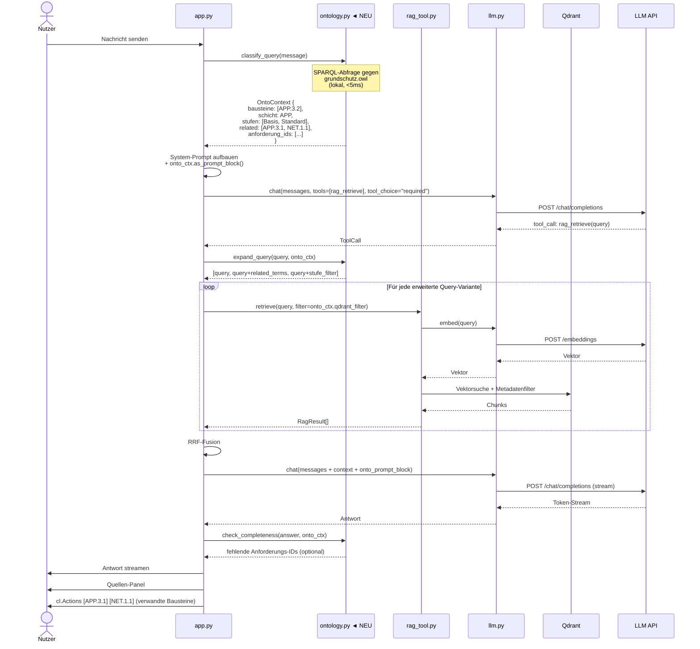

# Konzept: Integration der IT-Grundschutz-Ontologie in die Chainlit-App

> Status: Konzept / Entwurf  
> Stand: Mai 2026  
> Bezug: `grundschutz.owl` (Protégé / HermiT), `apps/chainlit/`

---

## Inhaltsverzeichnis

1. [Motivation](#motivation)
2. [Was die Ontologie leistet](#was-die-ontologie-leistet)
3. [Technische Basis](#technische-basis)
4. [Einsatzmöglichkeiten](#einsatzmöglichkeiten)
5. [Integration in den Verarbeitungsflow](#integration-in-den-verarbeitungsflow)
6. [Sequenzdiagramm mit Ontologie-Schicht](#sequenzdiagramm-mit-ontologie-schicht)
7. [Exkurs: Ontologie-Agent](#exkurs-ontologie-agent)
8. [Implementierungsempfehlung](#implementierungsempfehlung)
9. [Offene Fragen & Risiken](#offene-fragen--risiken)

---

## Motivation

Die aktuelle RAG-Pipeline behandelt jede Nutzeranfrage primär als **Ähnlichkeitsproblem**: Welche Textstellen im Vektorspeicher ähneln der Frage am stärksten? Das funktioniert gut für direkte Fragen, stößt aber an Grenzen, wenn:

- die Frage strukturelles Wissen über Grundschutz erfordert (z. B. „Was sind alle Anforderungen der Kategorie Standard für Webanwendungen?")
- der Begriff in der Frage ontologisch mehrdeutig ist (z. B. „Maßnahme" vs. „Anforderung" vs. „Empfehlung")
- verwandte Konzepte im Vektorspeicher geographisch weit verstreut liegen
- die Antwort explizit eine Klassifikation erfordert (z. B. „Ist das eine technische oder organisatorische Maßnahme?")

Die `grundschutz.owl`-Ontologie kodiert genau dieses Strukturwissen **maschinenlesbar und reasoningfähig**. Ihre Integration macht die App von einem reinen Ähnlichkeitssucher zu einem **strukturell verstehendem System**.

---

## Was die Ontologie leistet

Die Ontologie bildet u. a. folgende Konzepte und Relationen ab:

```
Sicherheitskonzept
    └── bestehtAus → Maßnahme (1..*)
            ├── beziehtSichAuf → Zielobjekt
            │       ├── PhysischesObjekt
            │       └── Informationsverbund
            ├── istTyp → TechnischeMaßnahme
            │            OrganisatorischeMaßnahme
            └── hatAnforderungsstufe → Basis
                                        Standard
                                        Erhöht

Baustein
    ├── gehörtZuSchicht → ISMS | ORP | CON | OPS | DER | APP | SYS | IND | NET | INF
    ├── hatAnforderung → Anforderung (1..*)
    │       ├── hatStufe → Basis | Standard | Erhöht
    │       └── adressiertZielobjekt → Zielobjekt
    └── hatAbhängigkeit → Baustein (0..*)
```

Dieses Wissen ist im Vektorspeicher **implizit** vorhanden, aber nicht direkt abfragbar. Die Ontologie macht es **explizit und inferierbar**.

---

## Technische Basis

### Python-Bibliotheken

| Bibliothek | Stärken | Einsatz |
|---|---|---|
| **`rdflib`** | Leichtgewichtig, SPARQL-Unterstützung, OWL-Parsing | Empfohlen für strukturierte Abfragen |
| **`owlready2`** | Python-native OWL-API, HermiT-Reasoning via Java | Wenn Inferenz (Klassifikation, Konsistenzprüfung) benötigt wird |
| **`owlrl`** | Reiner Python-Reasoner (RDFS/OWL-RL) | Ohne Java-Dependency |

### Empfohlener Stack für dieses Projekt

```
grundschutz.owl (Protégé-Export)
        │
        ▼
owlready2 + rdflib
        │
        ├── SPARQL-Abfragen (strukturell, deterministisch)
        └── Reasoning on demand (HermiT / owlrl)
```

### Laden der Ontologie

```python
# ontology.py
from owlready2 import get_ontology, sync_reasoner_pellet
from rdflib import Graph, Namespace, URIRef
from functools import lru_cache

ONTO_PATH = "data/grundschutz.owl"

@lru_cache(maxsize=1)
def load_ontology():
    onto = get_ontology(f"file://{ONTO_PATH}").load()
    return onto

@lru_cache(maxsize=1)
def load_graph() -> Graph:
    g = Graph()
    g.parse(ONTO_PATH, format="xml")
    return g
```

Die Ontologie wird einmalig beim App-Start geladen (`@cl.on_app_startup`) und gecacht — kein Latenzproblem im Request-Pfad.

---

## Einsatzmöglichkeiten

### 1. Query-Klassifikation und -Expansion

**Problem:** Der Nutzer fragt „Wie sichere ich meinen Webserver ab?" — ein breites Thema. Der RAG-Query ist flach und findet nur direkt ähnliche Chunks.

**Ontologie-Funktion:** Vor dem Retrieval wird die Frage ontologisch eingeordnet:
- Erkannte Klasse: `Baustein → APP → APP.3.2 Webserver`
- Übergeordnet: `Schicht APP (Anwendungen)`
- Abhängige Bausteine: `APP.3.1 Webanwendungen`, `NET.1.1 Netzarchitektur`
- Relevante Anforderungsstufen: Basis, Standard, Erhöht

Der RAG-Query wird um diese Terme erweitert → breiterer, strukturierter Treffer.

```python
def expand_query_with_ontology(query: str, onto_graph: Graph) -> list[str]:
    # 1. Erkennte Bausteine in der Frage (regex + SPARQL-lookup)
    # 2. Hole verwandte Bausteine via hasAbhängigkeit
    # 3. Hole Anforderungsstufen
    # → Gibt erweiterte Query-Varianten zurück
```

---

### 2. Strukturkontext im System-Prompt

**Problem:** Das LLM antwortet korrekt, aber ohne Einordnung in den Grundschutz-Kontext (z. B. ob eine Maßnahme Basis- oder Erhöht-Anforderung ist).

**Ontologie-Funktion:** Ein kurzer Ontologie-Kontext-Block wird in den System-Prompt injiziert:

```
## STRUKTURKONTEXT (Ontologie)
Die Frage betrifft Baustein APP.3.2 (Webserver).
Schicht: Anwendungen (APP)
Anforderungen nach Stufe:
  - Basis: APP.3.2.A1, APP.3.2.A2, APP.3.2.A3
  - Standard: APP.3.2.A4–A8
  - Erhöht: APP.3.2.A9–A11
Zielobjekt-Typ: Physisches IT-System
Abhängige Bausteine: APP.3.1, NET.1.1, SYS.1.1
```

Das LLM kann diese Struktur in die Antwort einweben, ohne sie aus Chunks rekonstruieren zu müssen.

---

### 3. Anforderungsstufen-Filter im Retrieval

**Problem:** Ein Nutzer fragt explizit nach Standard-Anforderungen. Der Vektorspeicher hat alle Stufen gemischt.

**Ontologie-Funktion:** SPARQL-Abfrage liefert exakte Anforderungs-IDs je Stufe → werden als Qdrant-Filter übergeben.

```sparql
PREFIX gs: <http://grundschutz.bsi.de/ontology#>
SELECT ?anforderung WHERE {
  ?anforderung a gs:Anforderung ;
               gs:hatStufe gs:Standard ;
               gs:gehoertZuBaustein gs:APP_3_2 .
}
```

```python
# In rag_tool.py
async def retrieve_by_anforderungsstufe(query, baustein_id, stufe):
    anforderung_ids = sparql_get_anforderungen(baustein_id, stufe)
    filter = {"anforderung_id": {"$in": anforderung_ids}}
    return await retrieve(query, filter=filter)
```

---

### 4. Antwort-Anreicherung: Vollständigkeitsprüfung

**Problem:** Das LLM nennt drei von sieben Standard-Anforderungen — die Antwort ist unvollständig, ohne dass das auffällt.

**Ontologie-Funktion:** Post-Processing-Schritt prüft, ob alle ontologisch relevanten Anforderungen in der Antwort adressiert wurden, und ergänzt einen Hinweis:

```
[Hinweis: Für Baustein APP.3.2 existieren 4 weitere Standard-Anforderungen
(APP.3.2.A5–A8), die in dieser Antwort nicht behandelt wurden.]
```

---

### 5. Begriffsklärung / Disambiguierung

**Problem:** Nutzer verwenden Begriffe unscharf. „Maßnahme" kann `Anforderung`, `Empfehlung` oder eine konkrete Umsetzungsmaßnahme meinen.

**Ontologie-Funktion:** Bei erkannter Ambiguität liefert die Ontologie eine Klärung:

```
[Begriffsklärung: Im IT-Grundschutz unterscheidet man:
- Anforderung (normativ, BSI-vorgegeben)
- Maßnahme (implementierungsspezifisch, aus Gefährdungskatalog)
- Empfehlung (informativ)
Ihre Frage bezieht sich vermutlich auf: Anforderung]
```

---

### 6. Navigationshilfe / Verwandte Themen

**Problem:** Nach einer Antwort zu APP.3.2 weiß der Nutzer nicht, was logisch als Nächstes relevant wäre.

**Ontologie-Funktion:** Automatisch generierte „Verwandte Themen"-Liste aus Ontologie-Traversal, als Chainlit-Action-Buttons:

```
Verwandte Bausteine:
  [APP.3.1 Webanwendungen]  [NET.1.1 Netzarchitektur]  [SYS.1.1 Allgemeiner Server]
```

---

## Integration in den Verarbeitungsflow

### Einordnung in den bestehenden Flow

```
Nutzer-Nachricht
       │
       ▼
① [ONTOLOGIE] Query-Klassifikation
   - Erkannte Bausteine, Schichten, Stufen
   - Ontologie-Kontext-Block erstellen
       │
       ▼
② System-Prompt aufbauen
   + Rollenkontext (chat_profiles.json)
   + Personalisierung (user_profile.py)
   + Strukturkontext (Ontologie) ◄── NEU
       │
       ▼
③ LLM: tool_choice="required" → rag_retrieve
       │
       ▼
④ [ONTOLOGIE] Query-Expansion         ◄── NEU
   - Verwandte Bausteine hinzufügen
   - Anforderungs-IDs für gefilterte Suche
       │
       ▼
⑤ Qdrant-Retrieval (ggf. mit Ontologie-Filter)
       │
       ▼
⑥ RRF-Fusion & Deduplizierung
       │
       ▼
⑦ LLM: Antwort generieren (mit Strukturkontext im Prompt)
       │
       ▼
⑧ [ONTOLOGIE] Vollständigkeitsprüfung ◄── NEU (optional)
   - Fehlende Anforderungen detektieren
   - Hinweis-Block ergänzen
       │
       ▼
⑨ Zitationen kanonisieren + Quellen-Panel
       │
       ▼
⑩ Antwort + ggf. „Verwandte Themen"-Actions ◄── NEU
```

### Aufruforte im Code (app.py)

| Stelle im Code | Neuer Aufruf | Zweck |
|---|---|---|
| `on_chat_start` | `onto = load_ontology()` | Einmalig laden, in `cl.user_session` speichern |
| Vor System-Prompt-Aufbau | `onto_ctx = classify_query(user_message)` | Strukturkontext erzeugen |
| System-Prompt | `prompt += onto_ctx.as_prompt_block()` | Kontext injizieren |
| Vor `retrieve()` | `extra_queries = expand_query(query, onto_ctx)` | Query-Varianten erweitern |
| Nach Antwort-Generierung | `completeness = check_completeness(answer, onto_ctx)` | Vollständigkeitsprüfung |
| Nach Antwort-Rendering | `cl.Action` Buttons aus `onto_ctx.related_bausteine` | Navigations-Actions |

---

## Sequenzdiagramm mit Ontologie-Schicht



---

## Exkurs: Ontologie-Agent

Du hattest einen dedizierten **Ontologie-Agenten** erwogen. Das ist ein legitimer Ansatz — er hat aber andere Trade-offs als die oben beschriebene direkte Integration.

### Was ein Ontologie-Agent leisten würde

Ein eigenständiger Agent würde eine oder mehrere der folgenden Aufgaben übernehmen:

```
Nutzer-Frage
     │
     ▼
[Ontologie-Agent]
  ├── Tool: sparql_query(query)      → SPARQL gegen grundschutz.owl
  ├── Tool: get_related(baustein_id) → Verwandte Konzepte
  ├── Tool: classify_requirement(text) → Welche Stufe / Typ?
  └── Tool: validate_answer(text)    → Vollständigkeitsprüfung
     │
     ▼
Strukturiertes Ergebnis an Haupt-Agent
```

### Vergleich: Direkte Integration vs. Ontologie-Agent

| Kriterium | Direkte Integration | Ontologie-Agent |
|---|---|---|
| **Latenz** | Gering (SPARQL lokal, <10ms) | Höher (extra LLM-Runde) |
| **Kontrolle** | Deterministisch, immer aktiv | LLM entscheidet, ob Agent nötig |
| **Flexibilität** | Nur vordefinierte Abfragen | Agent kann neue Fragen formulieren |
| **Komplexität** | Überschaubar | Mehr moving parts |
| **Fehleranfälligkeit** | Niedrig | LLM kann Agent falsch einsetzen |
| **Reasoning** | Kein LLM-Reasoning über Ontologie | Agent kann Ontologieergebnisse interpretieren |

### Wann ein Ontologie-Agent sinnvoll ist

Ein dedizierter Agent lohnt sich, wenn:

1. **Die Ontologie sehr komplex ist** und natürlichsprachige Abfragen gegen sie gestellt werden sollen, die nicht auf vordefinierte SPARQL-Queries passen
2. **Mehrstufiges Reasoning nötig ist**: z. B. „Welche Bausteine sind für ein Krankenhaus mit erhöhtem Schutzbedarf verpflichtend, die wir noch nicht umgesetzt haben?" — das erfordert Iteration über die Ontologie
3. **Die Ontologie als eigenständige Wissensquelle** neben dem RAG genutzt werden soll, nicht nur als Kontext-Anreicherung

### Empfehlung zur Agenten-Architektur

Falls ein Agent-Ansatz verfolgt wird, empfiehlt sich ein **Tool-basierter Ansatz** innerhalb des bestehenden Tool-Call-Loops:

```python
TOOLS = [
    {
        "name": "rag_retrieve",           # bestehend
        "description": "...",
    },
    {
        "name": "ontology_lookup",        # NEU
        "description": "Gibt strukturelles Wissen aus der IT-Grundschutz-Ontologie zurück: "
                       "Bausteine, Anforderungsstufen, Abhängigkeiten, Maßnahmentypen.",
        "parameters": {
            "type": "object",
            "properties": {
                "concept": {"type": "string", "description": "Baustein-ID oder Konzept"},
                "relation": {"type": "string", "enum": ["related", "requirements", "dependencies", "classify"]}
            }
        }
    }
]
```

Das LLM entscheidet dann selbst, wann es `ontology_lookup` vs. `rag_retrieve` aufruft — oder beide kombiniert. Der bestehende Tool-Call-Loop in `app.py` (bis zu 12 Runden) unterstützt das ohne Architekturänderung.

---

## Implementierungsempfehlung

### Vorschlag: Stufenweise Einführung

#### Stufe 1 — Leichtgewichtig, sofort umsetzbar

- Neue Datei: `ontology.py` mit `load_graph()` und `classify_query()`
- SPARQL-Abfragen für: Baustein-Erkennung, Anforderungsstufen, verwandte Bausteine
- Integration in `app.py`: Strukturkontext in System-Prompt + Verwandte-Bausteine-Actions
- **Aufwand:** ~2–3 Tage | **Nutzen:** Sofort messbar (bessere Strukturierung der Antworten)

#### Stufe 2 — Retrieval-Verbesserung

- Query-Expansion mit ontologisch verwandten Termen
- Anforderungsstufen-gefiltertes Retrieval (Qdrant-Filter aus SPARQL-Ergebnis)
- **Aufwand:** ~2 Tage | **Nutzen:** Präzisere Chunk-Auswahl bei Stufenfragen

#### Stufe 3 — Vollständigkeitsprüfung + Agent (optional)

- Post-Processing: Fehlende Anforderungen detektieren
- `ontology_lookup` als LLM-Tool registrieren
- **Aufwand:** ~3–4 Tage | **Nutzen:** Qualitätssicherung der Antworten

### Neue Datei: `ontology.py`

```python
# ontology.py — Skizze

from rdflib import Graph, Namespace
from functools import lru_cache
from dataclasses import dataclass, field

GS = Namespace("http://grundschutz.bsi.de/ontology#")

@dataclass
class OntoContext:
    bausteine: list[str] = field(default_factory=list)
    schicht: str | None = None
    anforderungsstufen: list[str] = field(default_factory=list)
    related_bausteine: list[str] = field(default_factory=list)
    anforderung_ids: list[str] = field(default_factory=list)
    massnahmen_typ: str | None = None  # "technisch" | "organisatorisch"

    def as_prompt_block(self) -> str:
        if not self.bausteine:
            return ""
        lines = ["## STRUKTURKONTEXT (IT-Grundschutz-Ontologie)"]
        if self.bausteine:
            lines.append(f"Erkannte Bausteine: {', '.join(self.bausteine)}")
        if self.schicht:
            lines.append(f"Schicht: {self.schicht}")
        if self.anforderungsstufen:
            lines.append(f"Relevante Anforderungsstufen: {', '.join(self.anforderungsstufen)}")
        if self.related_bausteine:
            lines.append(f"Verwandte Bausteine: {', '.join(self.related_bausteine)}")
        return "\n".join(lines)

    def to_qdrant_filter(self) -> dict | None:
        if not self.anforderung_ids:
            return None
        return {"anforderung_id": {"$in": self.anforderung_ids}}


@lru_cache(maxsize=1)
def load_graph() -> Graph:
    g = Graph()
    g.parse("data/grundschutz.owl", format="xml")
    return g


def classify_query(text: str) -> OntoContext:
    g = load_graph()
    ctx = OntoContext()
    # 1. Baustein-IDs via Regex aus Text extrahieren
    # 2. SPARQL: Schicht, Stufen, Abhängigkeiten
    # 3. Rückgabe des befüllten OntoContext
    return ctx
```

---

## Offene Fragen & Risiken

| Thema | Frage / Risiko | Maßnahme |
|---|---|---|
| **OWL-Vollständigkeit** | Sind alle Bausteine und Anforderungen in der Ontologie? | Abgleich mit BSI-Quelldokumenten |
| **Versionsstand** | Grundschutz-Kompendium wird jährlich aktualisiert | Ontologie-Update-Prozess definieren |
| **Erkennungsqualität** | SPARQL findet Bausteine nur bei expliziter Nennung | Fallback auf Embedding-Similarity gegen Ontologie-Labels |
| **Latenz** | owlready2 + HermiT-Reasoning kann langsam sein | Reasoning nur on-demand; SPARQL-Abfragen für Standardfälle |
| **False Positives** | Fälschlich erkannte Bausteine verzerren den Kontext | Konfidenz-Schwellwert; nur bei hoher Sicherheit injizieren |
| **OWL-Datei-Pfad** | Wo liegt `grundschutz.owl` im Docker-Container? | Via Volume mounten, Pfad in `settings.py` konfigurierbar |
