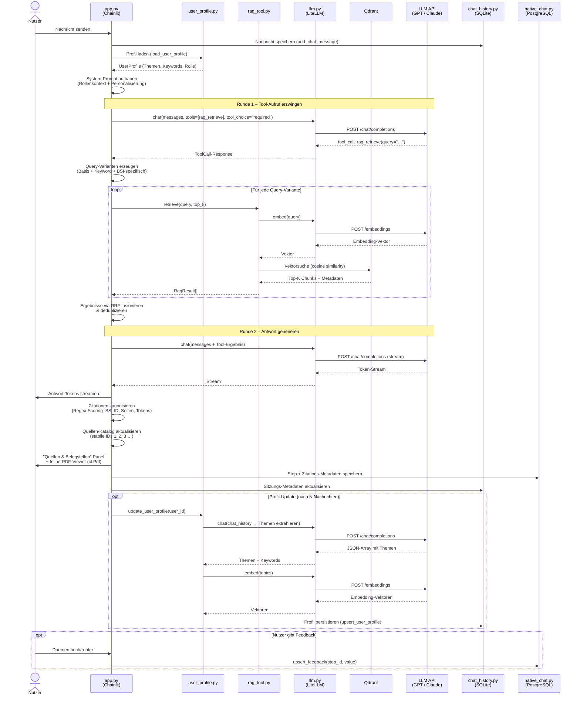

# Chainlit-App – Softwaredokumentation

> Projekt: pilotprojekt-GrundschutzKI  
> Stand: Mai 2026  
> Pfad: `apps/chainlit/`

---

## Inhaltsverzeichnis

1. [Überblick](#überblick)
2. [Architektur & Komponenten](#architektur--komponenten)
3. [Komponentenbeschreibungen](#komponentenbeschreibungen)
   - [app.py – Hauptanwendung](#apppy--hauptanwendung)
   - [settings.py – Konfiguration](#settingspy--konfiguration)
   - [llm.py – LLM-Integration](#llmpy--llm-integration)
   - [rag_tool.py – Retrieval](#rag_toolpy--retrieval)
   - [user_profile.py – Personalisierung](#user_profilepy--personalisierung)
   - [chat_history.py – SQLite-Persistenz](#chat_historypy--sqlite-persistenz)
   - [native_chat.py – PostgreSQL-Persistenz](#native_chatpy--postgresql-persistenz)
   - [ingest_docling.py – Dokumentenindexierung](#ingest_doclingpy--dokumentenindexierung)
   - [export_docling_md.py – PDF-Export mit OCR](#export_docling_mdpy--pdf-export-mit-ocr)
4. [Sequenzflussdiagramm: Nachrichtenverarbeitung](#sequenzflussdiagramm-nachrichtenverarbeitung)
5. [Konfigurationsdateien](#konfigurationsdateien)
6. [Infrastruktur & Docker](#infrastruktur--docker)
7. [Schlüsselkonzepte](#schlüsselkonzepte)

---

## Überblick

Die Chainlit-App ist eine RAG-gestützte (Retrieval-Augmented Generation) Chatanwendung für den deutschen IT-Grundschutz. Sie ermöglicht Anwenderinnen und Anwendern, Fragen zu BSI-Standards und dem IT-Grundschutz-Kompendium zu stellen und erhält kontextreiche, quellenbasierte Antworten mit zitierbaren Belegstellen.

**Kernfähigkeiten:**
- Semantische Suche über BSI-Dokumente via Qdrant-Vektordatenbank
- Rollensensitive Antwortgenerierung (Datenschutzbeauftragte, IT-Betrieb, Geschäftsführung, …)
- Nutzerindividuelle Personalisierung durch automatische Interessensprofilierung
- Interaktives Quellen-Panel mit Inline-PDF-Viewer
- Feedbacksystem mit persistenter Auswertung
- Selbstregistrierung und passwortbasierte Authentifizierung

---

## Architektur & Komponenten

```
┌─────────────────────────────────────────────────────────────────┐
│                        apps/chainlit/                           │
│                                                                 │
│  ┌──────────┐   ┌──────────┐   ┌──────────┐   ┌────────────┐  │
│  │  app.py  │──▶│  llm.py  │──▶│ LiteLLM  │──▶│  LLM API   │  │
│  │ (Chainlit│   │(LiteLLM  │   │  Proxy   │   │(GPT/Claude)│  │
│  │  Hooks)  │   │ Wrapper) │   └──────────┘   └────────────┘  │
│  └────┬─────┘   └──────────┘                                   │
│       │                                                         │
│       ├──▶ ┌──────────────┐   ┌────────────┐                   │
│       │    │ rag_tool.py  │──▶│   Qdrant   │                   │
│       │    │  (Retrieval) │   │ (Vektoren) │                   │
│       │    └──────────────┘   └────────────┘                   │
│       │                                                         │
│       ├──▶ ┌──────────────────┐                                 │
│       │    │ user_profile.py  │                                 │
│       │    │ (Personalisier.) │                                 │
│       │    └──────────────────┘                                 │
│       │                                                         │
│       ├──▶ ┌──────────────────┐   ┌──────────────────────────┐ │
│       │    │ chat_history.py  │──▶│  SQLite                  │ │
│       │    │  (Lokal)         │   │  chat_history.sqlite3    │ │
│       │    └──────────────────┘   └──────────────────────────┘ │
│       │                                                         │
│       └──▶ ┌──────────────────┐   ┌──────────────────────────┐ │
│            │ native_chat.py   │──▶│  PostgreSQL               │ │
│            │  (Chainlit-nativ)│   │  (Threads, Steps, ...)   │ │
│            └──────────────────┘   └──────────────────────────┘ │
└─────────────────────────────────────────────────────────────────┘
```

---

## Komponentenbeschreibungen

### app.py – Hauptanwendung

**Größe:** ~3450 Zeilen | **Typ:** Chainlit-Applikation

Orchestriert alle anderen Komponenten und definiert sämtliche Chainlit-Lifecycle-Hooks sowie FastAPI-Routen.

#### Lifecycle-Hooks

| Hook | Aufgabe |
|---|---|
| `@cl.on_app_startup` | DB-Schema initialisieren, FastAPI-Routen registrieren |
| `@cl.on_chat_start` | Nutzerprofil laden, System-Prompt aufbauen, Chat-Einstellungen senden |
| `@cl.on_chat_resume` | Nachrichten, Zitationen und Actions aus PostgreSQL/SQLite wiederherstellen |
| `@cl.on_message` | Haupt-Chat-Loop: RAG-Aufruf → LLM → Zitationen → Antwort |
| `@cl.on_settings_update` | Rollenwechsel, Personalisierungs-Toggle, Schlüsselwörter, Prompt-Anpassung |
| `@cl.on_feedback` | Feedback (Daumen hoch/runter) in PostgreSQL persistieren |

#### Authentifizierung

- `@cl.password_auth_callback`: Dual-Auth — PostgreSQL-Nutzer zuerst, Fallback auf `.env`-Credentials
- `POST /auth/register`: Selbstregistrierung mit bcrypt-Passwort-Hashing und Eingabevalidierung

#### Chat-Profile (Rollenbasiert)

Geladen aus `chat_profiles.json`. Jedes Profil trägt einen `prompt_context` zum System-Prompt bei:

```
## ROLLENKONTEXT
Du antwortest einer Person in der Rolle Datenschutzbeauftragte/r …
```

Das gewählte Profil wird pro Nutzer in SQLite persistiert und über Chat-Einstellungen umschaltbar.

#### Slash-Kommandos

| Kommando | Funktion |
|---|---|
| `/history` | Gespeicherte Chat-Sitzungen auflisten |
| `/export` | Chats als JSON/JSONL exportieren |
| `/keywords` | Personalisierungsschlüsselwörter verwalten |
| `/prompt` | System-Prompt anzeigen, zurücksetzen oder anpassen |
| `/help` | Alle verfügbaren Kommandos anzeigen |

#### Zitationsverwaltung

- **Quellen-Katalog:** Sitzungsübergreifende Deduplizierung mit stabilen numerischen IDs (1, 2, 3 …)
- **Zitations-Kanonisierer:** Mehrstufiger Regex-Abgleich mit Scoring zur Zuordnung von LLM-generierten Zitaten zu tatsächlichen Quellen
  - Seiten-Übereinstimmung: +3 Punkte
  - BSI-ID-Übereinstimmung: +4 Punkte
  - Abschnittstokens: +2 Punkte
- **Inline-PDF-Viewer:** `cl.Pdf(display="side")` für Seitenansicht
- **Zitationsverlauf:** Akkumulierter Quellen-Log über alle Antworten der Sitzung

#### FastAPI-Routen (dynamisch registriert)

| Route | Methode | Funktion |
|---|---|---|
| `/sources/pdf/{file_name}` | GET | Authentifizierter PDF-Abruf |
| `/sources/citations/{step_id}` | GET | Zitationsblock aus PostgreSQL-Step-Metadaten |
| `/export/all-chats` | GET | Alle Chats als ZIP (nutzergefiltert) |
| `/export/feedback` | GET | Feedback-CSV (nur Admin) |
| `/auth/register` | POST | Selbstregistrierung |

---

### settings.py – Konfiguration

Lädt alle Einstellungen aus `.env` mit definierten Standardwerten:

| Variable | Standard | Bedeutung |
|---|---|---|
| `LITELLM_BASE_URL` | — | LiteLLM-Proxy-Endpunkt |
| `LITELLM_API_KEY` | — | Authentifizierungstoken |
| `CHAT_MODEL` | `gpt-4o-mini` | Sprachmodell für Chat |
| `EMBED_MODEL` | `text-embedding-3-large` | Modell für Embeddings |
| `QDRANT_URL` | `http://localhost:6333` | Qdrant-Instanz |
| `QDRANT_COLLECTION` | `grundschutz` | Kollektion im Qdrant |
| `TOP_K` | `5` | Anzahl abgerufener Chunks |
| `MAX_SOURCE_LINKS` | `8` | Max. Quellen pro Antwort |
| `PERSONALIZATION_ENABLED` | `true` | Personalisierung aktiv |
| `PROFILE_MIN_MESSAGES` | `5` | Min. Nachrichten vor Profil-Extraktion |
| `PROFILE_TOPIC_LIMIT` | `8` | Max. extrahierte Themen |
| `DATABASE_URL` | — | PostgreSQL-Verbindungsstring |

---

### llm.py – LLM-Integration

Schlanker Wrapper um **LiteLLM** für Multi-Modell-Unterstützung.

```python
async def chat(messages, tools=None, tool_choice="auto", model=None)
    # → litellm.acompletion()

async def stream_chat(messages, tools=None, tool_choice=None)
    # Streaming-Variante

async def embed(texts: list[str]) -> list[list[float]]
    # Batch-Embedding via litellm.aembedding()

def message_to_dict(message) -> dict
    # Serialisiert tool_calls für Persistenz
```

Über den LiteLLM-Proxy lassen sich OpenAI-kompatible Modelle, Azure, Anthropic Claude u.a. einheitlich ansprechen, ohne App-seitigen Code zu ändern.

---

### rag_tool.py – Retrieval

Implementiert die semantische Suche gegen den Qdrant-Vektorspeicher.

#### Kernfunktionen

**`retrieve(query, top_k, source_scope, standard_id)`**
1. Query-Text via `llm.embed()` einbetten
2. Qdrant-Vektorsuche (optional gefiltert nach `source_scope`/`standard_id`)
3. Fallback auf ungefilterte Suche, wenn keine Ergebnisse
4. Rückgabe: `RagResult(text, score, metadata)[]`

**`personalized_retrieve(query, user_profile, balance, ...)`**
Wrapper um `retrieve()`. Personalisierung wirkt ausschließlich auf den System-Prompt, nicht auf den Chunk-Filter.

**`build_context(results)`** → Markdown-Kontextblock für Tool-Response

**`format_citations(results)`** → Formatierte Zitationsliste mit Autor/Jahr/Titel/Seiten

#### Metadaten-Extraktion

- `extract_source_file(payload)`: Kanonische PDF-Dateinamen-Auflösung (inkl. Alias-Handling für IT-Grundschutz-Kompendium)
- `extract_page(payload)`: Seiten-Range aus Metadaten (`page_start`/`page_end`)
- Grundschutz-spezifische Felder: `baustein`, `baustein_titel`, `anforderung_id`

---

### user_profile.py – Personalisierung

Verwaltet das lernende Nutzerprofil.

#### UserProfile-Datenstruktur

```python
@dataclass
class UserProfile:
    user_id: str
    topics: list[str]                    # Extrahierte Interessensgebiete
    topic_embeddings: list[list[float]]  # Embedding-Vektoren der Themen
    keywords: list[dict]                 # {value, active, source}
    message_count: int
    custom_prompt: str | None
    personalization_enabled: bool
```

#### Workflow der Profil-Aktualisierung

1. Nach `PROFILE_MIN_MESSAGES` Nachrichten: `extract_user_topics()` aufrufen
2. LLM analysiert Chat-Verlauf → JSON-Array mit Themen und Schlüsselwörtern
3. Themen werden eingebettet und in SQLite persistiert
4. Bei nächster Anfrage: Themen in `## PERSONALISIERTER KONTEXT` des System-Prompts injiziert

**Wichtig:** Schlüsselwörter dienen ausschließlich der Prompt-Anreicherung, nicht der Vektorsuche-Filterung.

---

### chat_history.py – SQLite-Persistenz

Lokale Persistenz von Chat-Verläufen und Nutzerprofilen.

#### Datenbank-Schema

```sql
chat_sessions    (id, title, user_id, metadata_json, created_at, updated_at)
chat_messages    (id, session_id, role, content, metadata_json, created_at)
user_profiles    (user_id, topics_json, topic_embeddings_json, keywords_json,
                  selected_chat_profile, custom_prompt, personalization_enabled, …)
```

#### Schlüsselfunktionen

| Funktion | Aufgabe |
|---|---|
| `init_chat_db()` | Idempotente Schema-Erstellung inkl. Migrationen |
| `create_chat_session()` / `add_chat_message()` | Sitzungs- und Nachrichtenverwaltung |
| `export_session_openai_json()` | Export im OpenAI-Chat-Format |
| `export_all_sessions_openai_jsonl()` | Bulk-Export als JSONL |
| `upsert_user_profile()` / `get_user_profile()` | Profil-Persistenz |
| `set_session_title_if_missing()` | Auto-Titelgenerierung aus erstem Satz |

---

### native_chat.py – PostgreSQL-Persistenz

Verwaltet Chainlits nativen Persistenz-Layer.

#### Datenbank-Objekte (PostgreSQL)

| Tabelle | Inhalt |
|---|---|
| `User` | Registrierte Nutzer (id, identifier, password_hash) |
| `Thread` | Chat-Sitzungen (für Seitenleiste) |
| `Step` | Einzelne Nachrichten / Tool-Calls |
| `Element` | Angehängte Elemente (PDFs, Bilder) |
| `Feedback` | Bewertungen pro Step |

#### Schlüsselfunktionen

- `ensure_native_schema()` — Schema-Erstellung mit idempotenten Migrationen
- `create_user()` / `get_user_by_identifier()` — Nutzerverwaltung
- `upsert_feedback()` / `export_feedback_csv()` — Feedback-Verwaltung und -Export
- `export_all_chats_zip()` — Alle Threads + Elemente als ZIP-Archiv

---

### ingest_docling.py – Dokumentenindexierung

Einmalig ausgeführte Pipeline zur Befüllung der Qdrant-Kollektion.

#### Ablauf

```
Docling-JSON-Dateien
        │
        ▼
Seiten + Metadaten extrahieren
(baustein, module, Seitenzahlen, Abschnittstitel)
        │
        ▼
Chunking (max. 3000 Zeichen, 300 Zeichen Überlapp)
        │
        ▼
Embedding via LiteLLM
        │
        ▼
Upsert in Qdrant (UUID5-IDs, COSINE-Distanz)
```

**Metadaten-Payload je Chunk:**
```json
{
  "text": "Chunk-Inhalt",
  "source": "standard_200_1.json",
  "baustein": "APP.3.2",
  "baustein_titel": "Webserver",
  "anforderung_id": "APP.3.2.A5",
  "page_start": 42,
  "page_end": 45,
  "section_title": "Maßnahmen"
}
```

---

### export_docling_md.py – PDF-Export mit OCR

Vorverarbeitungs-Skript: Konvertiert Roh-PDFs in Docling-JSON mit OCR-Unterstützung.

```bash
python export_docling_md.py \
  --pdf-dir ../../data/data_raw \
  --out-dir ../../data/data_docling_json_ocr \
  --format json \
  --ocr --ocr-engine tesseract \
  --ocr-lang eng deu \
  --skip-existing
```

Enthält OCR-spezifische Umlauts-/Encoding-Korrekturen für deutschsprachige Dokumente.

---

## Sequenzflussdiagramm: Nachrichtenverarbeitung

Das folgende Diagramm zeigt den vollständigen Ablauf einer Nutzeranfrage vom Eingang bis zur Antwort mit Quellennachweisen.



---

## Konfigurationsdateien

### `.chainlit/config.toml`

| Abschnitt | Einstellung | Wert |
|---|---|---|
| `[project]` | `session_timeout` | 3600 s |
| `[project]` | `user_session_timeout` | 15 Tage |
| `[features]` | `multi_modal` | `true` |
| `[features]` | `audio.enabled` | `false` |
| `[features]` | `mcp` | `false` |
| `[UI]` | `custom_css` / `custom_js` | `/public/custom.css` / `.js` |

### `chat_profiles.json`

Definiert die verfügbaren Rollen-Profile. Jeder Eintrag enthält:

```json
{
  "id": "rolle_id",
  "name": "Anzeigename",
  "icon": "/public/icons/shield.svg",
  "description": "Kurzbeschreibung",
  "relevant_bausteine": ["ISMS", "ORP"],
  "prompt_context": "Du antwortest einer Person in der Rolle …"
}
```

---

## Infrastruktur & Docker

### Services in `docker-compose.yml`

| Service | Image | Funktion |
|---|---|---|
| `postgres` | `postgres:16-alpine` | Chainlit-native Persistenz (Threads, Feedback) |
| `qdrant` | `qdrant/qdrant:latest` | Vektordatenbank für Embeddings |
| `chainlit` | Dockerfile (eigener Build) | Hauptanwendung, Port 8000 |
| `ingest` | Dockerfile (One-Shot) | Befüllt Qdrant vor App-Start |
| `langflow` | `langflowai/langflow` | Optionaler Agent-Workflow-Editor, Port 7860 |

### Start-Reihenfolge

```
qdrant (healthy)
    │
    ├──▶ ingest (One-Shot, überspringt bei vorhandener Kollektion)
    │         │
    └──────────┴──▶ postgres (healthy)
                          │
                          └──▶ chainlit (Port 8000)
```

### Hilfreiche Make-Kommandos

```bash
make up        # Alle Services starten
make logs      # Log-Output verfolgen
make reingest  # Qdrant-Kollektion neu aufbauen (INGEST_RECREATE=true)
```

---

## Schlüsselkonzepte

### Duale Persistenz

| Datenbank | Inhalt |
|---|---|
| **SQLite** | Lokale Chat-Verläufe, Nutzerprofile, Export-Caches |
| **PostgreSQL** | Chainlit-native Threads, Steps, Feedback, Nutzkonten |

### Tool-Call-Loop mit Sicherheitsgrenze

Das LLM wird mit `tool_choice="required"` aufgerufen, um einen RAG-Aufruf zu erzwingen. Der Loop läuft bis zu **12 Runden** (konfigurierbar). Bei Überschreitung erzwingt die App eine Abschluss-Antwort.

### Query-Varianten & Reciprocal Rank Fusion (RRF)

Für jede Anfrage werden drei Query-Varianten gebaut:
1. **Basis** — direkte Nutzerfrage
2. **Keyword-angereichert** — mit Personalisierungs-Keywords
3. **BSI-Standard-spezifisch** — mit Baustein-/Norm-Kontext

Ergebnisse werden via **RRF** fusioniert und dedupliziert, was robusteres Retrieval bei schwachen Signalen liefert.

### Zitations-Kanonisierer

LLM-generierte Zitate wie `Quelle APP.3.2 (S.42)` oder `Quelle 3: …` werden mehrstufig einem registrierten Quellen-Eintrag zugeordnet. Das verhindert Fehlzuweisungen bei Quellen mit überlappenden Seitenbereichen.

### Rollenkontext + Personalisierung

Beide Kontextebenen werden zur Laufzeit in den System-Prompt injiziert:

```
## ROLLENKONTEXT
[Aus chat_profiles.json – user-selected]

## PERSONALISIERTER KONTEXT
[Aus user_profile.py – automatisch extrahiert]
```

Nutzer können über `/prompt` einen eigenen Prompt-Anhang definieren, der beide überschreibt.
