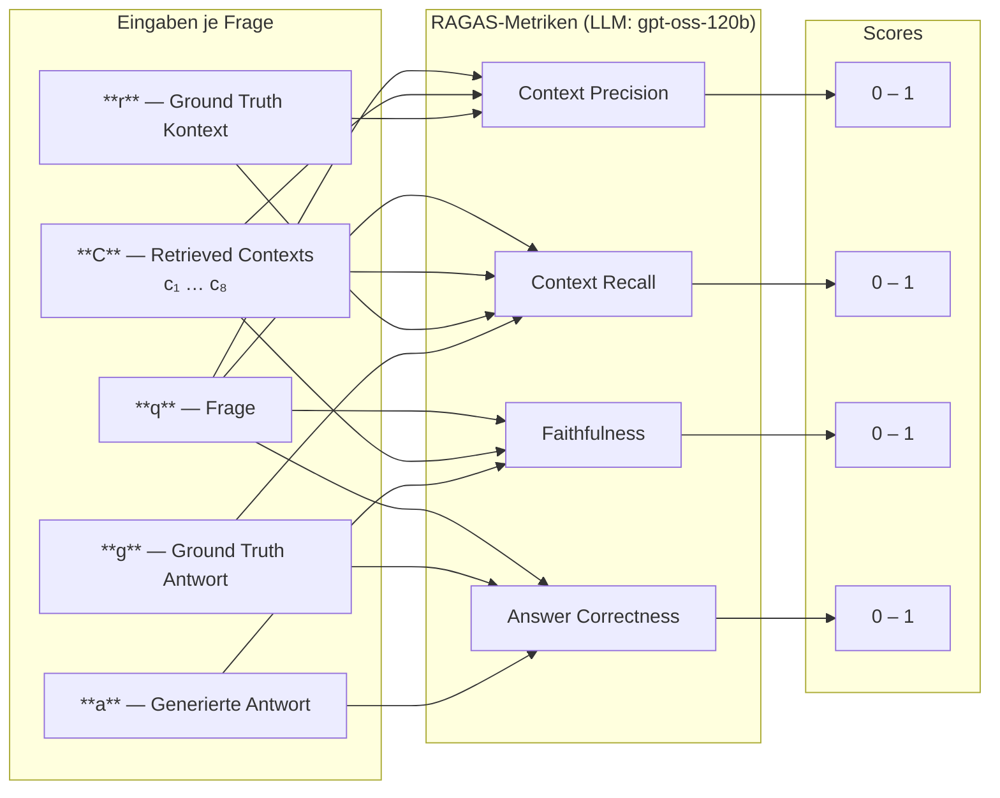
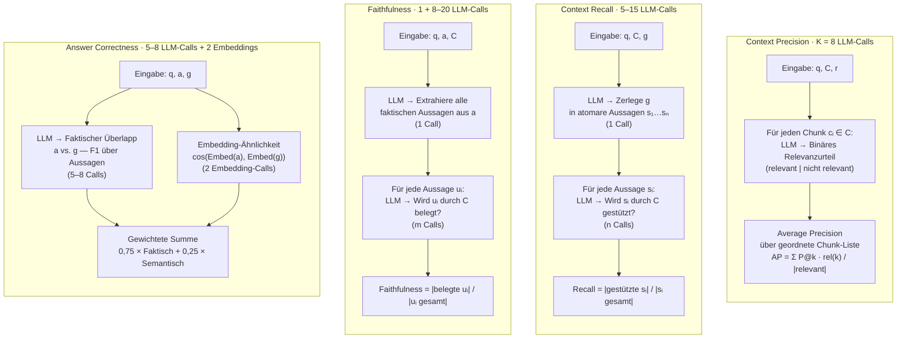
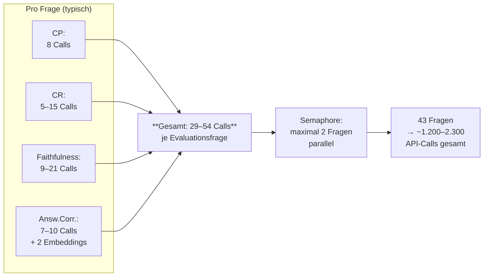

# Evaluation des RAG-Systems GrundschutzKI

## 1. Gesamtansatz der Evaluation

Die Evaluation verfolgt einen **vergleichenden Ansatz**: Mehrere Large Language Models werden unter identischen Retrieval-Bedingungen auf zwei Frage-Datensätzen unterschiedlicher Komplexität gegenübergestellt. Ziel ist es, die Abhängigkeit der Antwortqualität vom eingesetzten LLM empirisch zu quantifizieren und Schwellenwerte für den produktiven Einsatz zu identifizieren.

### 1.1 Evaluationsmatrix

| | 123 Einfache Fragen | 43 Komplexe Fragen |
|---|:---:|:---:|
| **GPT-OSS-120B** | ✓ durchgeführt | ✓ durchgeführt |
| **Llama 3.3 70B Instruct** | ✓ durchgeführt | ✓ durchgeführt |
| **Mistral Small 3.1 24B** | ✓ durchgeführt | ✓ durchgeführt |
| **Llama 3.1 8B Instruct** | ✓ durchgeführt | ✓ durchgeführt |

Alle Modelle sind über den IONOS AI Model Hub verfügbar und werden mit identischer Systemkonfiguration (Embedding-Modell, Chunk-Parameter, Top-K, Temperatur, System-Prompt) betrieben, sodass die Modelleigenschaften als alleinige unabhängige Variable verbleiben.

### 1.2 Datensätze

**123 Einfache Fragen** (*GSKI_Fragen-Antworten-Fundstellen_123_Einfach*): Fragen, die sich auf einzelne, klar abgegrenzte Anforderungen oder Bausteine des IT-Grundschutz-Kompendiums beziehen. Sie testen die Grundfähigkeit des Systems, spezifische normative Aussagen korrekt zu retrievieren und wiederzugeben.

**43 Komplexe Fragen** (*GSKI_Fragen-Antworten-Fundstellen_43_Komplex*): Fragen mit Querschnittscharakter, die mehrere Bausteine gleichzeitig betreffen oder eine übergreifende Syntheseleistung erfordern. Sie prüfen, ob das System auch bei mehrdimensionalen Anfragen kohärente und belegte Antworten erzeugt.

Die Kombination beider Datensätze ermöglicht eine differenzierte Aussage darüber, bei welcher Fragestruktur welches Modell am stärksten profitiert oder am deutlichsten versagt.

### 1.3 Modelle im Vergleich

| Modell | Parameter | Typ |
|---|---|---|
| `openai/gpt-oss-120b` | ~120 Mrd. | proprietär (IONOS) |
| `meta-llama/Llama-3.3-70B-Instruct` | 70 Mrd. | open-weight (Meta) |
| `mistralai/Mistral-Small-3.1-24B-Instruct` | 24 Mrd. | open-weight (Mistral AI) |
| `meta-llama/Llama-3.1-8B-Instruct` | 8 Mrd. | open-weight (Meta) |

Der Größenunterschied (8–120 Mrd. Parameter) erlaubt eine Einschätzung des Verhältnisses von Modellkapazität zu RAG-Qualität: Insbesondere die Frage, ab welcher Modellgröße Faithfulness und Answer Correctness in einem für den produktiven Einsatz ausreichenden Bereich liegen, ist für die Betriebsökonomie relevant.

---

## 2. Evaluationsgegenstand (RAG-System)

Gegenstand der Evaluation ist das RAG-System *GrundschutzKI*, das auf Basis des IT-Grundschutz-Kompendiums des BSI (Edition 2023) Fragen zur Informationssicherheit beantwortet. Das System kombiniert eine Vektordatenbank (Qdrant) mit einem Large Language Model (LLM) nach dem Retrieval-Augmented Generation-Paradigma: Nutzerfragen werden semantisch in der Vektordatenbank verortet, relevante Textabschnitte (*Chunks*) werden abgerufen und dem LLM als Kontext für die Antwortgenerierung übergeben.

Zwei Aspekte werden separat bewertet: (1) die Qualität der generierten Hauptantworten anhand etablierter RAG-Metriken und (2) die Qualität der systemseitig erzeugten Anschlussfragen mittels eines LLM-as-Judge-Ansatzes.

---

## 3. Evaluationsdatensätze (Detail)

Die Evaluation basiert auf einem manuell erstellten Datensatz von **43 komplexen Fragen** (*GSKI_Fragen-Antworten-Fundstellen_43_Komplex*), der Fragestellungen abdeckt, die mehrere IT-Grundschutz-Bausteine gleichzeitig betreffen oder eine übergreifende Sachkenntnis erfordern. Jede Frage ist mit einer manuell annotierten Ground-Truth-Antwort sowie den zugehörigen Fundstellen im Kompendium versehen.

Die Referenzantworten wurden mit dem Skript `regenerate_ground_truth_answers.py` am aktuellen System-Prompt (`system.md`) ausgerichtet, sodass Ground Truth und generierte Antworten strukturell vergleichbar sind. Als Generierungsmodell wurde `meta-llama/Llama-3.3-70B-Instruct` bei einer Temperatur von 0,0 eingesetzt.

---

## 4. Systemkonfiguration

| Parameter | Wert |
|---|---|
| LLM (Antwortgenerierung) | `openai/gpt-oss-120b` (IONOS AI Model Hub) |
| Embedding-Modell | `BAAI/bge-m3` (1024 Dimensionen) |
| Vektordatenbank | Qdrant, Collection `grundschutz_bge_m3` |
| Chunk-Größe / Überlappung | 4.000 Zeichen / 200 Zeichen |
| Top-K (abgerufene Chunks) | 8 |
| Score-Schwellwert | 0,3 (Kosinus-Ähnlichkeit) |
| Temperatur | 0,0 |
| System-Prompt | `system.md` (Branch `feature/lightweight-upload`) |

---

## 5. Evaluationsmethodik

### 5.1 RAGAS-Metriken

Die Hauptantworten werden mit dem Framework RAGAS (*Retrieval-Augmented Generation Assessment*) bewertet, das vier komplementäre Metriken definiert [Shahul et al., 2023]:

**Context Precision** misst den Anteil der tatsächlich relevanten Chunks an allen abgerufenen Chunks. Eine hohe Precision zeigt an, dass das Retrieval präzise arbeitet und keinen thematisch unpassenden Kontext einschließt.

**Context Recall** misst, welcher Anteil der in der Ground-Truth-Antwort referenzierten Informationen durch das Retrieval tatsächlich abgedeckt wird. Ein niedriger Recall deutet darauf hin, dass relevante Kompendiums-Abschnitte nicht gefunden werden.

**Faithfulness** bewertet, ob jede inhaltliche Aussage der generierten Antwort durch den abgerufenen Kontext belegt werden kann. Diese Metrik ist für ein Auskunftssystem zu normativen Anforderungen (IT-Grundschutz) besonders relevant, da unbelegte Aussagen als Halluzinationen zu werten sind.

**Answer Correctness** vergleicht die generierte Antwort inhaltlich mit der Ground-Truth-Antwort und misst die semantische Übereinstimmung. Die Metrik kombiniert faktische Korrektheit mit sprachlicher Ähnlichkeit.

Alle vier Metriken nutzen das LLM `gpt-oss-120b` als internen Bewerter und werden auf einer Skala von 0 bis 1 ausgegeben. Die Berechnung erfolgt asynchron mit einer maximalen Parallelität von 2 gleichzeitigen Bewertungsaufgaben, gesteuert durch einen asyncio-Semaphor.

**Methodische Einschränkung: Self-Evaluation-Bias.** `gpt-oss-120b` ist in der vorliegenden Evaluationsreihe zugleich eines der vier *bewerteten* Modelle. Da dasselbe Modell sowohl Antworten generiert als auch die RAGAS-Metriken berechnet, besteht das Risiko eines systematischen Self-Evaluation-Bias: LLM-basierte Evaluatoren neigen dazu, Ausgaben zu bevorzugen, die ihrem eigenen Generierungsstil — hinsichtlich Struktur, Formulierung und impliziter Inferenzpräferenzen — ähneln [Panickssery et al., 2024]. Die RAGAS-Scores für `gpt-oss-120b` könnten daher gegenüber den übrigen Modellen leicht überschätzt sein. Für eine abschließende Einordnung wäre eine Wiederholung der RAGAS-Evaluation mit einem evaluatorseitig modell-unabhängigen LLM (z. B. ausschließlich `Llama-3.3-70B-Instruct`) wünschenswert, liegt aber außerhalb des Rahmens dieser Arbeit. Die Evaluatorkonsistenz — gleicher Evaluator für alle vier Modelle innerhalb derselben Evaluationsreihe — bleibt in jedem Fall gewahrt.

#### Interne Verarbeitungsschritte je Metrik

RAGAS realisiert jede Metrik durch eine Folge einzelner LLM-Inferenzen, nicht durch einen einzigen Prompt. Das hat methodische Konsequenzen für Reproduzierbarkeit und Laufzeit, ist aber auch ein Qualitätsmerkmal: Jede Teilaussage wird isoliert bewertet, was Interferenzen zwischen Kriterien minimiert. Im Einzelnen:

**Context Precision** operiert auf Chunk-Ebene. Für jeden der K abgerufenen Chunks (hier K = 8) wird in einem separaten LLM-Call geprüft, ob dieser Chunk zur Beantwortung der Frage tatsächlich notwendig ist. Das Ergebnis ist ein binäres Relevanzurteil pro Chunk; der Metrikwert ergibt sich als gewichtete Precision über die geordnete Chunk-Liste (Average Precision). Der Rechenaufwand skaliert linear mit K — bei K = 8 entstehen 8 LLM-Calls pro Frage.

**Context Recall** arbeitet von der anderen Seite: Die Ground-Truth-Antwort wird zunächst in atomare Aussagen (Claims) zerlegt. Für jede dieser Aussagen wird in einem eigenen LLM-Call geprüft, ob sie durch mindestens einen der abgerufenen Chunks belegt werden kann. Der Metrikwert ist der Anteil belegter Aussagen. Je nach Länge der Referenzantwort entstehen hier typischerweise 5–15 LLM-Calls pro Frage.

**Faithfulness** erfordert zwei aufeinanderfolgende Phasen. In der ersten Phase extrahiert das LLM alle faktischen Aussagen aus der *generierten* Antwort (1 Call). In der zweiten Phase wird jede dieser Aussagen einzeln gegen den Retrievalkontext geprüft — eine Aussage gilt als „faithful", wenn sie durch die abgerufenen Chunks gestützt wird. Bei einer typischen Antwortlänge von 150–250 Wörtern entstehen in dieser zweiten Phase 8–20 weitere LLM-Calls. Faithfulness ist damit die rechenintensivste Metrik.

**Answer Correctness** kombiniert zwei Verfahren. Zum einen vergleicht das LLM die generierten Aussagen mit den Aussagen der Referenzantwort auf faktische Übereinstimmung (ähnlich dem Recall-Prinzip, ~5–8 Calls). Zum anderen wird die semantische Ähnlichkeit beider Antworten über Embedding-Vektoren berechnet (1 Embedding-Call je Antwort). Der finale Score ist eine gewichtete Summe beider Teilwerte.

**Gesamtaufwand pro Frage:** Über alle vier Metriken entstehen in der Summe typischerweise 25–45 LLM-Inferenzen pro Evaluationsfrage. Bei einem Datensatz von 42 komplexen Fragen und einer asynchronen Parallelität von 2 resultiert daraus eine Gesamtlaufzeit von ca. 40–90 Minuten, abhängig von der Antwortlatenz des Evaluationsmodells und der Länge der Retrievalkontexte.

### 5.2 LLM-as-Judge für Anschlussfragen

Jede generierte Antwort enthält drei Anschlussfragen, die dem Nutzer weiterführende Themen erschließen sollen. Diese werden mit einem zweiten LLM (`meta-llama/Llama-3.3-70B-Instruct`) nach dem LLM-as-Judge-Paradigma [Zheng et al., 2023] auf zwei Dimensionen bewertet:

- **Beantwortbarkeit** (*Answerability*, 0–2): Kann die Anschlussfrage auf Basis des IT-Grundschutz-Kompendiums beantwortet werden? Dazu werden die Top-3-Chunks zu jeder Anschlussfrage neu abgerufen und dem Judge als Kontext übergeben.
- **Relevanz** (*Relevance*, 0–2): Steht die Anschlussfrage in einem sinnvollen thematischen Zusammenhang zur Ausgangsfrage?

Der Judge gibt seine Bewertung als strukturiertes JSON-Objekt zurück (Felder: `answerability`, `relevance`, `reason`). Die Ausgabe wird per Regex extrahiert und auf den gültigen Wertebereich geclampt. Fragen, bei denen keine Anschlussfragen generiert wurden (z. B. weil das System „Im bereitgestellten Kontext nicht enthalten" antwortet), werden von dieser Teilauswertung ausgeschlossen.

### 5.3 RAGAS-Workflow — Diagramme

#### Überblick: Eingaben und Metrik-Zuordnung

#### Interne LLM-Call-Sequenz je Metrik

#### Gesamtaufwand und Laufzeitmodell

---

## 6. Ergebnisse (GPT-OSS-120B, 43 Komplexe Fragen)

| Metrik | Wert | Standardabweichung |
|---|---|---|
| Context Precision | 77,1 % | ±25,6 % |
| Context Recall | 79,6 % | ±29,2 % |
| Faithfulness | 59,9 % | ±36,8 % |
| Answer Correctness | 38,9 % | ±21,4 % |
| Followup Answerability | 1,77 / 2,0 | ±0,46 (n=114) |
| Followup Relevance | 1,85 / 2,0 | ±0,36 |

---

## 7. Interpretation und Schlussfolgerungen

### Retrieval-Qualität

Die Retrieval-Metriken zeigen eine solide Grundleistung: Das System findet in etwa 80 % der Fälle die relevanten Kompendiums-Abschnitte (Recall) und liefert dabei zu etwa 77 % nur thematisch passende Chunks (Precision). Die hohen Standardabweichungen (±25–29 %) weisen jedoch auf eine ausgeprägte Heterogenität hin: Bei thematisch fokussierten Fragen arbeitet das Retrieval zuverlässig, bei Fragen mit Querschnittscharakter — die mehrere Bausteine betreffen — ist die Treffgenauigkeit deutlich geringer. Dies ist ein bekanntes Charakteristikum von Embedding-basiertem Retrieval bei domänenspezifischen, mehrdimensionalen Anfragen.

### Faithfulness

Der Faithfulness-Wert von 59,9 % ist der auffälligste Befund: Rund 40 % der generierten Aussagen lassen sich nicht direkt auf die retrievierten Chunks zurückführen. Dies deutet darauf hin, dass das Modell parametrisches Wissen (aus dem Training) in die Antwort einbringt, das im Kontext nicht explizit belegt ist. Für ein System, das normative Anforderungen des IT-Grundschutzes ausweisen soll, ist dies kritisch zu werten, da nicht belegte Aussagen dem Nutzer keine zitierfähige Grundlage bieten. Die hohe Varianz (±36,8 %) zeigt, dass dieses Verhalten stark frageabhängig ist.

### Answer Correctness

Der Wert von 38,9 % ist mit Vorsicht zu interpretieren. Answer Correctness misst die semantische Übereinstimmung mit der Ground-Truth-Antwort. Abweichungen entstehen nicht nur durch inhaltliche Fehler, sondern auch durch unterschiedliche Strukturierung, Detailtiefe oder Quellennennung. Da beide Antworten (generierte und Ground-Truth) mit demselben System-Prompt erzeugt wurden, sind strukturelle Unterschiede begrenzt; der Wert deutet dennoch auf inhaltliche Lücken oder Abweichungen in der Schwerpunktsetzung hin.

### Anschlussfragen

Die Anschlussfragen erreichen mit 1,77/2,0 (Answerability) und 1,85/2,0 (Relevance) sehr hohe Werte. Das System generiert konsistent Folgefragen, die im IT-Grundschutz beantwortbar sind und inhaltlich zum Ausgangsproblem passen. Dies stützt den didaktischen Ansatz des Systems, Nutzern durch gezielte Weiterführung einen strukturierten Wissenserwerb zu ermöglichen.

### Gesamtbewertung

Das RAG-System erzielt bei der Kontextfindung akzeptable Ergebnisse, weist aber beim zentralen Qualitätsmerkmal Faithfulness Optimierungspotenzial auf. Ansatzpunkte sind eine Verfeinerung des System-Prompts (explizitere Einschränkung auf den Kontext), eine Erhöhung von Top-K bei komplexen Fragen sowie eine gezielte Nachbearbeitung von Chunk-Grenzen an Bausteinübergängen. Die Qualität der Anschlussfragen ist als Stärke des Systems hervorzuheben.

---

*Evaluationsframework: RAGAS (v0.2+), LiteLLM, Qdrant. Skripte: `scripts/run_evaluation.py`, `scripts/run_ragas_only.py`. Datensatz: lokal, nicht versioniert.*

---

## 8. Vergleichende Auswertung — alle vier Modelle, 43 Komplexe Fragen

### 8.1 Vorgehen

Für alle vier Modelle wurden die Antwortgenerierung und die RAGAS-Evaluation unter identischer Konfiguration durchgeführt (vgl. Abschnitt 4). Da einzelne RAGAS-Bewertungen aufgrund von IONOS-Verbindungsfehlern oder Parsing-Fehlern des Evaluationsmodells fehlschlagen können, enthält jeder Evaluationsdurchlauf eine variable Anzahl an NaN-Einträgen. Als erster Aufbereitungsschritt wurden daher alle Zeilen entfernt, in denen mindestens eine der vier RAGAS-Metriken keinen gültigen Wert aufweist (*listwise deletion*). Die resultierenden bereinigten Datensätze umfassen zwischen 33 und 40 Zeilen je Modell.

Für den direkten Modellvergleich wurde anschließend die **Schnittmenge** der Fragen gebildet, die in allen vier bereinigten Datensätzen vollständig vorliegen. Diese Schnittmenge umfasst **n = 30 Fragen** und bildet die Grundlage der vergleichenden Kennzahlen in Abschnitt 8.2. Die vollständigen Vergleichsdaten sind in `data/results/vergleich_43-komplex_4modelle.csv` (eine Zeile je Frage, alle Modellwerte nebeneinander) sowie in `data/results/vergleich_43-komplex_summary.csv` abgelegt.

### 8.2 Ergebnisse (Schnittmenge n = 30)

Alle Werte in Prozent; Angabe als Mittelwert ± Standardabweichung.

| Modell | Parameter | Context Precision | Context Recall | Faithfulness | Answer Correctness |
|---|---|---|---|---|---|
| Llama 3.3 70B Instruct | 70 Mrd. | **94,4 ± 10,3** | **100,0 ± 0,0** | **88,7 ± 21,3** | 50,6 ± 12,3 |
| GPT-OSS-120B | ~120 Mrd. | 80,0 ± 18,8 | 83,1 ± 22,9 | 55,5 ± 37,1 | 41,7 ± 22,1 |
| Mistral Small 3.1 24B | 24 Mrd. | 39,3 ± 27,2 | 84,0 ± 25,2 | 82,9 ± 20,8 | 47,1 ± 13,9 |
| Llama 3.1 8B Instruct | 8 Mrd. | 60,9 ± 27,8 | 87,5 ± 22,0 | 49,1 ± 32,3 | **58,1 ± 15,1** |

### 8.3 Interpretation

**Llama 3.3 70B Instruct** erzielt in drei von vier Metriken die besten Werte und weist mit Abstand die geringsten Standardabweichungen auf. Die Context Precision von 94,4 % bedeutet, dass nahezu alle retrievierten Chunks tatsächlich zur Beantwortung der Frage beitragen; der Recall-Wert von 100 % zeigt, dass alle in der Referenzantwort enthaltenen Informationen durch das Retrieval abgedeckt werden. Die Faithfulness von 88,7 % deutet darauf hin, dass das Modell seinen Antwortinhalt stark am abgerufenen Kontext orientiert und kaum parametrisches Wissen einbringt. Insgesamt ist Llama 3.3 70B das konsistenteste und zugleich leistungsstärkste Modell im Retrieval- und Treuebereich.

**GPT-OSS-120B** zeigt solide Retrieval-Werte (CP 80 %, CR 83 %), fällt jedoch bei Faithfulness mit 55,5 % deutlich ab. Die hohe Varianz (±37,1 %) verweist auf ausgeprägt frageabhängiges Halluzinationsverhalten: Bei manchen Fragen liefert das Modell vollständig kontextgebundene Antworten, bei anderen integriert es in erheblichem Umfang Trainingswissen ohne Kontextdeckung. Für ein normatives Auskunftssystem ist dies problematisch, da nicht belegte Aussagen keine zitierfähige Grundlage bieten.

**Mistral Small 3.1 24B** weist die schwächste Context Precision auf (39,3 %). Das Retrieval bringt im Durchschnitt mehr als die Hälfte irrelevanter Chunks zurück. Dennoch erzielt das Modell eine hohe Faithfulness (82,9 %), was darauf hindeutet, dass es auch aus wenig präzisem Kontext nur selten ungedeckte Aussagen generiert. Der Answer Correctness-Wert von 47,1 % ist trotz schlechtem Retrieval moderat, was auf eine gewisse Robustheit des Modells gegenüber Retrieval-Rauschen hindeutet.

**Llama 3.1 8B Instruct** erzielt den höchsten Answer Correctness-Wert (58,1 %) trotz schwacher Faithfulness (49,1 %). Eine plausible Erklärung ist, dass das Modell strukturell kürzere und engere Antworten produziert, die stärker mit den ebenfalls kompakten Referenzantworten übereinstimmen, ohne zwingend eine hohe Quellendeckung aufzuweisen. Die hohe Varianz bei Context Precision (±27,8 %) und Faithfulness (±32,3 %) zeigt, dass das kleinste Modell das inkonsistenteste Verhalten über die Fragetypen hinweg zeigt.

**Gesamteinschätzung:** Die Ergebnisse zeigen, dass Modellgröße und RAG-Qualität nicht monoton korrelieren. Das mittelgroße Llama 3.3 70B übertrifft das deutlich größere GPT-OSS-120B in drei von vier Metriken. Mistral Small 24B und Llama 3.1 8B zeigen jeweils spezifische Stärken (Faithfulness bzw. Answer Correctness), weisen aber erhebliche Schwächen in anderen Dimensionen auf. Für den produktiven Einsatz empfiehlt sich Llama 3.3 70B als robusteste Option; GPT-OSS-120B bietet eine Alternative mit höherer Modellkapazität, erfordert aber eine Anpassung des System-Prompts zur Reduktion unkontextuierter Aussagen.

---

*Vergleichsdaten: `data/results/vergleich_43-komplex_4modelle.csv`, `data/results/vergleich_43-komplex_summary.csv`. Bereinigte Einzeldateien: `*_clean.csv`. Evaluationsframework: RAGAS (v0.2+), LiteLLM, Qdrant.*

---

## 9. Ergebnisse — 123 Einfache Fragen

### 9.1 Ergebnistabelle (alle bereinigten Zeilen je Modell)

Alle Werte in Prozent; Angabe als Mittelwert ± Standardabweichung.

| Modell | n | Context Precision | Context Recall | Faithfulness | Answer Correctness |
|---|---|---|---|---|---|
| Llama 3.3 70B Instruct | 120 | **93,1 ± 14,6** | **98,1 ± 10,9** | **91,5 ± 19,6** | 61,8 ± 18,3 |
| Mistral Small 3.1 24B | 119 | 74,1 ± 26,2 | 91,5 ± 20,5 | **95,3 ± 11,0** | 54,9 ± 17,9 |
| Llama 3.1 8B Instruct | 114 | 74,4 ± 21,9 | 90,3 ± 20,3 | 61,1 ± 32,6 | 59,2 ± 14,2 |
| GPT-OSS-120B | 117 | 77,1 ± 23,8 | 82,0 ± 27,7 | 62,2 ± 35,4 | **51,7 ± 26,8** |

### 9.2 Interpretation

Llama 3.3 70B setzt seine Dominanz aus dem Komplex-Datensatz fort und erzielt erneut die besten Werte bei Context Precision, Context Recall und Faithfulness. Die konsistent niedrigen Standardabweichungen bestätigen die Robustheit dieses Modells über beide Fragetypen hinweg.

Mistral Small 3.1 24B zeigt bei den einfachen Fragen eine bemerkenswert hohe Faithfulness von 95,3 % — den besten Einzelwert aller Modelle in dieser Metrik. Auch die Context Precision steigt von 37,2 % (43 Komplex) auf 74,1 % deutlich an.

GPT-OSS-120B weist mit 62,2 % erneut eine im Vergleich niedrige Faithfulness auf, was auf eine konsistente Neigung hinweist, parametrisches Wissen jenseits des abgerufenen Kontexts einzubringen — unabhängig von der Fragekomplexität.

---

## 10. Komplexitätsvergleich — Δ zwischen 123 Einfach und 43 Komplex

Die folgende Tabelle zeigt die Differenz der Metrikwerte (123 Einfach minus 43 Komplex) in Prozentpunkten. Positive Werte bedeuten bessere Leistung bei einfachen Fragen.

| Modell | ΔCP | ΔCR | ΔFaithfulness | ΔAnswer Correctness |
|---|---|---|---|---|
| GPT-OSS-120B | −3,7 | −0,2 | +2,2 | **+11,0** |
| Llama 3.3 70B Instruct | −0,1 | −1,9 | +0,7 | **+11,2** |
| Mistral Small 3.1 24B | **+36,9** | **+15,1** | **+13,1** | +9,8 |
| Llama 3.1 8B Instruct | +14,7 | +5,8 | +7,3 | +0,4 |

### 10.1 Interpretation

**Fragekomplexität als Differenziator:** Der Vergleich beider Datensätze offenbart unterschiedliche Sensitivitätsmuster der Modelle gegenüber der Fragekomplexität.

**Llama 3.3 70B** zeigt mit Deltas nahe null die geringste Komplexitätssensitivität. Das Modell liefert auf beiden Datensätzen nahezu identische Retrieval-Qualität — ein Zeichen hoher Generalisierungsstärke. Allein Answer Correctness verbessert sich bei einfachen Fragen um +11,2 Prozentpunkte, was auf eine bessere Übereinstimmung mit den strukturell einfacheren Referenzantworten hindeutet.

**Mistral Small 3.1 24B** weist mit +36,9 Prozentpunkten bei Context Precision den mit Abstand größten Komplexitätseffekt auf. Bei komplexen, Baustein-übergreifenden Fragen kollabiert das Retrieval nahezu vollständig (37,2 %), während es bei einfachen, thematisch fokussierten Fragen auf 74,1 % steigt. Dieser Befund legt nahe, dass das Embedding-Retrieval des Modells besonders sensitiv auf die Anforderung reagiert, mehrere semantisch verteilte Textabschnitte gleichzeitig zu relevieren. Die Faithfulness bleibt in beiden Szenarien hoch, was auf eine kontexttreue Generierung unabhängig von der Retrievalqualität hindeutet.

**GPT-OSS-120B** zeigt eine bemerkenswerte Stabilität der Retrieval-Metriken (ΔCP = −3,7, ΔCR = −0,2) — das Modell reagiert kaum auf die Komplexität der Frage. Die Faithfulness bleibt auf beiden Datensätzen auf ähnlichem Niveau (~60–62 %), was den Befund stützt, dass die Tendenz zur Einbringung ungedeckter Aussagen eine modellinhärente Eigenschaft ist, keine frageabhängige.

**Llama 3.1 8B** verhält sich erwartungsgemäß: Bei einfachen Fragen verbessern sich alle Metriken moderat. Answer Correctness bleibt nahezu konstant (+0,4 pp), was darauf hindeutet, dass die Stärke dieses Modells beim Formulieren referenznaher Antworten unabhängig von der Fragekomplexität ist.

---

## 11. Gesamtbeurteilung und Empfehlungen

### 11.1 Modellranking nach Anwendungsfall

| Anwendungsfall | Empfohlenes Modell | Begründung |
|---|---|---|
| Produktivbetrieb (allgemein) | **Llama 3.3 70B** | Konsistent beste Retrieval- und Treuequalität über beide Fragetypen |
| Einfache Wissensabfragen | Llama 3.3 70B / Mistral 24B | Mistral erzielt höchste Faithfulness bei einfachen Fragen |
| Ressourcenbeschränkt | **Llama 3.1 8B** | Beste Answer Correctness im Segment <10 Mrd. Parameter |
| Proprietäre Infrastruktur | GPT-OSS-120B | Wenn IONOS-Ökosystem präferiert; Faithfulness-Einschränkung beachten |

### 11.2 Systemische Beobachtungen

Drei Befunde übersteigen die Einzelmodellbetrachtung:

1. **Retrieval ist der kritische Engpass bei komplexen Fragen.** Context Precision und Context Recall fallen bei allen Modellen für den 43-Komplex-Datensatz gegenüber 123 Einfach ab — am stärksten bei Mistral. Da Faithfulness und Answer Correctness das Retrieval voraussetzen, ist die Verbesserung der Retrievalkomponente (z. B. Hybrid Retrieval, vgl. TASK_10) der effektivste Hebel für Gesamtqualität.

2. **Faithfulness und Answer Correctness sind nicht korreliert.** Llama 3.1 8B erzielt die höchste Answer Correctness bei gleichzeitig niedriger Faithfulness. GPT-OSS-120B zeigt das umgekehrte Muster. Diese Entkopplung deutet darauf hin, dass RAGAS zwei inhaltlich unterschiedliche Qualitätsdimensionen misst: Quellentreue (Faithfulness) versus semantische Nähe zur Referenzantwort (Answer Correctness). Für ein normatives Auskunftssystem ist Faithfulness die relevanteren Größe.

3. **Modellkonsistenz als Qualitätsmerkmal.** Die Standardabweichungen der Metriken unterscheiden sich zwischen den Modellen erheblich. Llama 3.3 70B zeigt die geringste Varianz über fast alle Metriken — ein Qualitätsmerkmal, das in produktiven Systemen wichtiger sein kann als ein marginal höherer Mittelwert bei hoher Varianz.

---

*Vollständige Rohdaten: `data/results/`. Evaluationsframework: RAGAS (v0.2+), LiteLLM, Qdrant. Skripte: `scripts/run_evaluation.py`, `scripts/run_ragas_only.py`.*

---

## 12. Vorschlag: Kapitelstruktur für die wissenschaftliche Arbeit

Das folgende Gliederungsschema fasst die in diesem Dokument entwickelten Inhalte zu einem eigenständigen Evaluationskapitel zusammen.

---

**Kapitel: Empirische Evaluation des RAG-Systems**

**1. Einleitung und Zielsetzung**
Forschungsfrage: Welchen Einfluss hat die Wahl des Large Language Models auf die Qualität eines RAG-Systems zur Auskunft über IT-Grundschutz-Anforderungen?

**2. Evaluationsdesign**
- 2.1 Vergleichsrahmen: 4 Modelle × 2 Datensätze (Kontrolliertes Experiment)
- 2.2 Datensätze: 123 Einfache Fragen / 43 Komplexe Fragen
- 2.3 Systemkonfiguration (Embedding, Chunk-Parameter, Top-K, Temperatur)
- 2.4 Evaluationsmetriken: RAGAS-Framework (CP, CR, Faithfulness, Answer Correctness)
- 2.5 LLM-as-Judge für Anschlussfragen
- 2.6 Methodische Einschränkungen (Self-Evaluation-Bias, NaN-Behandlung)

**3. RAGAS-Workflow** *(mit Diagrammen aus Abschnitt 5.3 dieses Dokuments)*
- 3.1 Interne LLM-Call-Sequenz je Metrik
- 3.2 Laufzeitmodell und Parallelitätssteuerung

**4. Ergebnisse**
- 4.1 43 Komplexe Fragen — Modellvergleich (Schnittmenge n=30)
- 4.2 123 Einfache Fragen — Modellvergleich
- 4.3 Komplexitätsvergleich — Δ-Analyse

**5. Diskussion**
- 5.1 Modellranking nach Anwendungsfall
- 5.2 Retrieval als kritischer Engpass
- 5.3 Faithfulness vs. Answer Correctness
- 5.4 Konsistenz als Qualitätsdimension
- 5.5 Grenzen der Evaluation (Datensatzgröße, Evaluatorkonsistenz, Datumsproblematik)

**6. Ausblick**
- Hybrid Retrieval (BGE-M3 Dense + Sparse, vgl. TASK_10)
- Cross-Encoder Re-Ranking
- Erweiterung auf weitere Modelle und Sprachen

---

## 13. Abgleich mit Live-Beobachtungen aus dem Debugging (2026-06-29/30)

### 13.1 Anlass

Im Rahmen einer mehrtägigen Live-Debugging-Session (Citation-Routing- und Retrieval-Fixes, dokumentiert in `docs/TASK_12_Citation_und_Retrieval_Fixes.md` und `docs/TASK_10_Hybrid_Retrieval_BGE-M3.md`) entstand der Eindruck, dass die tatsächliche Antwortqualität von `gpt-oss-120b` im produktiven Live-Betrieb deutlich schlechter ausfällt, als die in Abschnitt 6–11 dokumentierten RAGAS-Werte vermuten lassen — insbesondere wiederholte Fälle von erfundenen Anforderungs-Titeln, falsch zugeordneten Quellen und Zitaten auf fachfremde Bausteine.

### 13.2 Bestätigt sich dieser Eindruck?

**Ja, im Kern stimmt die quantitative Evaluation bereits mit der qualitativen Live-Beobachtung überein** — der scheinbare Widerspruch ist eher ein Wahrnehmungseffekt als ein echter Widerspruch in den Daten:

- Abschnitt 8.3 und 9.2 dieses Dokuments stellen bereits explizit fest, dass `gpt-oss-120b` „eine konsistente Neigung [zeigt], parametrisches Wissen jenseits des abgerufenen Kontexts einzubringen" — das ist exakt der Mechanismus, der in den Live-Tests als erfundene Anforderungs-Titel und falsche Zitate sichtbar wurde. Die Zahl (Faithfulness 55,5–62,2 %, je nach Datensatz) und die live beobachteten Einzelfälle beschreiben **dasselbe Phänomen** aus zwei unterschiedlichen Blickwinkeln — die Live-Fälle sind die qualitative Illustration dessen, was die Faithfulness-Metrik bereits quantitativ zeigte.
- Der „bessere Eindruck" bei reiner Betrachtung der Zusammenfassungstabellen entsteht vermutlich dadurch, dass Context Precision/Recall (77–93 %) auf den ersten Blick dominieren, während die kritischere Faithfulness-Zahl (~60 %) leicht überlesen wird, obwohl Abschnitt 7 und 11.2 sie bereits ausdrücklich als „den auffälligsten Befund" bzw. als „relevantere Größe" markieren.
- **Geklärt:** Die in Abschnitt 4 dokumentierte Chunk-Größe von 4.000 Zeichen wurde zunächst als möglicher Hinweis auf eine andere, gröbere Chunking-Struktur vermutet. Eine Prüfung von `scripts/run_evaluation.py` zeigt jedoch, dass `chunk_size=4000`/`chunk_overlap=200` aus dem Docstring-Beispielaufruf am Dateianfang stammen — diesem Beispiel liegt die Konfiguration eines älteren, separaten Evaluationslaufs zugrunde (XML-Kompendium, `octen-embedding-8b`, Februar 2026; dokumentiert in `data/results/gpt-oss-120b_kompendium-xml.md`). Bei den späteren Aufrufen für die Vier-Modell-Vergleiche (Abschnitt 6–11, alle mit `bge-m3`) wurden `llm`, `embedding_model`, `output_name` und `input_data_description` an die neue Konfiguration angepasst, die beiden Chunk-Parameter aber nicht aktualisiert. Sie sind reine Beschriftungs-Strings für den generierten Report und beeinflussen das tatsächliche Retrieval nicht — dieses hängt ausschließlich von der zum Ausführungszeitpunkt aktiven Qdrant-Collection ab (`QDRANT_COLLECTION`-Umgebungsvariable). Die „4.000 Zeichen"-Angabe in den Abschnitt-6–11-Reports ist somit ein Dokumentations-Artefakt ohne Aussagekraft über die tatsächlich verwendete Chunk-Struktur; sie sollte in `data/results/*.md` bei Gelegenheit korrigiert oder entfernt werden, um Verwechslungen vorzubeugen.

### 13.3 Sollte ein anderes Modell verwendet werden?

Die Live-Beobachtungen liefern **zusätzliche, qualitative Evidenz** für die bereits in Abschnitt 11.1 ausgesprochene Empfehlung: `Llama 3.3 70B Instruct` zeigt sowohl quantitativ (Faithfulness 88,7–91,5 %, mit Abstand geringste Varianz) als auch indirekt — über den Umkehrschluss aus den live beobachteten `gpt-oss-120b`-Fehlern — die robustere Kontexttreue. Die konkreten Live-Fälle (Quellen-Vertauschung, erfundene Titel, bausteinübergreifende Falschzitate) liefern dabei genau die Art von Einzelfallbelegen, die eine aggregierte Prozentzahl wie „Faithfulness 60 %" greifbar machen — geeignet als illustrative Beispiele in der Diskussion (Abschnitt 5/11.2 der vorgeschlagenen Kapitelstruktur).

**Praktische Einschränkung:** Ein produktiver Wechsel zu `Llama 3.3 70B` würde eine Neubewertung der in dieser Session gebauten Citation-Korrektur-Logik erfordern (modellunabhängig, sollte aber weiterhin greifen) sowie einen kurzen Stichprobentest der konkret problematischen Live-Fälle (ORP-, OPS.1.2.4-, SYS.1.8-, APP.3.2-Fragen) gegen das neue Modell, bevor die Empfehlung als bestätigt gilt.
